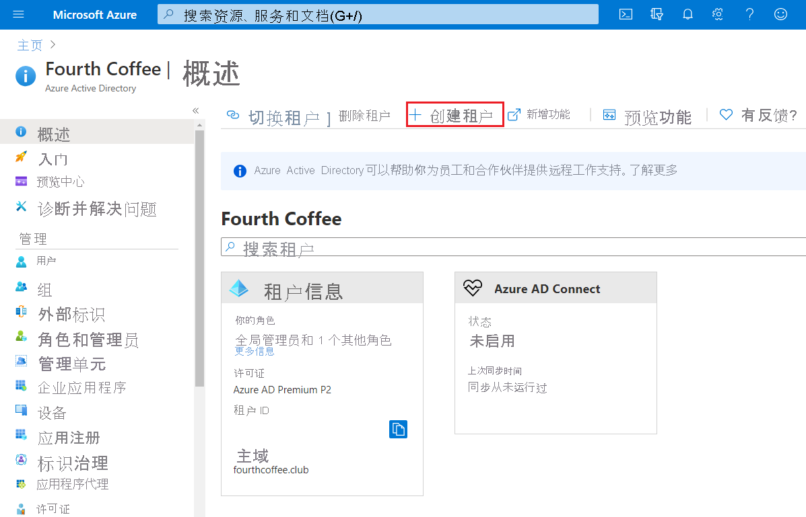
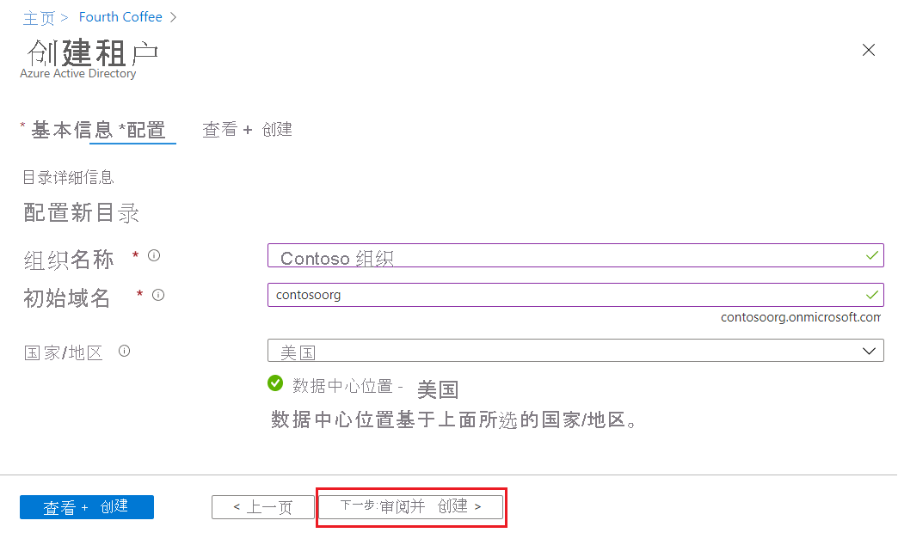
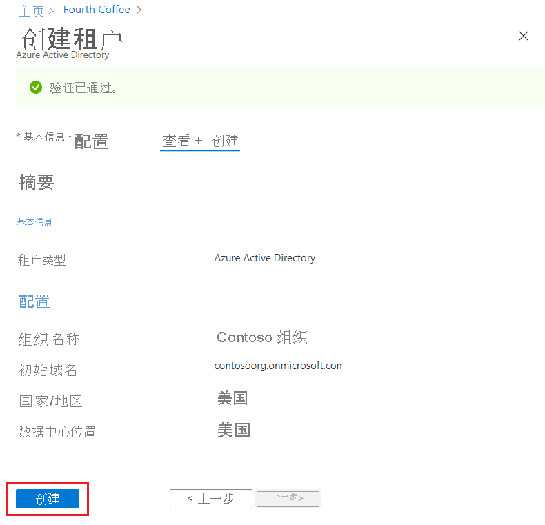
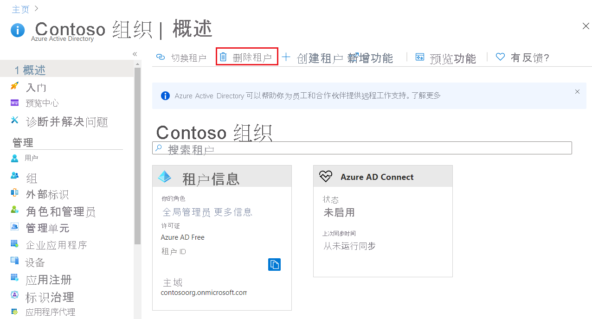

# 快速入门：在 Azure Active Directory 中创建一个新租户

可使用 Azure Active Directory (Azure AD) 门户执行所有管理任务，包括为组织创建新的租户。 

在该快速入门中，你将学习如何转到 Azure 门户和 Azure Active Directory，以及如何为组织创建基本租户。

如果没有 Azure 订阅，请在开始之前创建一个[免费帐户](https://azure.microsoft.com/free/)。

## 为组织创建新的租户

登录到 Azure 门户后，即可为组织创建新的租户。 新的租户代表你的组织，可帮助你管理面向内部和外部用户的特定 Microsoft 云服务实例。

### 创建新的租户

1. 登录到你组织的 [Azure 门户](https://portal.azure.com/)。

1. 从 Azure 门户菜单中，选择“Azure Active Directory”。  

    <kbd></kbd>  

1. 选择“创建租户”。

1. 在“基本信息”选项卡上，选择要创建的租户类型：“Azure Active Directory”或“Azure Active Directory (B2C)” 。

1. 在完成时选择“下一步:配置”，可转到“配置”选项卡。

    <kbd></kbd>

1.  在“配置”选项卡上，输入以下信息：
    
    - 在“组织名称”框中键入“Contoso Organization”。

    - 在“初始域名”框中键入“Contosoorg”。

    - 保留“国家或地区”框中的“美国”选项   。

1. 在完成时选择“下一步:查看 + 创建”。 查看输入的信息，如果信息正确，请选择“创建”。

    <kbd></kbd>

新租户是使用 contoso.onmicrosoft.com 域创建的。

## 新租户中的用户帐户

创建新的 Azure AD 租户时，你会成为该租户的第一位用户。 作为第一个用户，系统将自动为你分配[全局管理员](../roles/permissions-reference.md#global-administrator)角色。 通过导航到[用户](https://portal.azure.com/#blade/Microsoft_AAD_IAM/UsersManagementMenuBlade/MsGraphUsers)页面来查看你的用户帐户。

默认情况下，你还会作为租户的[技术联系人](/microsoft-365/admin/manage/change-address-contact-and-more#what-do-these-fields-mean)列出。 可在[属性](https://portal.azure.com/#blade/Microsoft_AAD_IAM/ActiveDirectoryMenuBlade/Properties)中更改技术联系人信息。

> [!WARNING]
> 确保你的目录至少具有两个分配有全局管理员权限的帐户。 这有助于应对一个全局管理员被锁定的情况。有关更多详细信息，请参阅[在 Azure AD 中管理紧急访问帐户](../roles/security-emergency-access.md)一文。

## 清理资源

如果不打算继续使用此应用程序，可按以下步骤删除该租户：

- 确保你已登录到要通过 Azure 门户中的“目录 + 订阅”筛选器删除的目录。 根据需要切换到目标目录。
- 选择 Azure Active Directory，然后在“Contoso - 概述”页面上，选择“删除目录”    。

    这会删除此租户及其关联的信息。

    <kbd></kbd>

## 后续步骤

- 更改或添加其他域名，请参阅[如何向 Azure Active Directory 添加自定义域名](add-custom-domain.md)

- 添加用户，请参阅[添加新用户或删除用户](add-users-azure-active-directory.md)

- 添加组和成员，请参阅[创建基本组并添加成员](active-directory-groups-create-azure-portal.md)

- 为帮助管理组织的应用程序和资源访问权限，请了解[使用 Privileged Identity Management 基于角色进行访问](../../role-based-access-control/best-practices.md)和[条件访问](../../role-based-access-control/conditional-access-azure-management.md)。

- 了解 Azure AD，包括[基本许可信息、术语和关联的功能](active-directory-whatis.md)。