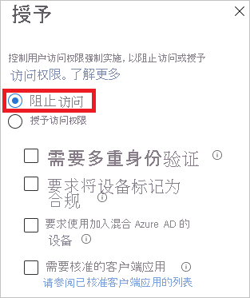
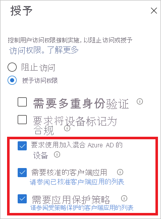

# 什么是 Azure AD 中的登录诊断？

Azure Active Directory (Azure AD) 提供了灵活的安全模型，可使用此模板控制用户可以对受管理资源执行的操作。 对这些资源的访问不仅受访问者标识控制，还受访问方式控制 。 通常，由于有许多配置选项，因此灵活模型伴随着一定程度的复杂性。 复杂性可能会增加出错的风险。

作为 IT 管理员，你需要一个解决方案来了解系统中的活动。 这样，你可以在发生问题时诊断并解决问题。 Azure AD 的登录诊断就是这种解决方案的一个示例。 可以使用诊断在没有 Microsoft 支持人员参与的情况下分析登录过程中发生的情况并获取解决问题的建议。

本文概述该解决方案的功能以及如何使用它。

## 要求

所有版本的 Azure AD 都提供登录诊断。

需要具有 Azure AD 中的全局管理员身份才能使用登录诊断。

## 工作原理

在 Azure AD 中，对登录尝试的响应与访问者标识和访问租户的方式有关 。 例如，当从公司网络登录时，管理员通常可以配置租户的所有方面。 但是，当使用同一帐户从不受信任的网络登录时，甚至可能会遭到阻止。

由于系统可以灵活地响应登录尝试，因此可能最终需要解决登录问题。登录诊断具有以下功能：

- 分析登录事件数据。

- 显示发生了什么。

- 提供有关如何解决问题的建议。

Azure AD 的登录诊断旨在启用登录错误的自我诊断。 若要完成诊断过程，需执行以下操作：

1. 定义你所关心的登录事件的范围。

2. 选择要查看的登录。

3. 查看诊断结果。

4. 执行操作。

### 定义范围

此步骤旨在定义要调查的登录事件的范围。 范围基于用户或标识符（correlationId、requestId）和时间范围。 要进一步缩小范围，可以指定应用名称。 Azure AD 使用范围信息来查找合适的事件。  

### 选择登录  

根据搜索条件，Azure AD 检索所有匹配的登录事件并将其显示在身份验证摘要列表视图中。

可以自定义在此视图中显示的列。

### 查看诊断结果

对于所选登录事件，Azure AD 可提供诊断结果。

这些结果以评估开头，该评估用几句话解释发生的情况。 解释有助于了解系统的行为。

接下来，获取应用于所选登录事件的相关条件访问策略的摘要。 诊断结果还包括用于解决问题的建议修正步骤。 由于并非总是可以在不借助其他帮助的情况下解决问题，因此可能建议创建支持工单。

### 执行操作

此时，应拥有解决问题所需的信息。

## 方案

登录诊断包括以下方案：

- 被条件访问阻止

- 因条件访问失败

- 条件访问中的多重身份验证 (MFA)

- 来自其他要求的 MFA

- 需要 MFA 证明

- 需要 MFA 证明（风险登录位置）

- 成功登录

### 被条件访问阻止

在本方案中，登录尝试已被条件访问策略阻止。

此方案的诊断部分显示有关用户登录事件和所应用策略的详细信息。

### 因条件访问失败

此方案通常是由于登录尝试失败造成的，失败原因是未满足条件访问策略的要求。 常见示例包括：

- 要求使用已建立混合 Azure AD 联接的设备

- 需要批准的客户端应用

- 需要应用保护策略

此方案的诊断部分显示有关用户登录尝试和所应用策略的详细信息。

### 通过条件访问进行 MFA

在此方案中，条件访问策略要求使用多重身份验证集登录。

此方案的诊断部分显示有关用户登录尝试和所应用策略的详细信息。

### 来自其他要求的 MFA

在此方案中，条件访问策略未强制实施多重身份验证要求。 例如，基于每个用户的多重身份验证。

此诊断方案的目的是提供有关以下内容的更多详细信息：

- 多重身份验证中断的源
- 客户端交互的结果

你还可以查看用户登录尝试的所有详细信息。

### 需要 MFA 证明

在此方案中，登录尝试被设置多重身份验证的请求中断。 此设置也称为“证明”。

当要求用户使用多重身份验证但尚未对其进行配置，或管理员已要求用户对其进行配置时，则会发生多重身份验证证明。

此诊断方案旨在表明多重身份验证中断是由于缺乏用户配置导致的。 建议的解决方案是要求用户完成“证明”。

### 需要 MFA 证明（风险登录位置）

在此方案中，登录尝试被从风险登录位置发出的设置多重身份验证的请求中断。

此诊断方案旨在表明多重身份验证中断是由于缺乏用户配置导致的。 建议的解决方案是要求用户完成“证明”，具体而言，需要通过没有风险的网络位置完成。

例如，如果将公司网络定义为命名位置，则用户应改为尝试通过公司网络进行证明。

### 成功登录

在此方案中，登录事件没有被条件访问或多重身份验证中断。

此诊断方案详细介绍了会因条件访问策略或多重身份验证而中断的用户登录事件。

## 后续步骤

- [什么是 Azure Active Directory 报表？](overview-reports.md)
- [什么是 Azure Active Directory 监视？](overview-monitoring.md)
