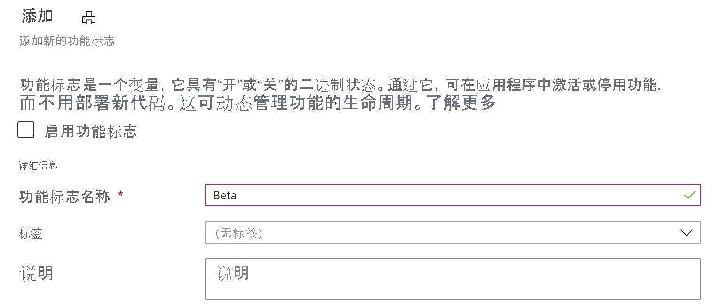

# <a name="quickstart-add-feature-flags-to-an-aspnet-core-app"></a>快速入门：将功能标志添加到 ASP.NET Core 应用

在本快速入门中，你将使用 Azure 应用程序配置在 ASP.NET Core 应用中创建功能管理的端到端实现。 你将使用应用程序配置服务集中存储所有功能标志并控制其状态。 

.NET Core 功能管理库使用全面的功能标志支持扩展了该框架。 这些库在 .NET Core 配置系统的基础上构建。 它们可以通过其 .NET Core 配置提供程序无缝集成到应用程序配置。

## <a name="prerequisites"></a>先决条件

* Azure 订阅 - [创建免费帐户](https://azure.microsoft.com/free/dotnet)
* [.NET Core SDK](https://dotnet.microsoft.com/download)

## <a name="create-an-app-configuration-store"></a>创建应用配置存储区

[!INCLUDE[Azure App Configuration resource creation steps](../../includes/azure-app-configuration-create.md)]

8. 选择“操作” > “功能管理器” > “添加”，添加名为 Beta 的功能标志  。

    > [!div class="mx-imgBorder"]
    > 

    暂时将“标签”留空。 选择“应用”  以保存新功能标志。

## <a name="create-an-aspnet-core-web-app"></a>创建一个 ASP.NET Core Web 应用

使用 [.NET Core 命令行接口 (CLI)](/dotnet/core/tools) 创建新的 ASP.NET Core MVC 项目。 使用 .NET Core CLI 而不是 Visual Studio 的优点是，它可用于 Windows、macOS 和 Linux 平台。

在新的 TestFeatureFlags 文件夹中，运行以下命令以创建 ASP.NET Core MVC 项目：

```dotnetcli
dotnet new mvc --no-https --output TestFeatureFlags
```

[!INCLUDE[Add Secret Manager support to an ASP.NET Core project](../../includes/azure-app-configuration-add-secret-manager.md)]

## <a name="connect-to-an-app-configuration-store"></a>连接到应用程序配置存储区

1. 运行以下命令，安装 [Microsoft.Azure.AppConfiguration.AspNetCore](https://www.nuget.org/packages/Microsoft.Azure.AppConfiguration.AspNetCore) 和 [Microsoft.FeatureManagement.AspNetCore](https://www.nuget.org/packages/Microsoft.FeatureManagement.AspNetCore) NuGet 包：

    ```dotnetcli
    dotnet add package Microsoft.Azure.AppConfiguration.AspNetCore
    ```

    ```dotnetcli
    dotnet add package Microsoft.FeatureManagement.AspNetCore
    ```

1. 在 .csproj 文件所在的同一目录中运行以下命令。 该命令使用机密管理器存储名为 `ConnectionStrings:AppConfig` 的机密，该机密存储应用程序配置存储区的连接字符串。 将 `<your_connection_string>` 占位符替换为应用程序配置存储区的连接字符串。 可以在 Azure 门户的“访问密钥”  下找到该连接字符串。

    ```dotnetcli
    dotnet user-secrets set ConnectionStrings:AppConfig "<your_connection_string>"
    ```

    机密管理器仅用于本地测试 web 应用程序。 将应用部署到 [Azure 应用服务](https://azure.microsoft.com/services/app-service/web)后，可以使用应用服务中的“连接字符串”应用程序设置，而无需使用机密管理器来存储连接字符串。

    使用 .NET Core 配置 API 访问此机密。 在所有支持的平台上，冒号 (`:`) 可以在配置 API 的配置名称中使用。 有关详细信息，请参阅[配置键和值](/aspnet/core/fundamentals/configuration#configuration-keys-and-values)。

1. 在 Program.cs 中更新 `CreateWebHostBuilder` 方法，以便通过调用 `AddAzureAppConfiguration` 方法使用应用程序配置  。

    > [!IMPORTANT]
    > `CreateHostBuilder` 替换 .NET Core 3.x 中的 `CreateWebHostBuilder`。 根据环境选择正确的语法。

    #### <a name="net-core-3x"></a>[.NET Core 3.x](#tab/core3x)

    ```csharp
    public static IHostBuilder CreateHostBuilder(string[] args) =>
        Host.CreateDefaultBuilder(args)
            .ConfigureWebHostDefaults(webBuilder =>
                webBuilder.ConfigureAppConfiguration(config =>
                {
                    var settings = config.Build();
                    var connection = settings.GetConnectionString("AppConfig");
                    config.AddAzureAppConfiguration(options =>
                        options.Connect(connection).UseFeatureFlags());
                }).UseStartup<Startup>());
    ```

    #### <a name="net-core-2x"></a>[.NET Core 2.x](#tab/core2x)

    ```csharp
    public static IWebHostBuilder CreateWebHostBuilder(string[] args) =>
        WebHost.CreateDefaultBuilder(args)
               .ConfigureAppConfiguration(config =>
               {
                   var settings = config.Build();
                   var connection = settings.GetConnectionString("AppConfig");
                   config.AddAzureAppConfiguration(options =>
                       options.Connect(connection).UseFeatureFlags());
               }).UseStartup<Startup>();
    ```

    ---

    进行上述更改后，[应用程序配置的配置提供程序](/dotnet/api/Microsoft.Extensions.Configuration.AzureAppConfiguration)就已注册到 .NET Core 配置 API。

1. 在 Startup.cs 中，添加对 .NET Core 功能管理器的引用：

    ```csharp
    using Microsoft.FeatureManagement;
    ```

1. 通过调用 `AddFeatureManagement` 方法更新 `Startup.ConfigureServices` 方法以添加功能标志支持。 （可选）可以通过调用 `AddFeatureFilter<FilterType>()` 来包括要与功能标志一起使用的任何筛选器：

    #### <a name="net-core-3x"></a>[.NET Core 3.x](#tab/core3x)

    ```csharp    
    public void ConfigureServices(IServiceCollection services)
    {
        services.AddControllersWithViews();
        services.AddFeatureManagement();
    }
    ```

    #### <a name="net-core-2x"></a>[.NET Core 2.x](#tab/core2x)

    ```csharp
    public void ConfigureServices(IServiceCollection services)
    {
        services.AddMvc()
            .SetCompatibilityVersion(CompatibilityVersion.Version_2_2);
        services.AddFeatureManagement();
    }
    ```

    ---

1. 使用以下代码将 MyFeatureFlags.cs 文件添加到根项目目录：

    ```csharp
    namespace TestFeatureFlags
    {
        public enum MyFeatureFlags
        {
            Beta
        }
    }
    ```

1. 使用以下代码将 BetaController.cs 文件添加到“控制器”目录 ：

    ```csharp
    using Microsoft.AspNetCore.Mvc;
    using Microsoft.FeatureManagement;
    using Microsoft.FeatureManagement.Mvc;

    namespace TestFeatureFlags.Controllers
    {
        public class BetaController: Controller
        {
            private readonly IFeatureManager _featureManager;

            public BetaController(IFeatureManagerSnapshot featureManager) =>
                _featureManager = featureManager;

            [FeatureGate(MyFeatureFlags.Beta)]
            public IActionResult Index() => View();
        }
    }
    ```

1. 在 Views/_ViewImports 中，使用 `@addTagHelper` 指令注册功能管理器标记帮助程序：

    ```cshtml
    @addTagHelper *, Microsoft.FeatureManagement.AspNetCore
    ```

    前面的代码允许在项目的 .cshtml 文件中使用 `<feature>` 标记帮助程序。

1. 在 Views\\Shared 目录下，打开 _Layout.cshtml”  。 在 `<body>` > `<header>` 下找到 `<nav>` 条码。 在“主页”和“隐私”导航栏项之间插入新的 `<feature>` 标记，如以下突出显示的行中所示 。

    :::code language="html" source="../../includes/azure-app-configuration-navbar.md" range="15-38" highlight="13-17":::

1. 创建一个 Views/Beta 目录，以及一个包含以下标记的 Index.cshtml 文件 。

    ```cshtml
    @{
        ViewData["Title"] = "Beta Home Page";
    }

    <h1>This is the beta website.</h1>
    ```

## <a name="build-and-run-the-app-locally"></a>在本地生成并运行应用

1. 要通过使用 .NET Core CLI 生成应用，请在命令行界面中执行以下命令：

    ```dotnetcli
    dotnet build
    ```

1. 生成成功完成后，请运行以下命令以在本地运行 Web 应用：

    ```dotnetcli
    dotnet run
    ```

1. 启动浏览器窗口并转到 `http://localhost:5000`，即本地托管的 Web 应用的默认 URL。 如果要在 Azure Cloud Shell 中操作，请依次选择“Web 预览”按钮和“配置”   。 出现提示时，选择“端口 5000”。

    

    浏览器应显示类似于下图的页面。

    :::image type="content" source="media/quickstarts/aspnet-core-feature-flag-local-before.png" alt-text="更改前的本地快速入门应用" border="true":::

1. 登录 [Azure 门户](https://portal.azure.com)。 选择“所有资源”，然后选择在快速入门中创建的应用程序配置存储区实例  。

1. 选择“功能管理器”。 

1. 通过选择“启用”下的复选框来启用 Beta 标志。

1. 返回到命令行界面。 按 <kbd>Ctrl + C</kbd>，取消正在运行的 `dotnet` 进程。 使用 `dotnet run` 重启应用。

1. 刷新浏览器页面，查看新的配置设置。

    :::image type="content" source="media/quickstarts/aspnet-core-feature-flag-local-after.png" alt-text="更改后的本地快速入门应用" border="true":::

## <a name="clean-up-resources"></a>清理资源

[!INCLUDE[Azure App Configuration cleanup](../../includes/azure-app-configuration-cleanup.md)]

## <a name="next-steps"></a>后续步骤

在本快速入门中，你已创建一个新的应用程序配置存储区，并已使用它来通过[功能管理库](/dotnet/api/Microsoft.Extensions.Configuration.AzureAppConfiguration)管理 ASP.NET Core Web 应用中的功能。

* 详细了解[功能管理](./concept-feature-management.md)。
* [管理功能标志](./manage-feature-flags.md)。
* [在 ASP.NET Core 应用中使用功能标志](./use-feature-flags-dotnet-core.md)。
* [在 ASP.NET Core 应用中使用动态配置](./enable-dynamic-configuration-aspnet-core.md)