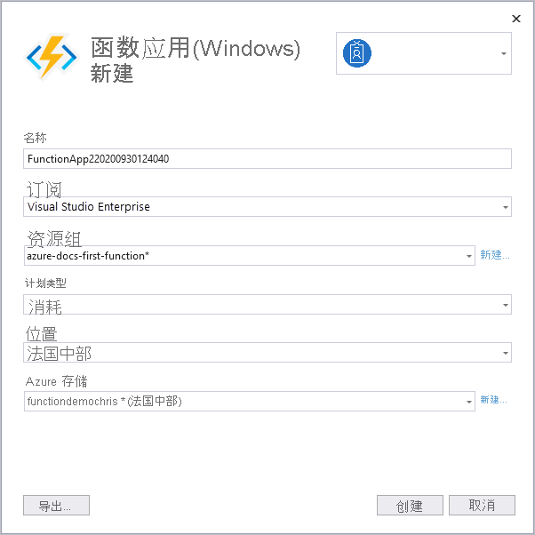

# 快速入门：使用 Visual Studio 在 Azure 中创建第一个函数

在本文中，我们使用 Visual Studio 来创建一个响应 HTTP 请求的基于 C# 类库的函数。 在本地测试代码之后，将其部署到 Azure Functions 的 <abbr title="一种运行时计算环境，其中服务器的所有详细信息对应用程序开发人员来说都是透明的，这简化了部署和管理代码的过程。">无服务器</abbr> 环境 <abbr title="为应用程序提供低成本无服务器计算环境的 Azure 服务。">Azure Functions</abbr>.

完成本快速入门会在你的 Azure 帐户中产生最多几美分的费用 <abbr title="用于维护 Azure 使用情况计费信息的配置文件。">Azure 帐户</abbr>.

## 1.准备环境

+ 创建 Azure <abbr title="用于维护 Azure 使用情况计费信息的配置文件。">account</abbr> 帐户 <abbr title="在 Azure 中管理资源的基本组织结构，通常与组织中的个人或部门关联。">订阅</abbr>. [免费创建帐户](https://azure.microsoft.com/free/?ref=microsoft.com&utm_source=microsoft.com&utm_medium=docs&utm_campaign=visualstudio)。

+ 安装 [Visual Studio 2019](https://azure.microsoft.com/downloads/) 并在安装期间选择“Azure 开发”工作负载。 

 

<strong>改用 Azure Functions 项目</strong>

如果要改用 Visual Studio 2017 创建 <abbr title="一个逻辑容器，它用于一个或多个可同时部署和管理的单独函数。">Azure Functions 项目</abbr> ，必须首先安装[最新的 Azure Functions 工具](functions-develop-vs.md#check-your-tools-version)。

## 2.创建函数应用项目

1. 在 Visual Studio 菜单中，选择“文件” > “新建” > “项目”。

1. 在“创建新项目”中，在搜索框中输入“functions”，选择“Azure Functions”模板，然后选择“下一步”。

1. 在“配置新项目”中，为项目输入<abbr title="函数应用名称必须可以充当 C# 命名空间，因此请勿使用下划线、连字符或任何其他的非字母数字字符。">项目名称</abbr>，然后选择“创建”  。 

1. 为“创建新的 Azure Functions 应用程序”设置提供以下信息：

    + 从 Functions 运行时下拉列表中选择<abbr title="此值会创建使用 Azure Functions 的版本 3.x 运行时（支持 .NET Core 3.x）的函数项目。Azure Functions 1.x 支持 .NET Framework。">“Azure Functions v3 (.NET Core)”</abbr>。 （有关详细信息，请参阅 [Azure Functions 运行时版本概述](functions-versions.md)。）
    
    + 选择<abbr title="此值会创建由 HTTP 请求触发的函数。">“HTTP 触发器”</abbr>作为函数模板。
    
    + 从“存储帐户”下拉列表中选择<abbr title="由于 Azure 函数需要存储帐户，因此在将项目发布到 Azure 时会分配或创建一个存储帐户。HTTP 触发器不使用 Azure 存储帐户连接字符串；所有其他触发器类型都需要有效的 Azure 存储帐户连接字符串。">“存储仿真器”</abbr>。
        
    + 从“授权级别”下拉列表中选择“匿名” <abbr title="在未提供密钥的情况下，任何客户端都可以触发创建的函数。 通过此授权设置可以轻松测试新函数。">授权级别</abbr> 。 （有关密钥和授权的详细信息，请参阅[授权密钥](functions-bindings-http-webhook-trigger.md#authorization-keys)和 [HTTP 和 Webhook 绑定](functions-bindings-http-webhook.md)。）

    + 选择“创建”
        
## 3.重命名函数

`FunctionName` 方法属性设置函数的名称（默认情况下生成为 `Function1`）。 由于工具不允许在创建项目时覆盖默认函数名称，请花一点时间为函数类、文件和元数据创建更好的名称。

1. 在“文件资源管理器”中，右键单击 Function1.cs 文件并将其重命名为 HttpExample.cs。

1. 在代码中，将 Function1 类重命名为 `HttpExample`。

1. 在名为 `Run` 的 `HttpTrigger` 方法中，将 `FunctionName` 方法属性重命名为 `HttpExample`。

## 4.在本地运行函数

1. 若要运行函数，请在 Visual Studio 中按 <kbd>F5</kbd>。

1. 从 Azure Functions 运行时输出复制函数的 URL。

    

1. 将 HTTP 请求的 URL 粘贴到浏览器的地址栏。 将查询字符串 ?name=<YOUR_NAME> 追加到此 URL 并运行请求。 

    

1. 若要停止调试，请在 Visual Studio 中按 <kbd>Shift</kbd>+<kbd>F5</kbd>。

 

<strong>疑难解答</strong>

 你可能需要启用防火墙例外，这样工具才能处理 HTTP 请求。 在本地运行函数时，永远不会强制实施授权级别。

## 5.将项目发布到 Azure

1. **在“解决方案资源管理器”** 中，右键单击该项目并选择“发布”。

1. 在“目标”中选择“Azure” 

    :::image type="content" source="../../includes/media/functions-vstools-publish/functions-visual-studio-publish-profile-step-1.png" alt-text="选择 Azure 目标":::

1. 在“特定目标”中，选择“Azure 函数应用(Windows)” 

    :::image type="content" source="../../includes/media/functions-vstools-publish/functions-visual-studio-publish-profile-step-2.png" alt-text="选择 Azure 函数应用":::

1. 在“函数实例”中，选择“创建新的 Azure 函数…”，然后使用以下指定的值 ：

    + 对于“名称”，提供一个 <abbr title="使用唯一标识新函数应用的名称。 接受此名称或输入新名称。 有效的字符是：`a-z`、`0-9` 和 `-`。">全局唯一名称</abbr>
    
    + 从下拉列表中选择一个订阅。
    
    + 从下拉列表中选择一个现有 <abbr title="相关 Azure 资源的逻辑容器，可将其作为一个单元进行管理。">资源组</abbr> ，或者选择“新建”以创建新的资源组。
    
    + **选择** <abbr title="将项目发布到在消耗计划中运行的函数应用时，只需为函数应用的执行付费。 其他托管计划会产生更高的成本。">消耗</abbr> 在“播放类型”下拉列表中。 （有关详细信息，请参阅[消耗计划](consumption-plan.md)。）
    
    + 从下拉列表中选择一个  <abbr title="对在其中分配资源的特定 Azure 数据中心的地理引用。有关可用区域列表，请参阅[区域](https://azure.microsoft.com/regions/)。">location</abbr> 。
    
    + 从下拉列表选择一个<abbr="Functions 运行时需要 Azure 存储帐户。 选择“新建”即可配置常规用途存储帐户。 也可选择一个符合存储帐户要求的现有帐户。">Azure 存储</abbr> 帐户

    

1. 选择 **创建** 

1. 在 **函数实例** 中，确保已选中 **从包文件运行** 。 

    :::image type="content" source="../../includes/media/functions-vstools-publish/functions-visual-studio-publish-profile-step-4.png" alt-text="完成配置文件的创建":::

     
    

    
<strong>此设置有哪些作用？</strong>

    使用“从包文件运行”时，会在启用[从包运行](run-functions-from-deployment-package.md)模式的情况下使用 [Zip 部署](functions-deployment-technologies.md#zip-deploy)来部署函数应用。 建议对你的函数项目使用此部署方法，因为它可提高性能。    
    
   

1. 选择“完成”。

1. 在“发布”页上选择 **发布**。

1. 在“发布”页上，查看函数应用的根 URL。

1. 在“发布”选项卡中，选择“在 Cloud Explorer<abbr title="借助 Cloud Explorer，可使用 Visual Studio 来查看网站的内容，启动和停止函数应用，并直接浏览到 Azure 上和 Azure 门户中的函数应用资源。">中管理”</abbr>。
    
    :::image type="content" source="../../includes/media/functions-vstools-publish/functions-visual-studio-publish-complete.png" alt-text="发布成功消息":::
    

## 6.在 Azure 中测试函数

1. 在 Cloud Explorer 中，应已选中新的函数应用。 如果未选中，请依次展开你的订阅、“应用服务”，并选择新的函数应用。

1. 右键单击函数应用，然后选择“在浏览器中打开”。 这会在默认的 Web 浏览器中打开函数应用的根，并显示指示函数应用正在运行的页面。 

    :::image type="content" source="media/functions-create-your-first-function-visual-studio/function-app-running-azure.png" alt-text="函数应用正在运行":::

1. 在浏览器的地址栏中，将字符串 /api/HttpExample?name=Functions 附加到基 URL 并运行请求。

    调用 HTTP 触发器函数的 URL 采用以下格式：

    `http://<APP_NAME>.azurewebsites.net/api/HttpExample?name=Functions`

2. 转到此 URL，你会在浏览器中看到函数返回的对远程 GET 请求的响应，如下例所示：

    :::image type="content" source="media/functions-create-your-first-function-visual-studio/functions-create-your-first-function-visual-studio-browser-azure.png" alt-text="浏览器中的函数响应":::

## 7.清理资源

删除函数应用及其资源以避免产生任何后续成本。

1. 在 Cloud Explorer 中，依次展开你的订阅、“应用服务”，右键单击函数应用，然后选择“在门户中打开” 。 

1. 在函数应用页中，请选择“概览”选项卡，然后选择“资源组”下的链接 。

   :::image type="content" source="media/functions-create-your-first-function-visual-studio/functions-app-delete-resource-group.png" alt-text="从函数应用页选择要删除的资源组":::

1. 在“资源组”页中查看所包括的资源的列表，然后验证这些资源是否是要删除的。
 
1. 选择“删除资源组”，然后按说明操作。

    可能需要数分钟才能删除完毕。 完成后会显示一个通知，持续数秒。 也可以选择页面顶部的钟形图标来查看通知。

## 后续步骤

转到下一篇文章，了解如何向函数添加 <abbr title="一种将函数与存储队列关联，以确保函数可在队列上创建消息的方法。 绑定是函数和其他资源之间的声明性连接。 输入绑定为函数提供数据；输出绑定向其他资源提供来自函数的数据。">Azure 存储队列输出绑定</abbr> ：

> [!div class="nextstepaction"]
> [将 Azure 存储队列绑定添加到函数](functions-add-output-binding-storage-queue-vs.md)
