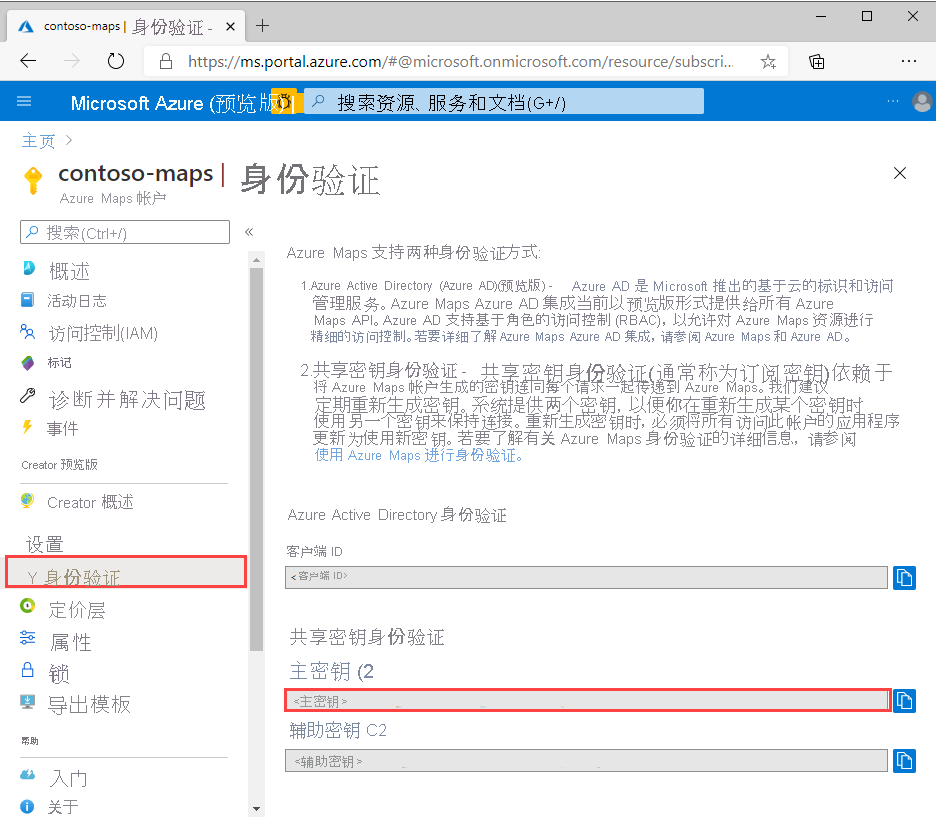
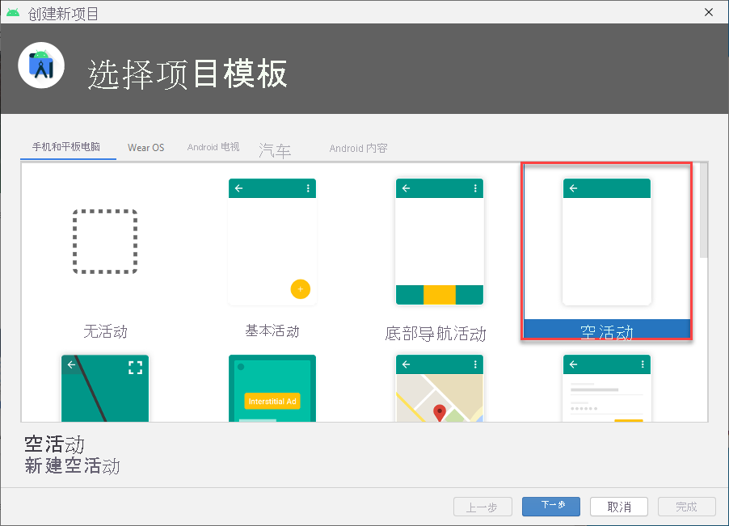
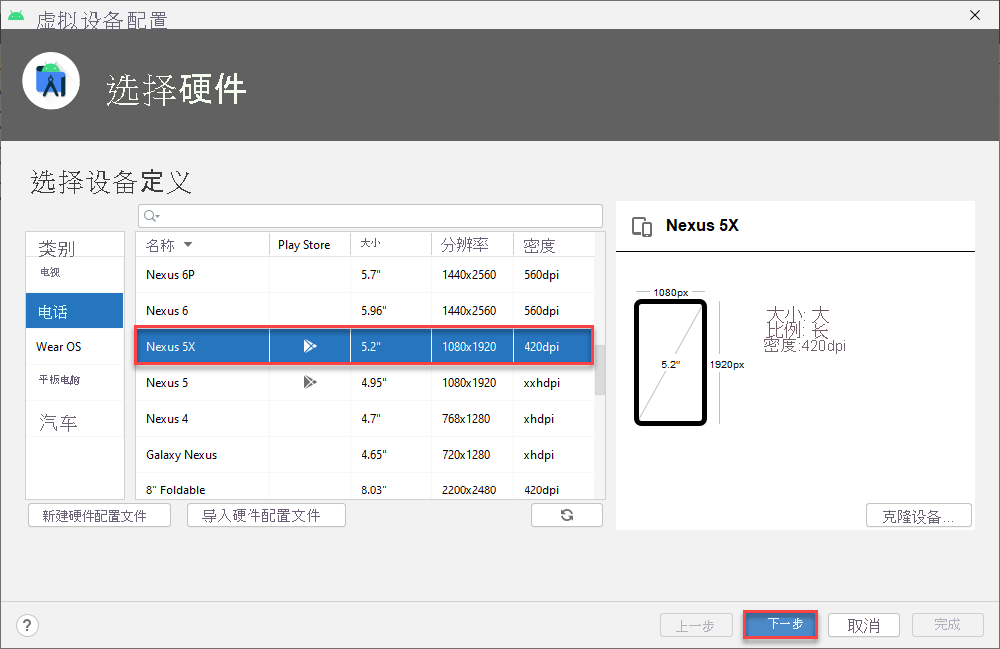
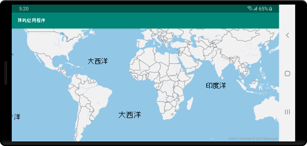

# <a name="quickstart-create-an-android-app-with-azure-maps"></a>快速入门：使用 Azure Maps 创建 Android 应用

本文介绍如何将 Azure Maps 添加到 Android 应用。 本文演示如何完成以下基本步骤：

* 设置开发环境。
* 创建自己的 Azure Maps 帐户。
* 获取主 Azure Maps 密钥以在应用中使用。
* 从项目中引用 Azure Maps 库。
* 将 Azure Maps 控件添加到应用。

## <a name="prerequisites"></a>先决条件

1. 通过登录到 [Azure 门户](https://portal.azure.com)来创建 Azure Maps 帐户。 如果没有 Azure 订阅，请在开始之前创建一个[免费帐户](https://azure.microsoft.com/free/)。
2. [创建 Azure Maps 帐户](quick-demo-map-app.md#create-an-azure-maps-account)
3. [获取主订阅密钥](quick-demo-map-app.md#get-the-primary-key-for-your-account)（亦称为“主密钥”或“订阅密钥”）。 有关 Azure Maps 中身份验证的详细信息，请参阅[在 Azure Maps 中管理身份验证](how-to-manage-authentication.md)。
4. 从 Google 免费[下载 Android Studio](https://developer.android.com/studio/)。

## <a name="create-an-azure-maps-account"></a>创建 Azure Maps 帐户

通过以下步骤创建新的 Azure Maps 帐户：

1. 在 [Azure 门户](https://portal.azure.com)的左上角单击“创建资源”。
2. 在“在市场中搜索”框中，键入“Azure Maps”。
3. 从“结果”中，选择“Azure Maps”。 单击地图下面显示的“创建”按钮。
4. 在“创建 Maps 帐户”页上，输入以下值  ：
    * 要用于此帐户的订阅。
    * 此帐户的资源组名称。 可以选择新建或使用现有的资源组。
    * 新帐户的名称。
    * 此帐户的定价层  。
    * 阅读许可证和隐私声明，并选择复选框接受这些条款   。
    * 单击“创建”  按钮。

    :::image type="content" source="./media/quick-demo-map-app/create-account.png" alt-text="在门户中创建 Maps 帐户":::

## <a name="get-the-primary-key-for-your-account"></a>获取帐户的主密钥

成功创建 Maps 帐户后，检索查询 Maps API 的主密钥。

1. 在门户中打开 Maps 帐户。
2. 在设置部分中，选择“身份验证”  。
3. 将“主密钥”复制到剪贴板。 本地保存它以便稍后在本教程中使用。

>[!NOTE]
> 如果使用 Azure 订阅密钥而不是 Azure Maps 主密钥，那么不会正确显示你的映射。 此外，出于安全考虑，建议轮换使用主密钥和辅助密钥。 若要轮换密钥，请更新应用以使用辅助密钥、进行部署，然后按主密钥旁边的循环/刷新按钮以生成新的主密钥。 将禁用旧的主密钥。 有关密钥轮换的详细信息，请参阅[使用密钥轮换和审核功能设置 Azure Key Vault](../key-vault/secrets/tutorial-rotation-dual.md)



## <a name="create-a-project-in-android-studio"></a>在 Android Studio 中创建项目

首先，请创建一个包含空活动的新项目。 请完成以下步骤创建 Android Studio 项目：

1. 在“Choose your project”（选择项目）下，选择“手机和平板电脑”（Phone and Tablet）。  你的应用程序将在具有此外形规格的设备上运行。
2. 在“Phone and Tablet”（手机和平板电脑）选项卡上选择“Empty  Activity”（空活动），然后选择“Next”（下一步）。  
3. 在“配置项目”下，选择 `API 21: Android 5.0.0 (Lollipop)` 作为最低要求的 SDK。 这是 Azure Maps Android SDK 支持的最旧版本。
4. 接受默认的 `Activity Name` 和 `Layout Name`，然后选择“Finish”（完成）。

安装 Android Studio 和创建新项目时如需更多帮助，请参阅 [Android Studio 文档](https://developer.android.com/studio/intro/)。



## <a name="set-up-a-virtual-device"></a>设置虚拟设备

Android Studio 可让你在计算机上设置 Android 虚拟设备。 这样做有助于在开发期间测试应用程序。 若要设置虚拟设备，请选择项目屏幕右上角的“Android Virtual Device (AVD) Manager”图标，然后选择“Create Virtual Device”（创建虚拟设备）。 也可以通过在工具栏中选择“Tools”（工具） > “Android” > “AVD Manager”打开 AVD Manager。   在“Phones”（手机）类别中选择“Nexus 5X”，然后选择“Next”（下一步）。  

可以在 [Android Studio 文档](https://developer.android.com/studio/run/managing-avds)中详细了解如何设置 AVD。



## <a name="install-the-azure-maps-android-sdk"></a>安装 Azure Maps Android SDK

生成应用程序的下一步是安装 Azure Maps Android SDK。 请完成以下步骤来安装该 SDK：

1. 打开顶级 **build.gradle** 文件，将以下代码添加到 **所有项目** 的 **repositories** 块节中：

    ```gradle
    maven {
        url "https://atlas.microsoft.com/sdk/android"
    }
    ```

2. 更新 **app/build.gradle** 并在其中添加以下代码：

    1. 确保项目的 **minSdkVersion** 设置为 API 21 或更高版本。

    2. 将以下代码添加到 Android 节：

        ```gradle
        compileOptions {
            sourceCompatibility JavaVersion.VERSION_1_8
            targetCompatibility JavaVersion.VERSION_1_8
        }
        ```

    3. 更新 dependencies 块，并为最新 Azure Maps Android SDK 添加新的实现依赖项行：

        ```gradle
        implementation "com.microsoft.azure.maps:mapcontrol:0.7"
        ```

        > [!Note]
        > 可将版本号设置为“0+”，使代码始终指向最新版本。

    4. 在工具栏中转到“文件”，然后单击“将项目与 Gradle 文件同步”。 
3. 将一个地图片段添加到 main 活动 (res \> layout \> activity\_main.xml)：

    ```xml
    <com.microsoft.azure.maps.mapcontrol.MapControl
        android:id="@+id/mapcontrol"
        android:layout_width="match_parent"
        android:layout_height="match_parent"
        />
    ```

::: zone pivot="programming-language-java-android"

4. 在 **MainActivity.java** 文件中，需要：

    * 添加 Azure Maps SDK 的 import 语句
    * 设置 Azure Maps 身份验证信息
    * 在 **onCreate** 方法中获取地图控件实例

    使用 `setSubscriptionKey` 或 `setAadProperties` 方法在 `AzureMaps` 类中全局设置身份验证信息后，无需在每个视图中添加身份验证信息。

    地图控件包含自身的生命周期方法用于管理 Android 的 OpenGL 生命周期。 必须直接从包含活动调用这些生命周期方法。 要使应用正确调用地图控件的生命周期方法，必须在包含地图控件的活动中重写以下生命周期方法。 并且，必须调用相应的地图控件方法。

    * `onCreate(Bundle)`
    * `onDestroy()`
    * `onLowMemory()`
    * `onPause()`
    * `onResume()`
    * `onSaveInstanceState(Bundle)`
    * `onStart()`
    * `onStop()`

    按如下所示编辑 **MainActivity.java** 文件：

    ```java
    package com.example.myapplication;
    
    import androidx.appcompat.app.AppCompatActivity;
    import com.microsoft.azure.maps.mapcontrol.AzureMaps;
    import com.microsoft.azure.maps.mapcontrol.MapControl;
    import com.microsoft.azure.maps.mapcontrol.layer.SymbolLayer;
    import com.microsoft.azure.maps.mapcontrol.options.MapStyle;
    import com.microsoft.azure.maps.mapcontrol.source.DataSource;
    
    public class MainActivity extends AppCompatActivity {
        
    static {
        AzureMaps.setSubscriptionKey("<Your Azure Maps subscription key>");

        //Alternatively use Azure Active Directory authenticate.
        //AzureMaps.setAadProperties("<Your aad clientId>", "<Your aad AppId>", "<Your aad Tenant>");
    }

    MapControl mapControl;

    @Override
    protected void onCreate(Bundle savedInstanceState) {
        super.onCreate(savedInstanceState);
        setContentView(R.layout.activity_main);

        mapControl = findViewById(R.id.mapcontrol);

        mapControl.onCreate(savedInstanceState);

        //Wait until the map resources are ready.
        mapControl.onReady(map -> {
            //Add your post map load code here.

        });
    }

    @Override
    public void onResume() {
        super.onResume();
        mapControl.onResume();
    }

    @Override
    protected void onStart(){
        super.onStart();
        mapControl.onStart();
    }

    @Override
    public void onPause() {
        super.onPause();
        mapControl.onPause();
    }

    @Override
    public void onStop() {
        super.onStop();
        mapControl.onStop();
    }

    @Override
    public void onLowMemory() {
        super.onLowMemory();
        mapControl.onLowMemory();
    }

    @Override
    protected void onDestroy() {
        super.onDestroy();
        mapControl.onDestroy();
    }

    @Override
    protected void onSaveInstanceState(Bundle outState) {
        super.onSaveInstanceState(outState);
        mapControl.onSaveInstanceState(outState);
    }}
    ```

    > [!NOTE]
    > 完成上述步骤后，你可能会收到 Android Studio 针对某些代码发出的警告。 若要解决这些警告，请导入 `MainActivity.java` 中引用的类。
    > 可选择 `Alt` + `Enter`（在 Mac 上选择 `Option` + `Return`）来自动导入这些类。

::: zone-end

::: zone pivot="programming-language-kotlin"

4. 在 MainActivity.kt 文件中，需要：

    * 添加 Azure Maps SDK 的 import 语句
    * 设置 Azure Maps 身份验证信息
    * 在 **onCreate** 方法中获取地图控件实例

    使用 `setSubscriptionKey` 或 `setAadProperties` 方法在 `AzureMaps` 类中全局设置身份验证信息后，无需在每个视图中添加身份验证信息。

    地图控件包含自身的生命周期方法用于管理 Android 的 OpenGL 生命周期。 必须直接从包含活动调用这些生命周期方法。 要使应用正确调用地图控件的生命周期方法，必须在包含地图控件的活动中重写以下生命周期方法。 并且，必须调用相应的地图控件方法。

    * `onCreate(Bundle)`
    * `onDestroy()`
    * `onLowMemory()`
    * `onPause()`
    * `onResume()`
    * `onSaveInstanceState(Bundle)`
    * `onStart()`
    * `onStop()`

    按如下所示编辑 MainActivity.kt 文件：

    ```kotlin
    package com.example.myapplication;

    import androidx.appcompat.app.AppCompatActivity
    import android.os.Bundle
    import com.microsoft.azure.maps.mapcontrol.AzureMap
    import com.microsoft.azure.maps.mapcontrol.AzureMaps
    import com.microsoft.azure.maps.mapcontrol.MapControl
    import com.microsoft.azure.maps.mapcontrol.events.OnReady
    
    class MainActivity : AppCompatActivity() {
    
        companion object {
            init {
                AzureMaps.setSubscriptionKey("<Your Azure Maps subscription key>");
    
                //Alternatively use Azure Active Directory authenticate.
                //AzureMaps.setAadProperties("<Your aad clientId>", "<Your aad AppId>", "<Your aad Tenant>");
            }
        }
    
        var mapControl: MapControl? = null
    
        override fun onCreate(savedInstanceState: Bundle?) {
            super.onCreate(savedInstanceState)
            setContentView(R.layout.activity_main)
    
            mapControl = findViewById(R.id.mapcontrol)
    
            mapControl?.onCreate(savedInstanceState)
    
            //Wait until the map resources are ready.
            mapControl?.onReady(OnReady { map: AzureMap -> })
        }
    
        public override fun onStart() {
            super.onStart()
            mapControl?.onStart()
        }
    
        public override fun onResume() {
            super.onResume()
            mapControl?.onResume()
        }
    
        public override fun onPause() {
            mapControl?.onPause()
            super.onPause()
        }
    
        public override fun onStop() {
            mapControl?.onStop()
            super.onStop()
        }
    
        override fun onLowMemory() {
            mapControl?.onLowMemory()
            super.onLowMemory()
        }
    
        override fun onDestroy() {
            mapControl?.onDestroy()
            super.onDestroy()
        }
    
        override fun onSaveInstanceState(outState: Bundle) {
            super.onSaveInstanceState(outState)
            mapControl?.onSaveInstanceState(outState)
        }
    }
    ```

    > [!NOTE]
    > 完成上述步骤后，你可能会收到 Android Studio 针对某些代码发出的警告。 若要解决这些警告，请导入 `MainActivity.kt` 中引用的类。
    > 可选择 `Alt` + `Enter`（在 Mac 上选择 `Option` + `Return`）来自动导入这些类。

::: zone-end

5. 如下图所示，选择“运行”按钮（或者在 Mac 上按 `Control` + `R`）来生成应用程序。

    

Android Studio 将花费几秒钟时间来生成应用程序。 生成完成后，可在 Android 仿真设备中测试应用程序。 应会看到如下所示的地图：



## <a name="clean-up-resources"></a>清理资源

>[!WARNING]
> [后续步骤](#next-steps)部分中列出的教程详细介绍了如何通过帐户使用和配置 Azure Maps。 如何打算继续学习这些教程，请勿清除本快速入门中创建的资源。

如果不打算继续学习这些教程，请通过以下步骤来清理资源：

1. 关闭 Android Studio 并删除你创建的应用程序。
2. 如果在外部设备上测试了应用程序，请从该设备上卸载它。

如果不打算继续使用 Azure Maps Android SDK 进行开发，请执行以下操作：

1. 导航到 Azure 门户页面。 选择门户主页中的“所有资源”。 或者，单击左上角的菜单图标。 选择“所有资源”，
2. 单击你的 Azure Maps 帐户。 在页面顶部，单击“删除”。
3. 如果不打算继续开发 Android 应用，请卸载 Android Studio。

有关更多代码示例，请参阅以下指南：

* [在 Azure Maps 中管理身份验证](how-to-manage-authentication.md)
* [更改 Android 地图中的地图样式](set-android-map-styles.md)
* [添加符号层](how-to-add-symbol-to-android-map.md)
* [添加线条层](android-map-add-line-layer.md)
* [添加多边形层](how-to-add-shapes-to-android-map.md)

## <a name="next-steps"></a>后续步骤

在本快速入门中，你创建了 Azure Maps 帐户和演示版应用程序。 请查看以下教程，详细了解 Azure Maps：

> [!div class="nextstepaction"]
> [将 GeoJSON 数据加载到 Azure Maps 中](tutorial-load-geojson-file-android.md)