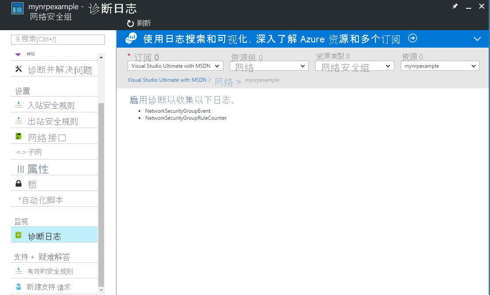
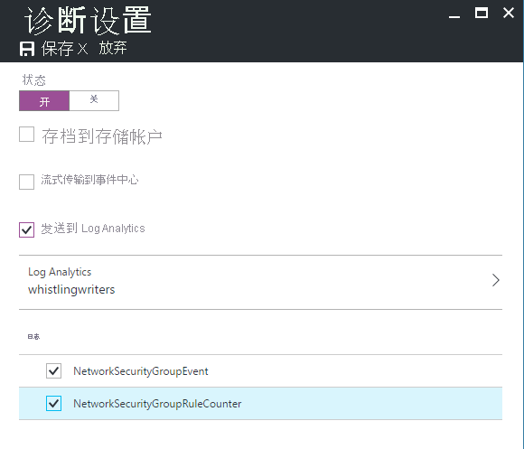
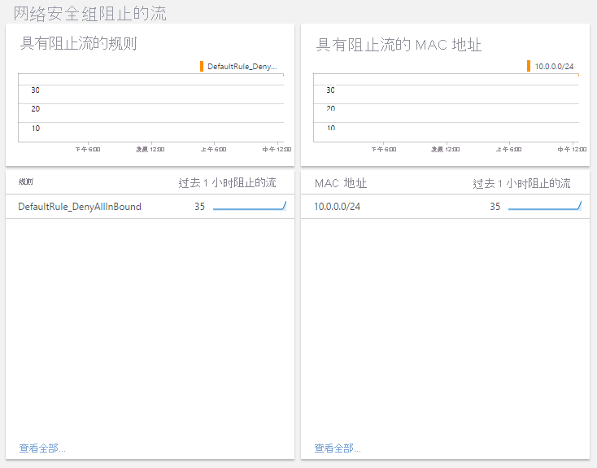
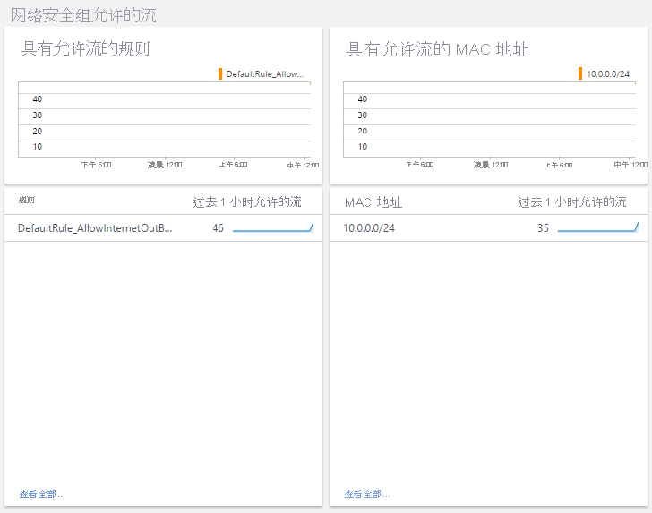

# <a name="azure-networking-monitoring-solutions-in-azure-monitor"></a>Azure Monitor 中的 Azure 网络监视解决方案

[!INCLUDE [updated-for-az](../../../includes/updated-for-az.md)]

Azure Monitor 提供了以下用于监视网络的解决方案：
* 网络性能监视器 (NPM)
    * 监视网络的运行状况
* 要查看的 Azure 应用程序网关分析
    * Azure 应用程序网关日志
    * Azure 应用程序网关指标
* 用于监视和审核云网络上的网络活动的解决方案
    * [流量分析](../../networking/network-monitoring-overview.md#traffic-analytics) 
    * Azure 网络安全组分析

## <a name="network-performance-monitor-npm"></a>网络性能监视器 (NPM)

[网络性能监视器](../../networking/network-monitoring-overview.md)管理解决方案是一个网络监视解决方案，它监视网络的运行状况、可用性和可访问性。  它用来监视以下项之间的连接：

* 公有云与本地
* 数据中心和用户位置（分支机构）
* 托管多层应用程序的各个层次的子网。

有关详细信息，请参阅[网络性能监视器](../../networking/network-monitoring-overview.md)。

## <a name="network-security-group-analytics"></a>网络安全组分析

1. 将管理解决方案添加到 Azure Monitor；并且
2. 启用诊断以将诊断信息定向到 Azure Monitor 中的 Log Analytics 工作区。 不需要将日志写入 Azure Blob 存储。

如果未启用诊断日志，该资源的仪表板边栏选项卡将为空，并显示一条错误消息。

## <a name="azure-application-gateway-analytics"></a>Azure 应用程序网关分析

1. 启用诊断以将诊断信息定向到 Azure Monitor 中的 Log Analytics 工作区。
2. 使用应用程序网关的工作簿模板来使用资源的详细摘要。

如果未对应用程序网关启用诊断日志，则仅在工作簿中填充默认的指标数据。


> [!NOTE]
> 2017 年 1 月，将应用程序网关和网络安全组中的日志发送到 Log Analytics 工作区的受支持方式已发生更改。 如果看到了“Azure 网络分析(已弃用)”解决方案，请参阅 [migrating from the old Networking Analytics solution](#migrating-from-the-old-networking-analytics-solution)（从旧的网络分析解决方案迁移）了解需要执行的步骤。
>
>

## <a name="review-azure-networking-data-collection-details"></a>查看 Azure 网络数据收集详细信息
Azure 应用程序网关分析和网络安全组分析管理解决方案直接从 Azure 应用程序网关和网络安全组收集诊断日志。 不需要将日志写入 Azure Blob 存储，且数据收集无需代理。

下表显示了数据收集方法，以及有关如何为 Azure 应用程序网关分析和网络安全组分析收集数据的其他详细信息。

| 平台 | 直接代理 | Systems Center Operations Manager 代理 | Azure | 需要 Operations Manager？ | Operations Manager 代理数据通过管理组发送 | 收集频率 |
| --- | --- | --- | --- | --- | --- | --- |
| Azure |  |  |&#8226; |  |  |登录时 |


### <a name="enable-azure-application-gateway-diagnostics-in-the-portal"></a>在门户中启用 Azure 应用程序网关诊断

1. 在 Azure 门户中，转到要监视的应用程序网关资源。
2. 选择 " *诊断设置* " 打开以下页面。

   

   [](media/azure-networking-analytics/application-gateway-diagnostics-2.png#lightbox)

5. 单击选中“发送到 Log Analytics”复选框。
6. 选择现有 Log Analytics 工作区，或创建一个工作区。
7. 在“日志”下，单击选中要收集的每种类型日志的复选框。
8. 单击“保存”，以启用在 Azure Monitor 中记录诊断日志。

#### <a name="enable-azure-network-diagnostics-using-powershell"></a>使用 PowerShell 启用 Azure 网络诊断

下面的 PowerShell 脚本示例展示了如何为应用程序网关启用资源日志记录。

```powershell
$workspaceId = "/subscriptions/d2e37fee-1234-40b2-5678-0b2199de3b50/resourcegroups/oi-default-east-us/providers/microsoft.operationalinsights/workspaces/rollingbaskets"

$gateway = Get-AzApplicationGateway -Name 'ContosoGateway'

Set-AzDiagnosticSetting -ResourceId $gateway.ResourceId  -WorkspaceId $workspaceId -Enabled $true
```

#### <a name="accessing-azure-application-gateway-analytics-via-azure-monitor-network-insights"></a>通过 Azure Monitor 网络见解访问 Azure 应用程序网关分析

可以通过应用程序网关资源中的 "见解" 选项卡访问 application insights。


"查看详细指标" 选项卡将打开预填充的工作簿，并汇总应用程序网关上的数据。

[](media/azure-networking-analytics/application-gateway-workbook.png#lightbox)

## <a name="migrating-from-azure-gateway-analytics-solution-to-azure-monitor-workbooks"></a>从 Azure 网关分析解决方案迁移到 Azure Monitor 工作簿

> [!NOTE]
> Azure 应用程序网关分析解决方案已过时，但使用分析的建议方法是通过应用程序网关资源 Azure Monitor 网络见解公开的工作簿。

* 如果已启用诊断设置以将日志存储到 Log Analytics 工作区中，Azure Monitor 网络见解工作簿可以使用来自同一位置的数据。 不需要任何新配置。

* 已启用点诊断设置后，工作簿中已有所有过去的数据可用。 不需要数据传输。

* 切换到工作簿时，无需活动切换。 分析解决方案和网络见解工作簿都可以并行工作。

* Azure Monitor 工作簿不会产生额外的费用。 根据使用情况，Log Analytics 工作区将继续计费。

* 若要从工作区清理 Azure 网关分析解决方案，可以从解决方案资源页中删除解决方案。

[](media/azure-networking-analytics/application-gateway-analytics-delete.png#lightbox)

## <a name="azure-network-security-group-analytics-solution-in-azure-monitor"></a>Azure Monitor 中的 Azure 网络安全组分析解决方案


> [!NOTE]
> 网络安全组分析解决方案正迁往社区支持，因为其功能已被[流量分析](../../network-watcher/traffic-analytics.md)取代。
> - [Azure 快速入门模板](https://azure.microsoft.com/resources/templates/oms-azurensg-solution/)目前提供该解决方案，但该解决方案很快将从 Azure 市场下架。
> - 对于已向其工作区添加该解决方案的现有客户，它将继续运行，不会有任何变化。
> - Microsoft 将继续支持使用“诊断设置”将 NSG 资源日志发送到你的工作区。

网络安全组支持以下日志：

* NetworkSecurityGroupEvent
* NetworkSecurityGroupRuleCounter

### <a name="install-and-configure-the-solution"></a>安装和配置解决方案
使用以下说明安装和配置 Azure 网络分析解决方案：

1. 使用[从解决方案库中添加 Azure Monitor 解决方案](./solutions.md)中所述的流程，启用 Azure 网络安全组分析解决方案。
2. 为想要监视的[网络安全组](../../virtual-network/virtual-network-nsg-manage-log.md)资源启用诊断日志记录。

### <a name="enable-azure-network-security-group-diagnostics-in-the-portal"></a>在门户中启用 Azure 网络安全组诊断

1. 在 Azure 门户中，导航到要监视的网络安全组资源
2. 选择“诊断日志”打开以下页面

   
3. 单击“打开诊断”打开以下页面

   
4. 若要打开诊断，请单击“状态”下面的“打开” 
5. 单击“发送到 Log Analytics”对应的复选框
6. 选择现有的 Log Analytics 工作区，或创建一个工作区
7. 对于要收集的每种日志类型，请单击“日志”下面的复选框
8. 单击“保存”，启用在 Log Analytics 中记录诊断日志

### <a name="enable-azure-network-diagnostics-using-powershell"></a>使用 PowerShell 启用 Azure 网络诊断

下面的 PowerShell 脚本示例展示了如何为网络安全组启用资源日志记录
```powershell
$workspaceId = "/subscriptions/d2e37fee-1234-40b2-5678-0b2199de3b50/resourcegroups/oi-default-east-us/providers/microsoft.operationalinsights/workspaces/rollingbaskets"

$nsg = Get-AzNetworkSecurityGroup -Name 'ContosoNSG'

Set-AzDiagnosticSetting -ResourceId $nsg.ResourceId  -WorkspaceId $workspaceId -Enabled $true
```

### <a name="use-azure-network-security-group-analytics"></a>使用 Azure 网络安全组分析
在“概述”中单击“Azure 网络安全组分析”磁贴后，可以查看日志摘要，并钻取以下类别的详细信息：

* 网络安全组阻止的流
  * 具有阻止流的网络安全组规则
  * 具有阻止流的 MAC 地址
* 网络安全组允许的流
  * 具有允许流的网络安全组规则
  * 具有允许流的 MAC 地址





在“Azure 网络安全组分析”仪表板上，查看其中一个边栏选项卡中的摘要信息，并单击一项摘要，在日志搜索页查看其详细信息。

在任何日志搜索页上，都可以按时间、详细结果和日志搜索历史记录查看结果。 也可以按方面进行筛选以缩减搜索结果。

## <a name="migrating-from-the-old-networking-analytics-solution"></a>从旧的网络分析解决方案迁移
2017 年 1 月，将 Azure 应用程序网关和 Azure 网络安全组中的日志发送到 Log Analytics 工作区的受支持方式已发生更改。 这些更改带来了以下优势：
+ 日志是直接写入到 Azure Monitor，而无需使用存储帐户
+ 从日志生成到在 Azure Monitor 中可用的延迟时间已缩短
+ 配置步骤更少
+ 所有类型的 Azure 诊断的通用格式

若要使用更新的解决方案，请执行以下操作：

1. [将诊断配置为直接从 Azure 应用程序网关发送到 Azure Monitor](#enable-azure-application-gateway-diagnostics-in-the-portal)
2. [将诊断配置为直接从 Azure 网络安全组发送到 Azure Monitor](#enable-azure-network-security-group-diagnostics-in-the-portal)
2. 使用[从解决方案库中添加 Azure Monitor 解决方案](solutions.md)中所述的流程，启用 Azure 应用程序网关分析和 Azure 网络安全组分析解决方案
3. 更新所有已保存的查询、仪表板或警报，以使用的新数据类型
   + 新类型为 AzureDiagnostics。 可以使用 ResourceType 筛选 Azure 网络日志。

     | 不是： | 使用： |
     | --- | --- |
     | NetworkApplicationgateways &#124; where OperationName=="ApplicationGatewayAccess" | AzureDiagnostics &#124; where ResourceType=="APPLICATIONGATEWAYS" and OperationName=="ApplicationGatewayAccess" |
     | NetworkApplicationgateways &#124; where OperationName=="ApplicationGatewayPerformance" | AzureDiagnostics &#124; where ResourceType=="APPLICATIONGATEWAYS" and OperationName=="ApplicationGatewayPerformance" |
     | NetworkSecuritygroups | AzureDiagnostics &#124; where ResourceType=="NETWORKSECURITYGROUPS" |

   + 对于名称中包含 \_s、\_d 或 \_g 后缀的任何字段，请将第一个字符更改为小写
   + 对于名称中包含 \_o 后缀的任何字段，数据会根据嵌套的字段名称拆分为单个字段。
4. 删除“Azure 网络分析(已弃用)”解决方案。
   + 如果使用的是 PowerShell，请使用 `Set-AzureOperationalInsightsIntelligencePack -ResourceGroupName <resource group that the workspace is in> -WorkspaceName <name of the log analytics workspace> -IntelligencePackName "AzureNetwork" -Enabled $false`

在发生此项更改之前收集的数据不会显示在新解决方案中。 可以继续使用旧类型和字段名称查询此数据。

## <a name="troubleshooting"></a>疑难解答
[!INCLUDE [log-analytics-troubleshoot-azure-diagnostics](../../../includes/log-analytics-troubleshoot-azure-diagnostics.md)]

## <a name="next-steps"></a>后续步骤
* 使用 [Azure Monitor 中的日志查询](../log-query/log-query-overview.md)查看详细的 Azure 诊断数据。

