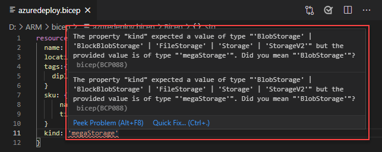

# <a name="quickstart-create-bicep-files-with-visual-studio-code"></a>快速入门：使用 Visual Studio Code 创建 Bicep 文件

Visual Studio Code 的 Bicep 扩展提供语言支持和资源自动完成功能。 这些工具可帮助创建和验证 [Bicep](./bicep-overview.md) 文件。 在本快速入门中，你将使用该扩展从头开始创建 Bicep 文件。 这样做时，你会体验到扩展功能，例如验证和完成。

[!INCLUDE [Bicep preview](../../../includes/resource-manager-bicep-preview.md)]

若要完成本快速入门，需要使用装有 [Bicep 扩展](https://marketplace.visualstudio.com/items?itemName=ms-azuretools.vscode-bicep)的 [Visual Studio Code](https://code.visualstudio.com/)。 此外，需要安装最新 [Azure CLI](/cli/azure/) 或最新 [Azure PowerShell 模块](/powershell/azure/new-azureps-module-az)并完成身份验证。

如果还没有 Azure 订阅，可以在开始前[创建一个免费帐户](https://azure.microsoft.com/free/)。

## <a name="create-a-bicep-file"></a>创建 Bicep 文件

使用 Visual Studio Code 创建并打开名为 azuredeploy.bicep 的新文件。

## <a name="add-an-azure-resource"></a>添加 Azure 资源

向 bicep 文件中添加基本存储帐户资源。

```bicep
resource stg 'Microsoft.Storage/storageAccounts@2019-06-01' = {
  name: 'storageaccount1' // must be globally unique
  location: 'eastus'
  tags:{
    diplayName: 'storageaccount1'
  }
  sku: {
      name: 'Standard_LRS'
      tier: 'Standard'
  }
  kind: 'Storage'
}
```

资源声明具有四个组件：

- **resource**：关键字。
- **符号名称** (stg)：符号名称是用于在整个 bicep 文件中引用资源的标识符。 它不是在部署资源时的资源名称。 资源名称由 **name** 属性定义。  请参阅此列表中的第四个组件。
- **资源类型** (Microsoft.Storage/storageAccounts@2019-06-01)：它包括资源提供程序 (Microsoft.Storage)、资源类型 (storageAccounts) 和 apiVersion (2019-06-01)。 每个资源提供程序都发布了其自身的 API 版本，因此此值与特定的类型相关。 可以从 [ARM 模板参考](/azure/templates/)中查找各种 Azure 资源的更多类型和 apiVersion。
- **属性**（= {...} 中的任何内容）：指定资源类型的属性。 每个资源都有一个 `name` 属性。 大多数资源还有一个 `location` 属性，该属性用于设置资源部署到的区域。 其他属性因资源类型和 API 版本而异。

有关详细信息，请参阅 [Bicep 结构](./bicep-file.md)。

名称属性有一个注释。  将 `//` 用于单行注释或将 `/* ... */` 用于多行注释

## <a name="completion-and-validation"></a>完成和验证

该扩展的最强大功能之一是与 Azure 架构的集成。 Azure 架构为扩展提供了验证和资源感知的完成功能。 让我们修改存储帐户，通过实际操作来了解验证和完成。

首先，将存储帐户类型更新为某个无效值，例如 `megaStorage`。 可以看到，此操作导致生成了一条警告，指出 `megaStorage` 不是有效值。



若要使用完成功能，请删除 `megaStorage`，将光标置于单引号内，然后按 `ctrl` + `space`。 此操作会显示有效值的完成列表。


## <a name="add-parameters"></a>添加参数

现在，创建并使用一个参数来指定存储帐户名称。

将以下代码添加到文件开头：

```bicep
@minLength(3)
@maxLength(24)
@description('Specify a storage account name.')
param storageAccountName string
```

Azure 存储帐户名称的最小长度为 3 个字符，最大长度为 24 个字符。 使用 `minLength` 和 `maxLength` 来提供合适的值。

现在，在存储资源中，将名称属性更新为使用该参数。 为此，请删除当前存储资源名称（包括单引号）。 按 `ctrl` + `space`。 从列表中选择 **storageAccountName** 参数。 请注意，在 Bicep 中可以使用参数名称直接引用参数。 JSON 模板需要一个 parameter() 函数。


## <a name="deploy-the-bicep-file"></a>部署 Bicep 文件

使用 `ctrl` + ```` ` ```` 组合键打开集成的 Visual Studio Code 终端，将当前目录更改为 Bicep 文件所在的目录，然后使用 Azure CLI 或 Azure PowerShell 模块部署 Bicep 文件。

# <a name="cli"></a>[CLI](#tab/CLI)

```azurecli
az group create --name arm-vscode --location eastus

az deployment group create --resource-group arm-vscode --template-file azuredeploy.bicep --parameters storageAccountName={your-unique-name}
```

# <a name="powershell"></a>[PowerShell](#tab/PowerShell)

```azurepowershell
New-AzResourceGroup -Name arm-vscode -Location eastus

New-AzResourceGroupDeployment -ResourceGroupName arm-vscode -TemplateFile ./azuredeploy.bicep -storageAccountName "{your-unique-name}"
```

---

## <a name="clean-up-resources"></a>清理资源

如果不再需要本文中创建的 Azure 资源，请使用 Azure CLI 或 Azure PowerShell 模块删除快速入门资源组。

# <a name="cli"></a>[CLI](#tab/CLI)

```azurecli
az group delete --name arm-vscode
```

# <a name="powershell"></a>[PowerShell](#tab/PowerShell)

```azurepowershell
Remove-AzResourceGroup -Name arm-vscode
```

---

## <a name="next-steps"></a>后续步骤

> [!div class="nextstepaction"]
> [初学者 Bicep 教程](./bicep-tutorial-create-first-bicep.md)
