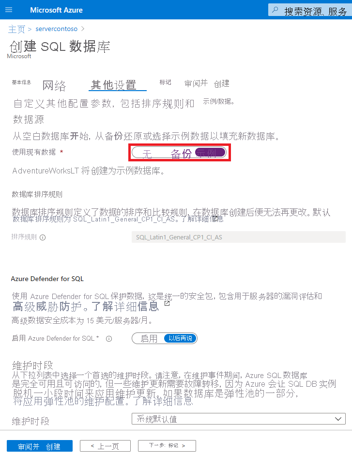

# <a name="quickstart-create-an-azure-sql-database-single-database"></a>快速入门：创建 Azure SQL 数据库单一数据库

在本快速入门中，你将使用 Azure 门户、PowerShell 脚本或 Azure CLI 脚本在 Azure SQL 数据库中创建[单一数据库](single-database-overview.md)。 然后，在 Azure 门户中使用“查询编辑器”查询该数据库。


## <a name="prerequisite"></a>先决条件

- 一个有效的 Azure 订阅。 如果没有帐户，请[创建一个免费帐户](https://azure.microsoft.com/free/)。

## <a name="create-a-single-database"></a>创建单一数据库

本快速入门在[无服务器计算层](serverless-tier-overview.md)中创建单一数据库。

# <a name="portal"></a>[门户](#tab/azure-portal)

若要在 Azure 门户中创建单一数据库，本快速入门将从 Azure SQL 页面开始。

1. 浏览[选择 SQL 部署选项](https://portal.azure.com/#create/Microsoft.AzureSQL)页。
1. 在“SQL 数据库”下将“资源类型”设置保留为“单一数据库”，然后选择“创建”   。

   

1. 在“创建 SQL 数据库”窗体的“基本信息”选项卡上的“项目详细信息”下，选择所需的 Azure订阅   。
1. 对于“资源组”，选择“新建”，输入“myResourceGroup”，然后选择“确定” 。
1. 对于“数据库名称”，输入“mySampleDatabase”。
1. 对于“服务器”，选择“新建”，并使用以下值填写“新服务器”窗体  ：
   - **服务器名称**：输入“mysqlserver”并添加一些字符以实现唯一性。 我们无法提供要使用的确切服务器名称，因为对于 Azure 中的所有服务器，服务器名称必须全局唯一，而不只是在订阅中唯一。 因此，输入类似于 mysqlserver12345 的名称，然后门户会告知你是否可用。
   - **服务器管理员登录名**：输入“azureuser”。
   - **密码**：输入符合要求的密码，然后在“确认密码”字段中再次输入该密码。
   - 位置：从下拉列表中选择一个位置。

   选择“确定”。

1. 将“想要使用 SQL 弹性池”设置保留为“否” 。
1. 在“计算 + 存储”下选择“配置数据库” 。
1. 此快速入门使用无服务器数据库，因此请选择“无服务器”，然后选择“应用” 。 

      

1. 在完成时选择“下一步:网络”。

   

1. 在“网络”选项卡上，对于“连接方法”，选择“公共终结点”  。
1. 对于“防火墙规则”，将“添加当前客户端 IP 地址”设置为“是”  。 将“允许 Azure 服务和资源访问此服务器”设置保留为“否” 。
1. 在完成时选择“下一步:其他设置”。

   
  

1. 在“其他设置”选项卡上的“数据源”部分中，对于“使用现有数据”，请选择“示例”。 这将创建一个 AdventureWorksLT 示例数据库，此数据库包含可查询和试验的一些表和数据，而不是一个空数据库。
1. （可选）启用 [Azure Defender for SQL](../database/azure-defender-for-sql.md)。
1. （可选）设置[维护时段](../database/maintenance-window.md)，以便在数据库的最佳时间执行计划内维护。
1. 在页面底部选择“查看 + 创建”：

   

1. 在“查看 + 创建”页上，查看后选择“创建”。 

# <a name="azure-cli"></a>[Azure CLI](#tab/azure-cli)

## <a name="launch-azure-cloud-shell"></a>启动 Azure Cloud Shell

Azure Cloud Shell 是免费的交互式 shell，可以使用它运行本文中的步骤。 它预安装有常用 Azure 工具并将其配置与帐户一起使用。 

若要打开 Cloud Shell，只需要从代码块的右上角选择“试一试”。  也可以通过转到 [https://shell.azure.com](https://shell.azure.com) 在单独的浏览器标签页中启动 Cloud Shell。 选择“复制”以复制代码块，将其粘贴到 Cloud Shell 中，然后按 Enter 来运行它。

## <a name="set-parameter-values"></a>设置参数值

后续命令使用以下值来创建数据库和所需资源。 服务器名称需要在整个 Azure 中全局唯一，因此使用 $RANDOM 函数创建服务器名称。 替换 IP 地址范围中的 0.0.0.0 值，以匹配你的特定环境。

```azurecli-interactive
# Set the resource group name and location for your server
resourceGroupName=myResourceGroup
location=eastus

# Set an admin login and password for your database
adminlogin=azureuser
password=Azure1234567!

# Set a server name that is unique to Azure DNS (<server_name>.database.windows.net)
serverName=server-$RANDOM

# Set the ip address range that can access your database
startip=0.0.0.0
endip=0.0.0.0
```

## <a name="create-a-resource-group"></a>创建资源组

使用“[az group create](/cli/azure/group)”命令创建资源组。 Azure 资源组是在其中部署和管理 Azure 资源的逻辑容器。 以下示例在 eastus 位置创建名为 myResourceGroup 的资源组：  

```azurecli-interactive
az group create --name $resourceGroupName --location $location
```

## <a name="create-a-server"></a>创建服务器

使用 [az sql server create](/cli/azure/sql/server) 命令创建服务器。

```azurecli-interactive
az sql server create \
    --name $serverName \
    --resource-group $resourceGroupName \
    --location $location  \
    --admin-user $adminlogin \
    --admin-password $password
```


## <a name="configure-a-firewall-rule-for-the-server"></a>配置服务器的防火墙规则

使用 [az sql server firewall-rule create](/cli/azure/sql/server/firewall-rule) 命令创建防火墙规则。

```azurecli-interactive
az sql server firewall-rule create \
    --resource-group $resourceGroupName \
    --server $serverName \
    -n AllowYourIp \
    --start-ip-address $startip \
    --end-ip-address $endip
```


## <a name="create-a-single-database-with-azure-cli"></a>使用 Azure CLI 创建单一数据库

使用 [az sql db create](/cli/azure/sql/db) 命令创建数据库。 以下代码将创建


```azurecli-interactive
az sql db create \
    --resource-group $resourceGroupName \
    --server $serverName \
    --name mySampleDatabase \
    --sample-name AdventureWorksLT \
    --edition GeneralPurpose \
    --compute-model Serverless \
    --family Gen5 \
    --capacity 2
```


# <a name="powershell"></a>[PowerShell](#tab/azure-powershell)

可以使用 Windows PowerShell 创建资源组、服务器和单一数据库。

## <a name="launch-azure-cloud-shell"></a>启动 Azure Cloud Shell

Azure Cloud Shell 是免费的交互式 shell，可以使用它运行本文中的步骤。 它预安装有常用 Azure 工具并将其配置与帐户一起使用。 

若要打开 Cloud Shell，只需要从代码块的右上角选择“试一试”。  也可以通过转到 [https://shell.azure.com](https://shell.azure.com) 在单独的浏览器标签页中启动 Cloud Shell。 选择“复制”以复制代码块，将其粘贴到 Cloud Shell 中，然后按 Enter 来运行它。

## <a name="set-parameter-values"></a>设置参数值

后续命令使用以下值来创建数据库和所需资源。 服务器名称需要在整个 Azure 中全局唯一，因此使用 Get-Random cmdlet 创建服务器名称。 替换 IP 地址范围中的 0.0.0.0 值，以匹配你的特定环境。

```azurepowershell-interactive
   # Set variables for your server and database
   $resourceGroupName = "myResourceGroup"
   $location = "eastus"
   $adminLogin = "azureuser"
   $password = "Azure1234567!"
   $serverName = "mysqlserver-$(Get-Random)"
   $databaseName = "mySampleDatabase"

   # The ip address range that you want to allow to access your server
   $startIp = "0.0.0.0"
   $endIp = "0.0.0.0"

   # Show randomized variables
   Write-host "Resource group name is" $resourceGroupName
   Write-host "Server name is" $serverName
```


## <a name="create-resource-group"></a>创建资源组

使用 [New-AzResourceGroup](/powershell/module/az.resources/new-azresourcegroup) 创建 Azure 资源组。 资源组是在其中部署和管理 Azure 资源的逻辑容器。

```azurepowershell-interactive
   Write-host "Creating resource group..."
   $resourceGroup = New-AzResourceGroup -Name $resourceGroupName -Location $location -Tag @{Owner="SQLDB-Samples"}
   $resourceGroup
```


## <a name="create-a-server"></a>创建服务器

使用 [New-AzSqlServer](/powershell/module/az.sql/new-azsqlserver) cmdlet 创建服务器。

```azurepowershell-interactive
  Write-host "Creating primary server..."
   $server = New-AzSqlServer -ResourceGroupName $resourceGroupName `
      -ServerName $serverName `
      -Location $location `
      -SqlAdministratorCredentials $(New-Object -TypeName System.Management.Automation.PSCredential `
      -ArgumentList $adminLogin, $(ConvertTo-SecureString -String $password -AsPlainText -Force))
   $server
```

## <a name="create-a-firewall-rule"></a>创建防火墙规则

使用 [New-AzSqlServerFirewallRule](/powershell/module/az.sql/new-azsqlserverfirewallrule) cmdlet 创建服务器防火墙规则。

```azurepowershell-interactive
   Write-host "Configuring server firewall rule..."
   $serverFirewallRule = New-AzSqlServerFirewallRule -ResourceGroupName $resourceGroupName `
      -ServerName $serverName `
      -FirewallRuleName "AllowedIPs" -StartIpAddress $startIp -EndIpAddress $endIp
   $serverFirewallRule
```


## <a name="create-a-single-database-with-powershell"></a>使用 PowerShell 创建单一数据库

使用 [New-AzSqlDatabase](/powershell/module/az.sql/new-azsqldatabase) cmdlet 创建单一数据库。

```azurepowershell-interactive
   Write-host "Creating a gen5 2 vCore serverless database..."
   $database = New-AzSqlDatabase  -ResourceGroupName $resourceGroupName `
      -ServerName $serverName `
      -DatabaseName $databaseName `
      -Edition GeneralPurpose `
      -ComputeModel Serverless `
      -ComputeGeneration Gen5 `
      -VCore 2 `
      -MinimumCapacity 2 `
      -SampleName "AdventureWorksLT"
   $database
```

---


## <a name="query-the-database"></a>查询数据库

创建数据库后，可以使用 Azure 门户中的“查询编辑器(预览)”连接到该数据库并查询数据。

1. 在门户中搜索并选择“SQL 数据库”，然后从列表中选择你的数据库。
1. 在数据库页面的左侧菜单中，选择“查询编辑器(预览)”。
1. 输入服务器管理员登录信息，然后选择“确定”。

   

1. 在“查询编辑器”窗格中输入以下查询。

   ```sql
   SELECT TOP 20 pc.Name as CategoryName, p.name as ProductName
   FROM SalesLT.ProductCategory pc
   JOIN SalesLT.Product p
   ON pc.productcategoryid = p.productcategoryid;
   ```

1. 选择“运行”，然后在“结果”窗格中查看查询结果。 

   

1. 关闭“查询编辑器”页，并在系统提示时选择“确定”，以放弃未保存的修改 。

## <a name="clean-up-resources"></a>清理资源

保留资源组、服务器和单一数据库可以继续执行后续步骤，并了解如何以不同的方法连接和查询数据库。

用完这些资源后，可以删除创建的资源组，这也会删除该资源组中的服务器和单一数据库。

### <a name="portal"></a>[Portal](#tab/azure-portal)

若要使用 Azure 门户删除 **myResourceGroup** 及其包含的所有资源：

1. 在 Azure 门户中搜索并选择“资源组”，然后从列表中选择“myResourceGroup”。 
1. 在资源组页上，选择“删除资源组”。
1. 在“键入资源组名称”下输入 *myResourceGroup*，然后选择“删除”。 

### <a name="azure-cli"></a>[Azure CLI](#tab/azure-cli)

若要删除资源组及其包含所有资源，请使用该资源组的名称运行以下 Azure CLI 命令：

```azurecli-interactive
az group delete --name $resourceGroupName
```

### <a name="powershell"></a>[PowerShell](#tab/azure-powershell)

若要删除资源组及其包含所有资源，请使用该资源组的名称运行以下 PowerShell cmdlet：

```azurepowershell-interactive
Remove-AzResourceGroup -Name $resourceGroupName
```

---

## <a name="next-steps"></a>后续步骤

使用不同的工具与语言[连接和查询](connect-query-content-reference-guide.md)数据库：
> [!div class="nextstepaction"]
> [使用 SQL Server Management Studio 连接和查询](connect-query-ssms.md)
>
> [使用 Azure Data Studio 连接和查询](/sql/azure-data-studio/quickstart-sql-database?toc=/azure/sql-database/toc.json)

希望优化并节省云支出？

> [!div class="nextstepaction"]
> [使用成本管理开始分析成本](../../cost-management-billing/costs/quick-acm-cost-analysis.md?WT.mc_id=costmanagementcontent_docsacmhorizontal_-inproduct-learn)