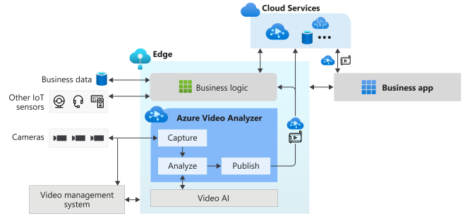

# Azure 视频分析器是什么？ （预览版）

Azure 视频分析器提供了一个平台，可用于构建跨越边缘和云的智能视频应用程序。 该平台包含一个 IoT Edge 模块和一个关联的 Azure 服务。 它提供了捕获、录制和分析实时视频的功能，同时还能发布结果（视频和/或视频分析）。 视频可发布到边缘或视频分析器云服务，而视频分析可发布到 Azure 服务（云和/或边缘）。 该平台可用于通过视频分析增强 IoT 解决方案。 视频分析器功能可与其他 Azure IoT Edge 模块（例如 IoT Edge 上的流分析、IoT Edge 上的认知服务）和云中的 Azure 服务（例如事件中心和认知服务等）相结合，构建强大的混合（例如边缘+云）应用程序。

视频分析器边缘模块设计成可扩展平台，以便可以连接到不同的视频分析边缘模块（例如认知服务容器、使用开源机器学习模型或通过自己的数据训练的自定义模型构建的自定义边缘模块），并使用这些模块来分析实时视频，而不必担心构建和运行实时视频管道的复杂性。 视频分析器云服务使你可以播放此类工作流中的视频和视频分析。

## 加速 IoT 解决方案开发 

将视频分析与来自其他 IoT 传感器的信号和/或业务数据相结合的 IoT 解决方案可以帮助自动或半自动制定业务决策，从而提高工作效率。 视频分析器使你可以更快构建此类解决方案。 通过此平台，你可以专注于构建特定于业务的视频分析模块和逻辑，不必担心管理和运行视频管道的复杂性。

借助视频分析器，你可以继续将 [CCTV 摄像头](https://en.wikipedia.org/wiki/Closed-circuit_television_camera)与现有[视频管理系统 (VMS)](https://en.wikipedia.org/wiki/Video_management_system) 结合使用，并独立地构建视频分析应用。 视频分析器可与计算机视觉 SDK 和工具包结合使用，以构建先进的 IoT 解决方案。 下图对此进行了说明。

### 概念

* 管道
* [视频录制](video-recording.md)
* [连续视频录制](continuous-video-recording.md)
* [基于事件的视频录制](event-based-video-recording-concept.md)
* [在不录制视频的情况下使用视频分析器](analyze-live-video-without-recording.md)

## 符合性、隐私和安全性

需要重点提醒的是，在使用视频分析器时，你必须遵守所有适用法律，不得以侵犯他人权利或可能对他人有害的方式使用视频分析器或任何 Azure 服务。

在视频分析器处理任何视频之前，你必须拥有使用该视频的所有适当权限，根据法律要求，包括获得视频/图像中的个人（如果有）授予的，在视频分析器和 Azure 中使用、处理和存储其数据的所有必要许可。 某些司法辖区可能会对收集、在线处理和存储某些类别的数据（例如生物识别数据）施加特殊的法律要求。 在使用视频分析器和 Azure 来处理以及存储任何必须满足特殊法律要求的数据之前，必须确保符合可能适用于你的任何法律要求。

如需了解视频分析器中的合规性、隐私性和安全性，请访问 Microsoft [信任中心](https://www.microsoft.com/TrustCenter/CloudServices/Azure/default.aspx)。 若要了解 Microsoft 的隐私义务、数据处理和保留惯例，包括如何删除数据，请查看 Microsoft 的[隐私声明](https://privacy.microsoft.com/PrivacyStatement)、[在线服务条款](https://www.microsoft.com/licensing/product-licensing/products?rtc=1)（“OST”）和[数据处理附录](https://www.microsoftvolumelicensing.com/DocumentSearch.aspx?Mode=3&DocumentTypeId=67)（“DPA”）。 使用视频分析器，即表示你同意遵守 OST、DPA 和隐私声明。

## 后续步骤

* 请参阅《[快速入门：入门 - Azure 视频分析器](get-started-detect-motion-emit-events.md)》一文，了解如何对实时视频源运行运动检测。
* 查看[术语](terminology.md)
