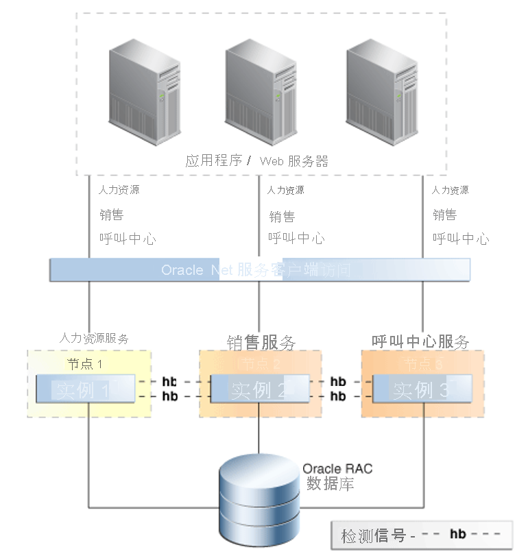

# Azure BareMetal 上的 Oracle 的高可用性功能

本文介绍 Oracle 的关键高可用性和灾难恢复功能。

Oracle 提供了许多功能来构建用于运行 Oracle 数据库的弹性平台。 尽管无法单凭一项功能来解决每种类型的故障，但通过以分层方式组合技术，可创建高度可用的系统。 维持可用性并不会需要每项功能。 但通过组合策略，可提供最佳保护，避免发生各种故障。 

## 闪回数据库

[闪回数据库](https://docs.oracle.com/en/database/oracle/oracle-database/21/rcmrf/FLASHBACK-DATABASE.html#GUID-584AC79A-40C5-45CA-8C63-DED3BE3A4511)功能是 Oracle Database Enterprise Edition 中提供的功能。 闪回数据库功能可将数据库后退到特定时间点。 此功能不同于[恢复管理器 (RMAN)](https://docs.oracle.com/en/cloud/paas/db-backup-cloud/csdbb/performing-general-restore-and-recovery-operations.html) 时间点恢复，它从当前时间后退，而不是在还原后前进。 因此，闪回数据库的完成时间更快。
 
可以将此功能与 [Oracle Data Guard](https://docs.oracle.com/en/database/oracle/oracle-database/19/sbydb/preface.html#GUID-B6209E95-9DA8-4D37-9BAD-3F000C7E3590) 结合使用。 使用闪回数据库，数据库管理员无需进行完整 RMAN 还原和恢复即可将故障数据库重新实例化为 Data Guard 配置。 利用此功能，可以更快地还原灾难恢复功能（以及卸载的报告和 Active Data Guard 的备份优势）。
 
可以对备用数据库使用此功能，而不是时间延迟的恢复。 备用数据库可以闪回到出现问题之前的某个时间点。
 
Oracle Database 将闪回日志保留在快速恢复区域 (FRA) 中。 这些日志独立于恢复日志，需要在 FRA 中占用更多空间。 默认情况下，闪回日志保留 24 小时，但你可以根据需要更改此设置。

## Oracle Real Application Clusters

[Oracle Real Application Clusters (RAC)](https://docs.oracle.com/en/database/oracle/oracle-database/19/racad/introduction-to-oracle-rac.html#GUID-5A1B02A2-A327-42DD-A1AD-20610B2A9D92) 允许多个互连的服务器作为一个数据库服务呈现给最终用户和应用程序。 此功能消除了许多故障点，并且是普遍接受的 Oracle 数据库高可用性主动/主动解决方案。

如下图所示，按照 Oracle 的[高可用性概述和最佳做法](https://docs.oracle.com/en/database/oracle/oracle-database/19/haovw/ha-features.html)，应用程序层中呈现了一个 RAC 数据库。 应用程序连接到 SCAN侦听器，后者将流量定向到特定数据库实例。 RAC 控制来自多个实例的访问，以便在不同的计算节点之间保持数据一致性。

如果一个实例失败，该服务可在所有其他剩余实例上继续。 解决方案上部署的每个数据库都采用 n + 1 的 RAC 配置，其中 n 是支持服务所需的最小处理能力。

Oracle Database 服务用于在实例暂时故障时，允许在节点之间进行故障转移。 此类故障可能是计划内故障或计划外故障。 使用应用程序（快速应用程序通知事件），服务可在实例不可用时移动到仍正常运行的节点。 服务移动到服务配置中指定为“首选”或“可用”的节点。

Oracle Database 服务的另一个关键功能是仅根据服务角色启动服务。 进行 Data Guard 故障转移时，将使用此功能。 使用 Data Guard 部署的所有模式都需要将数据库服务链接到 Data Guard 角色。

例如，可以创建两个服务：MY\_DB\_APP 和 MY\_DB\_AS。 仅当数据库实例已启动，且 Data Guard 角色为 PRIMARY 时，才会启动 MY\_DB\_APP 服务。 仅当 Data Guard 角色为 PHYSICAL\_STANDBY 时，才会启动 MY\_DB\_AS。 此配置允许应用程序指向 \_APP 服务以及报告，报告可以卸载到 Active Standby，并指向 \_ 服务。

## Oracle 数据防护

使用 Data Guard，可以在单独的物理硬件上维护数据库的相同副本。 理想情况下，该硬件应远离主数据库。 Data Guard 不会施加任何距离限制，但距离对保护模式有影响。 距离增加会使站点之间的延迟增长，这可能会导致某些选项（例如同步复制）不再可行。

与存储级别的复制相比，Data Guard 具有以下优势：

- 由于复制是数据库感知的，因此只复制相关流量。
- 某些工作负载会在临时表空间中生成大量输入/输出，而备用数据库中不需要这些输入/输出，因此不会复制它们。
- 对复制块的验证在备用数据库上进行，因此主数据库上的物理损坏不会复制到备用数据库。
- 防止块内逻辑损坏和写入丢失损坏。 它还消除了将存储管理员所犯错误复制到备用数据库的风险。
恢复可能会延迟一段预先确定的时间，因此用户错误不会立即复制到备用数据库。

## Azure NetApp 文件快照

BareMetal 中使用的 NetApp 文件存储解决方案可用于创建卷的快照。 快照可让你快速将文件系统还原到特定时间点。 快照技术支持恢复时间目标 (RTO) 时间（还原数据库备份所需的一小部分时间）。

可通过 Azure NetApp SnapCenter 获得 Oracle 数据库的快照功能。 SnapCenter 启用快照用于备份，SnapVault 提供脱机保管库，而 Snap Clone 支持自助式还原和其他操作。 有关详细信息，请查看 [BareMetal 基础结构上 Oracle 的 SnapCenter 集成](netapp-snapcenter-integration-oracle-baremetal.md)。

## 恢复管理器

恢复管理器 (RMAN) 是进行物理数据库备份的首选实用工具。 RMAN 与数据库控制文件（或集中式恢复目录）交互，以保护数据库的各种核心组件，包括：

- 数据库数据文件
- 存档的恢复日志
- 数据库控制文件
- 数据库初始化文件 (spfile)

RMAN 可用于进行热数据库备份或冷数据库备份。 可以使用这些备份来创建备用数据库，或将数据库复制到克隆环境。 RMAN 还具有还原验证函数。 此函数可读取备份集，并确定是否可以使用备份集将数据库恢复到特定时间点。

由于 RMAN 是 Oracle 提供的实用工具，因此它会读取数据库文件的内部结构。 这允许你在备份和还原操作期间运行物理和逻辑损坏检查。 你还可以恢复数据库数据文件，并将单个数据文件和表空间还原到特定时间点。 这些是 RMAN 相较于存储快照的优势。 当无法使用快照时，RMAN 备份提供了防止数据完全丢失的最后一道防线。

## 后续步骤

了解有关针对在 BareMetal 基础结构上运行 Oracle 优化保护和性能的选项和建议：

> [!div class="nextstepaction"]
> [适用于 Oracle BareMetal 基础结构服务器的选项](options-considerations-high-availability.md)
