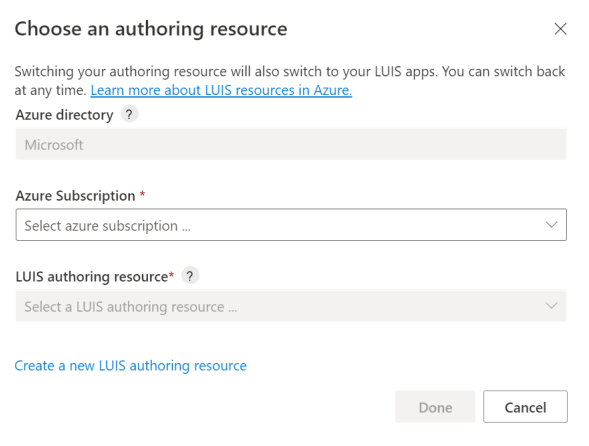

## 登录到 LUIS 门户

[!INCLUDE [Note about portal deprecation](luis-portal-note.md)]

LUIS 的新用户需要执行此过程：

1. 登录 [LUIS 门户](https://www.luis.ai)，选择你所在的国家/地区，然后同意使用条款。 如果看到“我的应用”，则 LUIS 资源已存在，你应该跳过此过程，开始创建应用。 如果没有，首先使用 Azure 资源，这使你能将 LUIS 帐户与新的或现有的 Azure 创作资源进行关联。 <!---This is equivalent to signing up already migrated. You won't need to go through the [migration process](../luis-migration-authoring.md#what-is-migration) later on.-->
<!---
    * Using a trial key. This allows you to sign in to LUIS with a trial resource that you don't need to set up. If you choose this option, you will eventually be required to [migrate your account](../luis-migration-authoring.md#migration-steps) and link your applications to an authoring resource.
-->

2. 在出现的“选择创作”窗口中，找到你的 Azure 订阅和 LUIS 创作资源。 如果没有资源，可新建一个。

    <!---:::image type="content" source="../media/luis-how-to-azure-subscription/choose-authoring-resource.png" alt-text="Choose a type of Language Understanding authoring resource.":::
    -->
    
    
    创建新的创作资源时，请提供以下信息：
    * **租户名称** - 与 Azure 订阅关联的租户。
    * **Azure 订阅名称** - 将对资源计费的订阅。
    * **Azure 资源组名称** - 你选择或创建的自定义资源组名称。 使用资源组可将 Azure 资源分组，以便进行访问和管理。
    * **Azure 资源名称** - 你选择的自定义名称，用作创作和预测终结点查询的 URL 的一部分。
    * **定价层** - 定价层确定每秒和每月的最大事务数。

