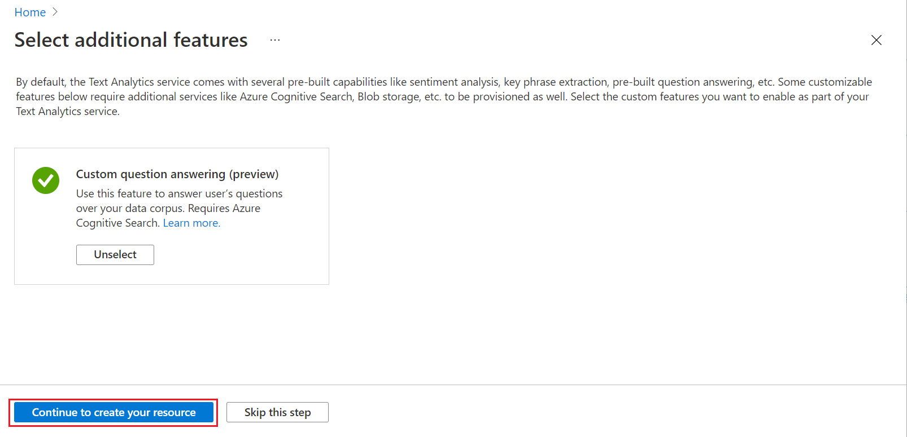

# 管理 QnA Maker 资源

在创建任何 QnA Maker 知识库之前，必须先在 Azure 中设置 QnA Maker 服务。 任何有权在订阅中创建新资源的人都可以设置 QnA Maker 服务。 如果要试用自定义问答功能，则需要创建文本分析资源并添加自定义问答功能。

创建资源之前，对以下概念有深入的理解非常有帮助：

* [QnA Maker 资源](../Concepts/azure-resources.md)
* [创作和发布密钥](../Concepts/azure-resources.md#keys-in-qna-maker)

## 新建 QnA Maker 服务

# [QnA Maker GA（稳定版本）](#tab/v1)

此过程创建管理知识库内容所需的 Azure 资源。 完成这些步骤后，可以在 Azure 门户中资源的“密钥”页面上找到订阅密钥。

1. 登录 Azure 门户并[创建 QnA Maker](https://ms.portal.azure.com/#create/Microsoft.CognitiveServicesQnAMaker) 资源。

1. 阅读条款和条件后，选择“创建”：

    

1. 在 QnA Maker 中，选择适当的层和区域：

    

    * 在“名称”字段中，输入一个唯一的名称来标识此 QnA Maker 服务。 此名称还会标识知识库将关联到的 QnA Maker 终结点。
    * 选择将部署 QnA Maker 资源的订阅。
    * 为 QnA Maker 管理服务（门户和管理 API）选择定价层。 查看[有关 SKU 定价的更多详细信息](https://aka.ms/qnamaker-pricing)。
    * 创建新的资源组（推荐），或使用现有的资源组来在其中部署此 QnA Maker 资源。 QnA Maker 会创建多个 Azure 资源。 创建用于保存这些资源的资源组时，可以通过资源组名称轻松查找、管理和删除这些资源。
    * 选择一个“资源组位置”。
    * 选择 Azure 认知搜索服务的“搜索定价层”。 如果“免费层”选项不可用（以灰色显示），这意味着你已通过订阅部署了免费的服务。 在这种情况下，需要从“基本”层开始操作。 请参阅 [Azure 认知搜索定价详细信](https://azure.microsoft.com/pricing/details/search/)。
    * 选择要部署 Azure 认知搜索索引的搜索位置。 对必须存储客户数据的位置进行限制有助于确定为 Azure 认知搜索选择的位置。
    * 在“应用名称”字段中，输入 Azure 应用服务实例的名称。
    * 默认情况下，应用服务默认使用标准 (S1) 层。 可以在创建后更改该计划。 详细了解[服务定价](https://azure.microsoft.com/pricing/details/app-service/)。
    * 选择将部署应用服务的“网站位置”。

        > [!NOTE]
        > “搜索位置”可以与“网站位置”不同 。

    * 选择是否要启用 Application Insights。 如果启用了 **Application Insights**，则 QnA Maker 会收集有关流量、聊天日志和错误的遥测数据。
    * 选择将部署 Application Insights 资源的 App insights 位置。
    * 为了节省成本，可以[共享](configure-QnA-Maker-resources.md#configure-qna-maker-to-use-different-cognitive-search-resource)为 QnA Maker 创建的某些 Azure 资源，但不是所有。

1. 验证所有字段后，请选择“创建”。 此过程可能需要几分钟才能完成。

1. 部署完成后，会在订阅中看到创建的以下资源：

   

    具有“认知服务”类型的资源具有订阅密钥 。

# [自定义问答（预览版）](#tab/v2)

此过程创建管理知识库内容所需的 Azure 资源。 完成这些步骤后，可以在 Azure 门户中资源的“密钥”页面上找到订阅密钥。

1.  登录到 Azure 门户并[创建文本分析](https://ms.portal.azure.com/#create/Microsoft.CognitiveServicesTextAnalytics)资源。

2.  选择要添加到文本分析资源的自定义问答功能。 单击“继续创建资源”。

> [!div class="mx-imgBorder"]
> 

3.  为文本分析资源选择适当的层级和区域。 对于自定义问答功能，请选择搜索位置和定价层。

> [!div class="mx-imgBorder"]
> 

   * 选择将在其中部署文本分析资源的“订阅”。
   * 创建新的资源组（推荐）或使用现有的资源组，以在其中部署此文本分析资源。 使用文本分析资源启用自定义问答将创建较少的 Azure 资源。 创建用于保存这些资源的资源组时，可以通过资源组名称轻松查找、管理和删除这些资源。
   * 在“名称”字段中，输入一个独一无二的名称来标识此文本分析资源。 
   * 选择要在其中部署文本分析资源的“位置”。 管理 API 和服务终结点将托管在此位置。 
   * 选择文本分析服务的“定价层”。 查看[有关 SKU 定价的更多详细信息](https://aka.ms/qnamaker-pricing)。
   * 选择要部署 Azure 认知搜索索引的搜索位置。 对必须存储客户数据的位置进行限制有助于确定为 Azure 认知搜索选择的位置。
   * 选择 Azure 认知搜索服务的“搜索定价层”。 如果“免费层”选项不可用（以灰色显示），这意味着你已通过订阅部署了免费的服务。 在这种情况下，需要从“基本”层开始操作。 请参阅 [Azure 认知搜索定价详细信](https://azure.microsoft.com/pricing/details/search/)。

4.  验证所有字段后，请选择“评审 + 创建”。 此过程可能需要几分钟才能完成。

> [!div class="mx-imgBorder"]
> 

5.  部署完成后，会在订阅中看到创建的以下资源：

> [!div class="mx-imgBorder"]
> 

   具有“认知服务”类型的资源具有订阅密钥 。

---

## 升级 Azure 资源

# [QnA Maker GA（稳定版本）](#tab/v1)

### 升级 QnA Maker SKU

想要在知识库中获得超出当前层能力范围的更多问题和解答，请升级 QnA Maker 服务定价层。

升级 QnA Maker 管理 SKU：

1. 转到 Azure 门户中的 QnA Maker 资源，然后选择“定价层”。

    

1. 选择合适的 SKU 并按“选择”。

    
    
### 升级应用服务

当知识库需要处理来自客户端应用的更多请求时，请升级应用服务定价层。

你可以[纵向扩展](../../../app-service/manage-scale-up.md)或横向扩展应用服务。

转到 Azure 门户中的应用服务资源，并根据需要选择“纵向扩展”或“横向扩展”选项 。

### 升级 Azure 认知搜索服务

如果计划拥有许多知识库，请升级 Azure 认知搜索服务定价层。

目前，不能执行 Azure 搜索 SKU 的就地升级。 但是，你可以使用所需的 SKU 创建新的 Azure 搜索资源、将数据还原到新资源，然后将其链接到 QnA Maker 堆栈。 要实现这一点，请执行下列操作：

1. 在 Azure 门户中创建新的 Azure 搜索资源，然后选择所需的 SKU。

    

1. 将索引从原始 Azure 搜索资源还原到新资源。 请参阅[备份还原示例代码](https://github.com/pchoudhari/QnAMakerBackupRestore)。

1. 还原数据后，转到新的 Azure 搜索资源，选择“密钥”，并记下“名称”和“管理密钥”  ：

    

1. 若要将新的 Azure 搜索资源链接到 QnA Maker 堆栈，请转到 QnA Maker 应用服务实例。

    

1. 选择“应用程序设置”并修改步骤 3 中“AzureSearchName”和“AzureSearchAdminKey”字段的设置  。

    

1. 重启应用服务实例。

    
    
### 免费搜索资源的非活动策略

如果未使用 QnA maker 资源，则应删除所有资源。 如果不删除未使用的资源，则在创建免费搜索资源时，知识库将停止工作。

免费搜索资源在 90 天后将被删除，而不会收到 API 调用。
    
# [自定义问答（预览版）](#tab/v2)

### 升级 Azure 认知搜索服务

如果计划拥有许多知识库，请升级 Azure 认知搜索服务定价层。

目前，不能执行 Azure 搜索 SKU 的就地升级。 但是，你可以使用所需的 SKU 创建新的 Azure 搜索资源，将数据还原到新资源，然后将其链接到自定义问答堆栈。 要实现这一点，请执行下列操作：

1. 在 Azure 门户中创建新的 Azure 搜索资源，然后选择所需的 SKU。

    

1. 将索引从原始 Azure 搜索资源还原到新资源。 请参阅[备份还原示例代码](https://github.com/pchoudhari/QnAMakerBackupRestore)。

1. 将新的 Azure 搜索资源链接到[文本分析资源的“特征”选项卡](https://docs.microsoft.com/azure/cognitive-services/qnamaker/how-to/configure-qna-maker-resources?tabs=v2#configure-qna-maker-managed-preview-service-to-use-different-cognitive-search-resource)中的自定义问答功能。

### 免费搜索资源的非活动策略

如果不使用 QnA Maker 或文本分析资源，则应删除所有资源。 如果不删除未使用的资源，则在创建免费搜索资源时，知识库将停止工作。

免费搜索资源在 90 天后将被删除，而不会收到 API 调用。

---

## 删除 Azure 资源

如果删除了用于知识库的任何 Azure 资源，则知识库将不再工作。 在删除任何资源之前，请务必从“设置”页导出知识库。

## 后续步骤

详细了解[应用服务](../../../app-service/index.yml)和[搜索服务](../../../search/index.yml)。

> [!div class="nextstepaction"]
> [如何与他人一起创作](../index.yml)
