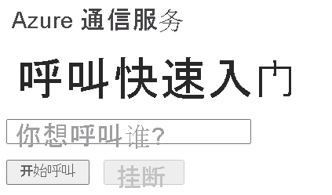

[!INCLUDE [Emergency Calling Notice](../../../includes/emergency-calling-notice-include.md)]
## <a name="prerequisites"></a>先决条件

- 具有活动订阅的 Azure 帐户。 [免费创建帐户](https://azure.microsoft.com/free/?WT.mc_id=A261C142F)。 
- 已部署的通信服务资源。 [创建通信服务资源](../../create-communication-resource.md)。
- 在通信服务资源中获取的电话号码。 [如何获取电话号码](../../telephony-sms/get-phone-number.md)。
- 用于启用呼叫客户端的`User Access Token`。 详细了解[如何获取`User Access Token`](../../access-tokens.md)
- 完成[开始向应用程序添加呼叫](../getting-started-with-calling.md)快速入门

### <a name="prerequisite-check"></a>先决条件检查

- 若要查看与通信服务资源关联的电话号码，请登录到 [Azure 门户](https://portal.azure.com/)，找到通信服务资源，然后从左侧导航窗格中打开“电话号码”选项卡。
- 可以通过适用于 JavaScript 的 Azure 通信服务呼叫客户端库来生成和运行应用：

```console
npx webpack-dev-server --entry ./client.js --output bundle.js
```

## <a name="setting-up"></a>设置

### <a name="add-pstn-functionality-to-your-app"></a>向应用添加 PSTN 功能

使用电话拨号控件扩展布局。

将此代码放在 index.html 的 `<body />` 节末尾、`<script />` 标记之前：

```html
<input 
  id="callee-phone-input"
  type="text"
  placeholder="Phone number you would like to dial"
  style="margin-bottom:1em; width: 230px;"
/>
<div>
  <button id="call-phone-button" type="button">
    Start Phone Call
  </button>
  &nbsp;
  <button id="hang-up-phone-button" type="button" disabled="true">
    Hang Up Phone Call
  </button>
</div>
```

使用电话服务功能扩展应用程序逻辑。

将此代码添加到 client.js 中：

```javascript
const calleePhoneInput = document.getElementById("callee-phone-input");
const callPhoneButton = document.getElementById("call-phone-button");
const hangUpPhoneButton = document.getElementById("hang-up-phone-button");
```

## <a name="start-a-call-to-phone"></a>发起电话呼叫

指定在通信服务资源中获取的电话号码，该号码将用于发起呼叫：
> [!WARNING]
> 请注意，电话号码应采用 E.164 国际标准格式。 （例如：+12223334444）

添加事件处理程序，以在单击 `callPhoneButton` 时向你提供的电话号码发起呼叫：


```javascript
callPhoneButton.addEventListener("click", () => {
  // start a call to phone
  const phoneToCall = calleePhoneInput.value;
  call = callAgent.call(
    [{phoneNumber: phoneToCall}], { alternateCallerId: {phoneNumber: '+18336528005'}
  });

  // toggle button states
  hangUpPhoneButton.disabled = false;
  callPhoneButton.disabled = true;
});
```

## <a name="end-a-call-to-phone"></a>结束电话呼叫

添加事件侦听器，以便在单击 `hangUpPhoneButton` 时结束当前呼叫：

```javascript
hangUpPhoneButton.addEventListener("click", () => {
  // end the current call
  call.hangUp({
    forEveryone: true
  });

  // toggle button states
  hangUpPhoneButton.disabled = true;
  callPhoneButton.disabled = false;
});
```

`forEveryone` 属性结束所有呼叫参与者的呼叫。

## <a name="run-the-code"></a>运行代码

使用 `webpack-dev-server` 生成并运行应用。 运行以下命令，在本地 Web 服务器上捆绑应用程序主机：


```console
npx webpack-dev-server --entry ./client.js --output bundle.js
```

打开浏览器并导航到 `http://localhost:8080/`。 应该看到以下内容：




可以通过在添加的文本字段中提供电话号码，然后单击“发起电话呼叫”按钮来呼叫真实电话号码。

> [!WARNING]
> 请注意，电话号码应采用 E.164 国际标准格式。 （例如：+12223334444）
