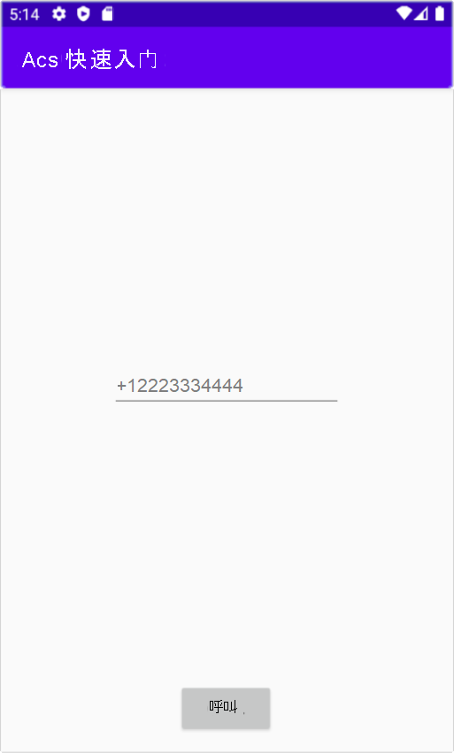

[!INCLUDE [Emergency Calling Notice](../../../../includes/emergency-calling-notice-include.md)]

> [!NOTE]
> 在 [GitHub](https://github.com/Azure-Samples/communication-services-android-quickstarts/tree/main/Add%20Telephone%20Calling) 上查找此快速入门的最终代码

## <a name="prerequisites"></a>必备条件

- 具有活动订阅的 Azure 帐户。 [免费创建帐户](https://azure.microsoft.com/free/?WT.mc_id=A261C142F)。 
- 已部署的通信服务资源。 [创建通信服务资源](../../../create-communication-resource.md)。
- 在通信服务资源中获取的电话号码。 [如何获取电话号码](../../../telephony-sms/get-phone-number.md)。
- 用于启用呼叫客户端的`User Access Token`。 详细了解[如何获取`User Access Token`](../../../access-tokens.md)
- 完成[开始向应用程序添加呼叫](../../getting-started-with-calling.md)快速入门

### <a name="prerequisite-check"></a>先决条件检查

- 若要查看与通信服务资源关联的电话号码，请登录到 [Azure 门户](https://portal.azure.com/)，找到通信服务资源，然后从左侧导航窗格中打开“电话号码”选项卡。

## <a name="setting-up"></a>设置

### <a name="add-pstn-functionality-to-your-app"></a>向应用添加 PSTN 功能

通过修改 MainActivity.java，将 `PhoneNumber` 类型添加到应用中：


```java
import com.azure.android.communication.common.PhoneNumberIdentifier;
```

<!--
> [!TBD]
> Namespace based on input from Komivi Agbakpem. But it does not correlates with other use namespaces in Calling Quickstart. E.g: "com.azure.communication.calling.CommunicationUserIdentifier" or "com.azure.communication.common.client.CommunicationTokenCredential". Double-chek this.
-->

## <a name="start-a-call-to-phone"></a>发起电话呼叫

指定从通信服务资源中获取的电话号码。 该号码将用于发起呼叫：

> [!WARNING]
> 请注意，电话号码应采用 E.164 国际标准格式。 （例如：+12223334444）

修改 MainActivity.java 中的 `startCall()` 事件处理程序，使其处理电话呼叫：

```java
    private void startCall() {
        EditText calleePhoneView = findViewById(R.id.callee_id);
        String calleePhone = calleePhoneView.getText().toString();
        PhoneNumberIdentifier callerPhone = new PhoneNumberIdentifier("+12223334444");
        StartCallOptions options = new StartCallOptions();
        options.setAlternateCallerId(callerPhone);
        options.setVideoOptions(new VideoOptions(null));
        call = agent.startCall(
                getApplicationContext(),
                new PhoneNumberIdentifier[] {new PhoneNumberIdentifier(calleePhone)},
                options);
    }
```

## <a name="launch-the-app-and-call-the-echo-bot"></a>启动应用并呼叫回显机器人

现在可以使用工具栏上的“运行应用”按钮 (Shift+F10) 启动应用。 可以通过在添加的文本字段中提供电话号码，然后单击“呼叫”按钮来拨打电话。
> [!WARNING]
> 请注意，电话号码应采用 E.164 国际标准格式。 （例如：+12223334444）


