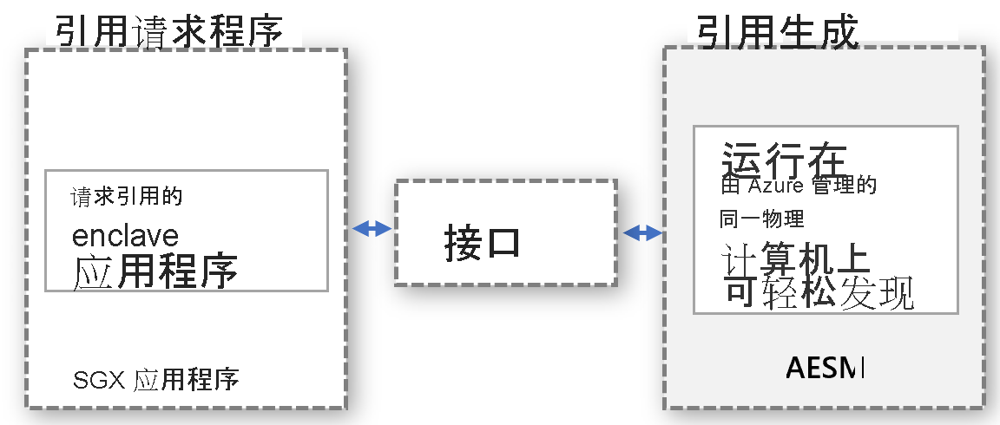

# <a name="platform-software-management-with-intel-sgx-quote-helper-daemonset-preview"></a>具有 Intel SGX 引用帮助程序 DaemonSet 的平台软件管理（预览版）

执行远程证明的 [enclave 应用程序](confidential-computing-enclaves.md)需要生成的引用。 此引用提供应用程序的标识和状态的加密证明，以及 enclave 正在运行的环境。 生成引用需要使用 Intel 平台软件组件 (PSW) 中的可信软件组件。

## <a name="overview"></a>概述
 
英特尔支持两种证明模式来运行引用生成：

- *进程内*：在 enclave 应用程序进程内托管可信软件组件。

- *进程外*：在 enclave 应用程序外托管可信软件组件。
 
默认情况下，通过开放式 Enclave SDK 构建的 Intel Software Guard Extension (Intel SGX) 应用程序使用进程内证明模式。 基于 Intel SGX 的应用程序允许进程外证明模式。 如果要使用此模式，则需要额外的托管，并且需要在应用程序外部公开所需的组件，如 Architectural Enclave Service Manager (AESM)。

此功能在 Intel 平台更新或 DCAP 驱动程序更新期间可增加 enclave 应用的正常运行时间。 因此，我们建议使用此功能。

若要在 Azure Kubernetes 服务 (AKS) 群集上启用此功能，请在启用机密计算外接程序时，将 `--enable-sgxquotehelper` 命令添加到 Azure CLI。 

```azurecli-interactive
# Create a new AKS cluster with system node pool with Confidential Computing addon enabled and SGX Quote Helper
az aks create -g myResourceGroup --name myAKSCluster --generate-ssh-keys --enable-addon confcom --enable-sgxquotehelper
```

有关详细信息，请参阅[快速入门：使用 Azure CLI 部署具有机密计算节点的 AKS 群集](confidential-nodes-aks-get-started.md)。

## <a name="benefits-of-the-out-of-process-mode"></a>进程外模式的优势

下面的列表描述了此证明模式的一些主要优势：

-   每个容器化应用程序的 PSW 引用生成组件都无需更新。 容器所有者不需要管理其容器内的更新。 容器所有者依赖提供商接口来调用容器外部的集中式服务。 提供商复制更新和管理容器。

-   无需担心由于 PSW 组件过期而导致证明失败。 提供商负责管理这些组件的更新。

-   与进程内模式相比，进程外模式可以更好地利用 EPC 内存。 在进程内模式下，每个 enclave 应用程序都需要实例化 QE 和 PCE 的副本以实现远程证明。 在进程外模式下，容器无需托管这些 enclave，因此不会消耗容器配额中的 enclave 内存。

-   将 Intel SGX 驱动程序向上游传输到 Linux 内核时，将强制 enclave 具有更高的特权。 此特权允许 enclave 调用 PCE，这将破坏在进程内模式下运行的 enclave 应用程序。 默认情况下，enclave 不会获取此权限。 向 enclave 应用程序授予此权限需要更改应用程序安装进程。 相反，在进程外模式中，处理进程外请求的服务提供商将确保服务在安装时具有此特权。

-   你无需检查与 PSW 和 DCAP 的后向兼容性。 提供商在更新 PSW 的引用生成组件之前会先验证这些组件的更新的后向兼容性。 这有助于在部署机密工作负载的更新之前处理兼容性问题。

## <a name="confidential-workloads"></a>机密工作负载

引用请求程序和引用生成单独执行，但在同一物理计算机上运行。 引用生成将集中进行，并服务于来自所有实体的引用请求。 若要任何实体可请求引用，需要正确定义接口并确保其可被发现。



此抽象模型利用现有的 AESM 服务，适用于机密工作负载场景。 AESM 在 Kubernetes 群集中作为 DaemonSet 进行容器化和部署。 Kubernetes 保证 AESM 服务容器的单个实例（包装在 Pod 中）部署到每个代理节点上。 新的 Intel SGX 引用 DaemonSet 将依赖于 sgx-device-plugin DaemonSet，因为 AESM 服务容器将从 sgx-device-plugin 请求 EPC 内存以启动 QE 和 PCE enclave。

每个容器都需要在创建过程中设置环境变量 `SGX_AESM_ADDR=1` 才能选择使用进程外引用生成。 容器还应包括包 libsgx-quote-ex，用于将请求定向到默认 Unix 域套接字。

应用程序仍可像以前一样使用进程内证明，但应用程序中不能同时使用进程内和进程外。 进程外基础结构默认可用并消耗资源。

## <a name="sample-implementation"></a>实现示例

下面的 Docker 文件是基于开放式 Enclave 的应用程序的示例。 在 Docker 文件中设置 `SGX_AESM_ADDR=1` 环境变量，或在部署文件中设置它。 下面的示例提供了 Docker 文件和部署的详细信息。 

  > [!Note] 
  > 为使进程外证明正常运行，需要将 Intel 提供的 libsgx-quote-ex 打包在应用程序容器中。
    
```yaml
# Refer to Intel_SGX_Installation_Guide_Linux for details
FROM ubuntu:18.04 as sgx_base
RUN apt-get update && apt-get install -y \
    wget \
    gnupg

# Add the repository to sources, and add the key to the list of
# trusted keys used by the apt to authenticate packages
RUN echo "deb [arch=amd64] https://download.01.org/intel-sgx/sgx_repo/ubuntu bionic main" | tee /etc/apt/sources.list.d/intel-sgx.list \
    && wget -qO - https://download.01.org/intel-sgx/sgx_repo/ubuntu/intel-sgx-deb.key | apt-key add -
# Add Microsoft repo for az-dcap-client
RUN echo "deb [arch=amd64] https://packages.microsoft.com/ubuntu/18.04/prod bionic main" | tee /etc/apt/sources.list.d/msprod.list \
    && wget -qO - https://packages.microsoft.com/keys/microsoft.asc | apt-key add -

FROM sgx_base as sgx_sample
RUN apt-get update && apt-get install -y \
    clang-7 \
    libssl-dev \
    gdb \
    libprotobuf10 \
    libsgx-dcap-ql \
    libsgx-quote-ex \
    az-dcap-client \
    open-enclave
WORKDIR /opt/openenclave/share/openenclave/samples/remote_attestation
RUN . /opt/openenclave/share/openenclave/openenclaverc \
    && make build
# This sets the flag for out-of-process attestation mode. Alternatively you can set this flag on the deployment files.
ENV SGX_AESM_ADDR=1 

CMD make run
```
或者，也可以在部署 yaml 文件中设置进程外证明模式。 方法如下：

```yaml
apiVersion: batch/v1
kind: Job
metadata:
  name: sgx-test
spec:
  template:
    spec:
      containers:
      - name: sgxtest
        image: <registry>/<repository>:<version>
        env:
        - name: SGX_AESM_ADDR
          value: 1
        resources:
          limits:
            kubernetes.azure.com/sgx_epc_mem_in_MiB: 10
        volumeMounts:
        - name: var-run-aesmd
          mountPath: /var/run/aesmd
      restartPolicy: "Never"
      volumes:
      - name: var-run-aesmd
        hostPath:
          path: /var/run/aesmd
```

## <a name="next-steps"></a>后续步骤

[快速入门：使用 Azure CLI 部署具有机密计算节点的 AKS 群集](./confidential-nodes-aks-get-started.md)

[机密容器快速入门示例](https://github.com/Azure-Samples/confidential-container-samples)

[DCsv2 SKU](../virtual-machines/dcv2-series.md)
