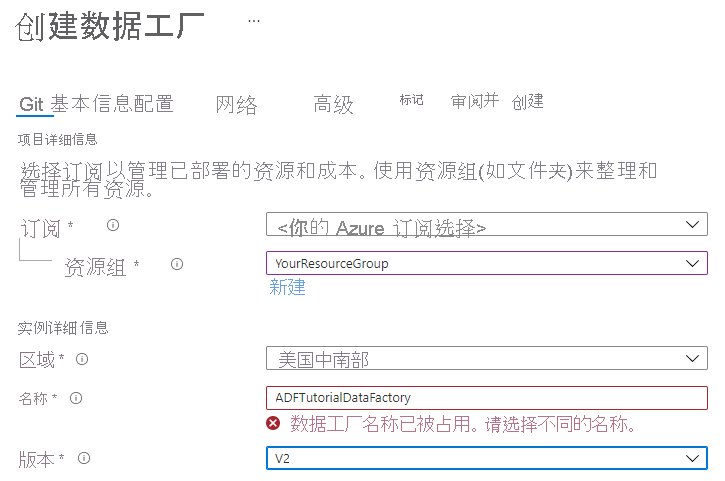
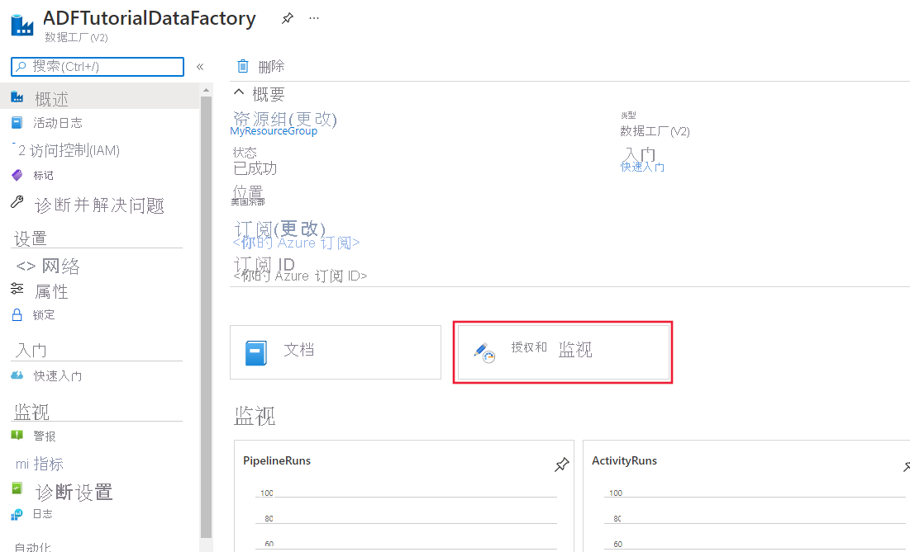

# <a name="copy-data-from-a-sql-server-database-to-azure-blob-storage-by-using-the-copy-data-tool"></a>使用“复制数据”工具将数据从 SQL Server 数据库复制到 Azure Blob 存储
> [!div class="op_single_selector" title1="选择所使用的数据工厂服务版本："]
> * [版本 1](v1/data-factory-copy-data-from-azure-blob-storage-to-sql-database.md)
> * [当前版本](tutorial-hybrid-copy-data-tool.md)

[!INCLUDE[appliesto-adf-xxx-md](includes/appliesto-adf-xxx-md.md)]

在本教程中，我们将使用 Azure 门户创建数据工厂。 然后，使用“复制数据”工具创建一个管道，用于将数据从 SQL Server 数据库复制到 Azure Blob 存储。

> [!NOTE]
> - 如果对 Azure 数据工厂不熟悉，请参阅[数据工厂简介](introduction.md)。

将在本教程中执行以下步骤：

> [!div class="checklist"]
> * 创建数据工厂。
> * 使用“复制数据”工具创建管道。
> * 监视管道和活动运行。

## <a name="prerequisites"></a>先决条件
### <a name="azure-subscription"></a>Azure 订阅
如果还没有 Azure 订阅，请在开始前[创建一个免费帐户](https://azure.microsoft.com/free/)。

### <a name="azure-roles"></a>Azure 角色
若要创建数据工厂实例，用于登录到 Azure 的用户帐户必须分配有“参与者”或“所有者”角色，或者必须是 Azure 订阅的管理员。

若要查看自己在订阅中的权限，请转到 Azure 门户。 在右上角选择自己的用户名，然后选择“权限”。 如果可以访问多个订阅，请选择相应的订阅。 有关如何将用户添加到角色的示例说明，请参阅[使用 Azure 门户添加或删除 Azure 角色分配](../role-based-access-control/role-assignments-portal.md)。

### <a name="sql-server-2014-2016-and-2017"></a>SQL Server 2014、2016 和 2017
在本教程中，需将 SQL Server 数据库用作源数据存储。 在本教程中创建的数据工厂中的管道将数据从这个 SQL Server 数据库（源）复制到 Blob 存储（接收器）。 然后，你可以在 SQL Server 数据库中创建名为 **emp** 的表，并向表中插入几个示例条目。

1. 启动 SQL Server Management Studio。 如果此软件尚未安装在计算机上，请访问[下载 SQL Server Management Studio](/sql/ssms/download-sql-server-management-studio-ssms)。

1. 使用凭据连接到 SQL Server 实例。

1. 创建示例数据库。 在树状视图中右键单击“数据库”，然后选择“新建数据库”。 

1. 在“新建数据库”窗口中输入数据库的名称，然后选择“确定”。

1. 若要创建 **emp** 表并将一些示例数据插入到其中，请对数据库运行以下查询脚本。 在树状视图中右键单击所创建的数据库，然后选择“新建查询”。

    ```sql
    CREATE TABLE dbo.emp
    (
        ID int IDENTITY(1,1) NOT NULL,
        FirstName varchar(50),
        LastName varchar(50)
    )
    GO

    INSERT INTO emp (FirstName, LastName) VALUES ('John', 'Doe')
    INSERT INTO emp (FirstName, LastName) VALUES ('Jane', 'Doe')
    GO
    ```

### <a name="azure-storage-account"></a>Azure 存储帐户
在本教程中，请使用常规用途的 Azure 存储帐户（具体说来就是 Blob 存储）作为目标/接收器数据存储。 如果没有常规用途的存储帐户，请参阅[创建存储帐户](../storage/common/storage-account-create.md)中的创建说明。 在本教程中创建的数据工厂中的管道将数据从 SQL Server 数据库（源）复制到此 Blob 存储（接收器）。 

#### <a name="get-the-storage-account-name-and-account-key"></a>获取存储帐户名称和帐户密钥
在本教程中，请使用存储帐户的名称和密钥。 若要获取存储帐户的名称和密钥，请执行以下步骤：

1. 使用 Azure 用户名和密码登录到 [Azure 门户](https://portal.azure.com)。

1. 在左窗格中，选择“所有服务”。 使用“存储”关键字进行筛选，然后选择“存储帐户”。 

    

1. 在存储帐户列表中，根据需要通过筛选找出你的存储帐户， 然后选择存储帐户。

1. 在“存储帐户”窗口中选择“访问密钥” 。


1. 复制“存储帐户名称”和“key1”框中的值，然后将其粘贴到记事本或其他编辑器中，在教程的后面部分使用。 

#### <a name="create-the-adftutorial-container"></a>创建 adftutorial 容器
此部分在 Blob 存储中创建名为 **adftutorial** 的 Blob 容器。

1. 在“存储帐户”窗口中切换到“概览”，然后选择“Blob”。

1. 在“Blob”窗口中，选择“+ 容器”。

1. 在“新建容器”窗口中的“名称”下输入“adftutorial”，然后选择“确定”。   

1. 在容器列表中选择“adftutorial”。


1. 让 **adftutorial** 的“容器”窗口保持打开状态。 在教程结束时使用它来验证输出。 数据工厂自动在该容器中创建输出文件夹，因此不需要你来创建。


## <a name="create-a-data-factory"></a>创建数据工厂

1. 在左侧菜单中，选择“创建资源” > “集成” > “数据工厂”  。

   

1. 在“新建数据工厂”页的“名称”下输入 **ADFTutorialDataFactory** 。

   数据工厂的名称必须全局唯一。 如果看到名称字段的以下错误消息，请更改数据工厂的名称（例如，改为 yournameADFTutorialDataFactory）。 有关数据工厂项目的命名规则，请参阅[数据工厂命名规则](naming-rules.md)。

   
1. 选择要在其中创建数据工厂的 Azure **订阅**。
1. 对于“资源组”，请执行以下步骤之一：

   - 选择“使用现有资源组”，并从下拉列表选择现有的资源组。 

   - 选择“新建”，并输入资源组的名称。 
        
     若要了解资源组，请参阅[使用资源组管理 Azure 资源](../azure-resource-manager/management/overview.md)。
1. 在“版本”下选择“V2”。 
1. 在“位置”下选择数据工厂的位置。 下拉列表中仅显示支持的位置。 数据工厂使用的数据存储（例如，Azure 存储和 SQL 数据库）和计算资源（例如，Azure HDInsight）可以位于其他位置/区域。
1. 选择“创建”。

1. 创建完以后，会看到图中所示的“数据工厂”页：

     
1. 选择“创作和监视”，在单独的选项卡中启动数据工厂用户界面。

## <a name="use-the-copy-data-tool-to-create-a-pipeline"></a>使用“复制数据”工具创建管道

1. 在“开始使用”页中选择“复制数据”，启动“复制数据”工具 。

   

1. 在“复制数据”工具的“属性”页的“任务名称”下，输入 **CopyFromOnPremSqlToAzureBlobPipeline**。  然后，选择“下一步”。 “复制数据”工具将使用在此字段中指定的名称创建一个管道。
  

1. 在“源数据存储”页面上，单击“创建新连接”。

1. 在“新建链接服务”下，搜索“SQL Server”，然后选择“继续”。

1. 在“新建链接服务(SQL Server)”对话框中的“名称”下输入“SqlServerLinkedService”  。 在“通过集成运行时连接”下选择“+新建”。  必须创建自承载的 Integration Runtime，将其下载到计算机，然后将其注册到数据工厂。 自承载的 Integration Runtime 时可在本地环境与云之间复制数据。

1. 在“集成运行时安装”对话框中选择“自承载”。  然后选择“继续”。

   

1. 在“集成运行时安装”对话框中的“名称”下输入 **TutorialIntegrationRuntime**。  然后选择“创建”。

1. 在“集成运行时安装”对话框中，选择“单击此处对此计算机启动快速安装”。  此操作在计算机上安装集成运行时，并将其注册到数据工厂。 或者，可以使用手动安装选项来下载安装文件、运行该文件，并使用密钥来注册集成运行时。

1. 运行下载的应用程序。 窗口中会显示快速安装的状态。

    

1. 在“新建链接服务(SQL Server)”对话框中，确认为“集成运行时”字段选择了 **TutorialIntegrationRuntime**。 然后执行以下步骤：

    a. 在“名称”下输入 **SqlServerLinkedService**。

    b. 在“服务器名称”下，输入 SQL Server 实例的名称。

    c. 在“数据库名称”下输入本地数据库的名称。

    d. 在“身份验证类型”下选择适当的身份验证。

    e. 在“用户名”下输入有权访问 SQL Server 的用户名。

    f. 输入该用户的 **密码**。

    g. 测试连接并选择“完成”。

      

1. 在“源数据存储”页中选择“下一步” 。

1. 在“选择要从中复制数据的表或使用自定义查询”页中，从列表中选择“[dbo].[emp]”表，然后选择“下一步”。   可以根据你的数据库选择任何其他表。

1. 在“目标数据存储”页面上，选择“创建新连接”


1. 在“新建链接服务”中，搜索并选择“Azure Blob”，然后选择“继续”。

   

1. 在“新建链接服务(Azure Blob 存储)”对话框中，执行以下步骤：

   a. 在“名称”下输入 **AzureStorageLinkedService**。

   b. 在“通过集成运行时连接”下，选择 **TutorialIntegrationRuntime**

   c. 在“存储帐户名称”下的下拉列表中选择自己的存储帐户。

   d. 选择“完成”。

1. 在“目标数据存储”对话框中，确保选择了“Azure Blob 存储”。 然后，选择“下一步”。

1. 在“选择输出文件或文件夹”对话框中，在“文件夹路径”下，输入 **adftutorial/fromonprem**。  在执行先决条件中的步骤时，你已创建了 **adftutorial** 容器。 如果输出文件夹（在本例中为 **fromonprem**）不存在，则数据工厂会自动创建它。 也可以使用“浏览”按钮来浏览 Blob 存储及其容器/文件夹。 如果没有在“文件名”下指定任何值，则默认情况下将使用源中的名称（在本例中为 **dbo.emp**）。

   

1. 在“文件格式设置”对话框中，选择“下一步”。 

1. 在“设置”对话框中，选择“下一步”。 

1. 在“摘要”对话框中，复查所有设置的值，然后选择“下一步”。 

1. 在“部署”页中，选择“监视”可以监视管道（任务） 。 

1. 管道运行完成后，可以查看所创建的管道的状态。 

1. 在“管道运行”页上，选择“刷新”来刷新列表。 单击“管道名称”下的链接，查看活动运行详细信息或重新运行管道。 

1. 在“活动运行”页上，选择“活动名称”列下的“详细信息”链接（眼镜图标），以获取有关复制操作的更多详细信息。 若要回到“管道运行”视图，请选择痕迹导航菜单中的“所有管道运行”链接。 若要刷新视图，请选择“刷新”。

1. 确认可以在 **adftutorial** 容器的 **fromonprem** 文件夹中看到输出文件。

1. 选择左侧的“编辑”选项卡可以切换到编辑器模式。 可以使用编辑器来更新该工具创建的链接服务、数据集和管道。 选择“代码”可以查看与编辑器中打开的实体相关联的 JSON 代码。 有关如何在数据工厂 UI 中编辑这些实体的详细信息，请参阅[此教程的 Azure 门户版本](tutorial-copy-data-portal.md)。


## <a name="next-steps"></a>后续步骤
此示例中的管道可将数据从 SQL Server 数据库复制到 Blob 存储。 你已了解如何：

> [!div class="checklist"]
> * 创建数据工厂。
> * 使用“复制数据”工具创建管道。
> * 监视管道和活动运行。

有关数据工厂支持的数据存储的列表，请参阅[支持的数据存储](copy-activity-overview.md#supported-data-stores-and-formats)。

若要了解如何将数据从源批量复制到目标，请继续学习以下教程：

> [!div class="nextstepaction"]
>[批量复制数据](tutorial-bulk-copy-portal.md)
