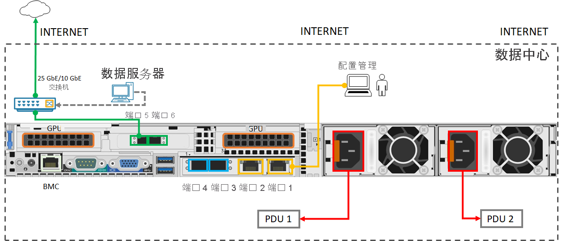

# 快速入门：开始使用 Azure Stack Edge Pro with GPU 

本快速入门详细介绍部署 Azure Stack Edge Pro GPU 设备的先决条件和所需步骤。 快速入门步骤在 Azure 门户以及设备的本地 Web UI 中完成。 

整个过程大约需要 1.5 小时才能完成。 有关详细的分步说明，请转至[教程：准备部署 Azure Stack Edge Pro GPU](azure-stack-edge-gpu-deploy-prep.md#deployment-configuration-checklist)。 

## 先决条件

部署之前，请确保满足以下先决条件：

1. 收到 Azure Stack Edge Pro GPU 设备，将设备[拆包](azure-stack-edge-gpu-deploy-install.md#unpack-the-device)并[装入机架](azure-stack-edge-gpu-deploy-install.md#rack-the-device)。 
1. 配置网络，使设备可访问[列出的 URL 模式和端口](azure-stack-edge-gpu-system-requirements.md#networking-port-requirements)。 
1. 对 Azure 订阅具有所有者或参与者访问权限。
1. 在 Azure 门户中，转到“主页”>“订阅”> 你的订阅 >“资源提供程序”。 搜索 `Microsoft.DataBoxEdge` 并注册该资源提供程序。 如果要创建 IoT 中心资源来部署计算工作负荷，请重复注册 `Microsoft.Devices`。
1. 确保为 Kubernetes 节点提供至少 2 个免费的连续静态 IP，为 IoT Edge 服务提供至少 1 个静态 IP。 对于部署的每个模块或外部服务，需要 1 个额外的 IP。
1. 请参阅[部署清单](azure-stack-edge-gpu-deploy-checklist.md)，获取设备配置所需的一切。 

## 部署步骤

1. **安装**：通过交叉电缆或 USB 以太网适配器将端口 1 连接到客户端计算机。 通过至少 1 GbE 交换机和 SFP+ 铜缆，将至少一个用于传输数据的其他设备端口（端口 3 到端口 6，最好是 25 GbE）连接到 Internet。 将提供的电源线连接到电源设备和单独的配电插座。 按下前面板上的电源按钮打开设备。  

    请参阅 [Cavium FastlinQ 41000 Series Interoperability Matrix](https://www.marvell.com/documents/xalflardzafh32cfvi0z/)（Cavium FastlinQ 41000 系列互操作性矩阵）和 [Mellanox 双端口 25G ConnectX-4 通道网络适配器兼容产品](https://docs.mellanox.com/display/ConnectX4LxFirmwarev14271016/Firmware+Compatible+Products)，以获取兼容的网络电缆和交换机。

    下面是部署设备所需的最低布线配置：

2. **连接**：在计算机的以太网适配器上配置 IPv4 设置，其中静态 IP 地址为 192.168.100.5，子网为 255.255.255.0。 打开浏览器并连接到设备的本地 Web UI，网址为 https://192.168.100.10 。 这可能需要几分钟的时间。 当你看到安全证书警告时，请继续浏览该网页。

3. **登录**：使用默认密码 Password1 登录设备。 更改设备管理员密码。 该密码必须包含 8 到 16 个字符，并且必须包含以下字符中的 3 项：大写字母、小写字母、数字和特殊字符。

4. **配置网络**：如果网络中有 DHCP 服务器，则接受已连接数据端口的默认 DHCP 配置。 如果没有，则提供 IP、DNS 服务器和默认网关。 请在[网络设置](azure-stack-edge-gpu-deploy-configure-network-compute-web-proxy.md#configure-network)中查看详细信息。

5. **配置计算网络**：通过在设备上启用端口来创建虚拟交换机。 在创建交换机的同一网络中，为 Kubernetes 节点输入 2 个免费的连续静态 IP。 为 IoT Edge 中心服务提供至少 1 个静态 IP 以访问计算模块；为要从 Kubernetes 群集外部访问的每个额外服务或容器提供至少 1 个静态 IP。 

    需要通过 Kubernetes 来部署所有容器化工作负荷。 请在[计算网络设置](azure-stack-edge-gpu-deploy-configure-network-compute-web-proxy.md#enable-compute-network)中查看详细信息。

6. **配置 Web 代理**：如果在环境中使用 Web 代理，请在 `http://<web-proxy-server-FQDN>:<port-id>` 中输入 Web 代理服务器 IP。 将身份验证设置为“无”。 请在 [Web 代理设置](azure-stack-edge-gpu-deploy-configure-network-compute-web-proxy.md#configure-web-proxy)中查看详细信息。

7. **配置设备**：输入设备名称和 DNS 域，或接受默认值。 

8. **配置更新服务器**：接受默认的 Microsoft 更新服务器，或指定 Windows Server Update Services (WSUS) 服务器以及其路径。 

9. **配置时间设置**：接受默认时间设置，或者在本地网络上或作为公用服务器设置时区、主 NTP 服务器和辅助 NTP 服务器。

10. **配置证书**：如果更改了设备名称和/或 DNS 域，则必须生成证书或添加证书以激活设备。 

    - 若要测试非生产工作负荷，请使用[“生成证书”选项](azure-stack-edge-gpu-deploy-configure-certificates.md#generate-device-certificates)。 
    - 如果使用自己的证书，包括签名链，则以适当的格式[添加证书](azure-stack-edge-gpu-deploy-configure-certificates.md#bring-your-own-certificates)。 确保先上传签名链。 请参阅[创建证书](azure-stack-edge-gpu-create-certificates-tool.md)和[通过本地 UI 上传证书](azure-stack-edge-gpu-deploy-configure-certificates.md#bring-your-own-certificates)。

11. **激活**：获取激活密钥 

    1. 在 Azure 门户中，转到“Azure Stack Edge 资源”>“概述”>“设备设置”>“激活”>“生成密钥”。 复制密钥。 
    1. 在本地 Web UI 中，转到“入门”>“激活”，并提供激活密钥。 应用密钥后，设备需要几分钟才能激活。 当系统提示你安全地存储将来进行恢复所需的设备密钥时，下载 `<device-serial-number>`.json 文件。 

12. **配置计算**：在 Azure 门户中，转到“概述”>“设备”。 确认设备处于联机状态。 在左窗格中，转到“边缘计算”>“入门”>“配置边缘计算”>“计算”。 提供现有或新的 IoT 中心服务，并等待大约 20 分钟的时间完成计算配置。 请在[教程：在 Azure Stack Edge Pro GPU 设备上配置计算](azure-stack-edge-gpu-deploy-configure-compute.md)中查看详细信息

现在即可在设备上[通过 IoT Edge](azure-stack-edge-gpu-deploy-sample-module-marketplace.md)、[通过 `kubectl`](azure-stack-edge-gpu-create-kubernetes-cluster.md) 或[通过启用了 Azure Arc 的 Kubernetes](azure-stack-edge-gpu-deploy-arc-kubernetes-cluster.md) 部署计算工作负荷！ 如果在设置过程中遇到任何问题，请转到[排查设备问题]()、[订购问题](azure-stack-edge-gpu-troubleshoot.md)、[证书问题](azure-stack-edge-gpu-certificate-troubleshooting.md)或 Kubernetes 问题。 

## 后续步骤

[安装 Azure Stack Edge Pro GPU](./azure-stack-edge-gpu-deploy-install.md)

