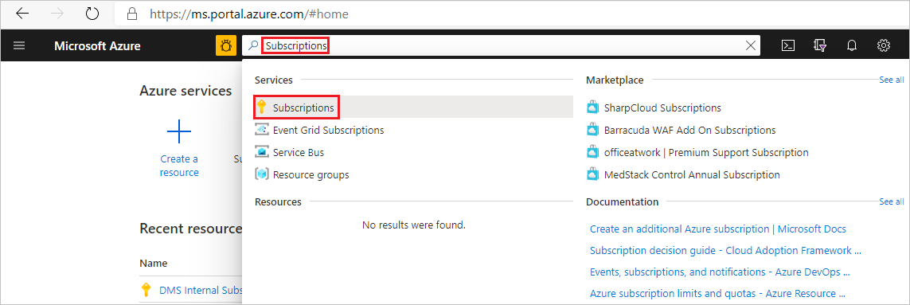
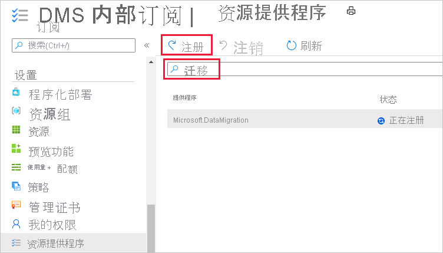
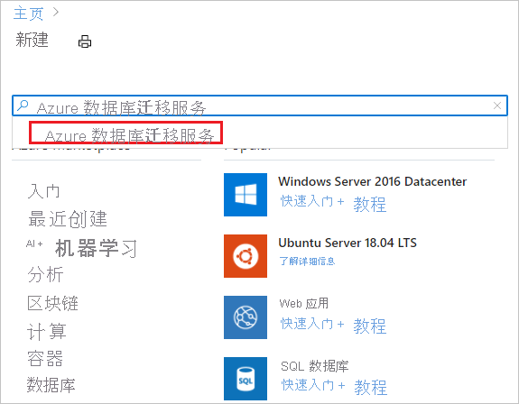
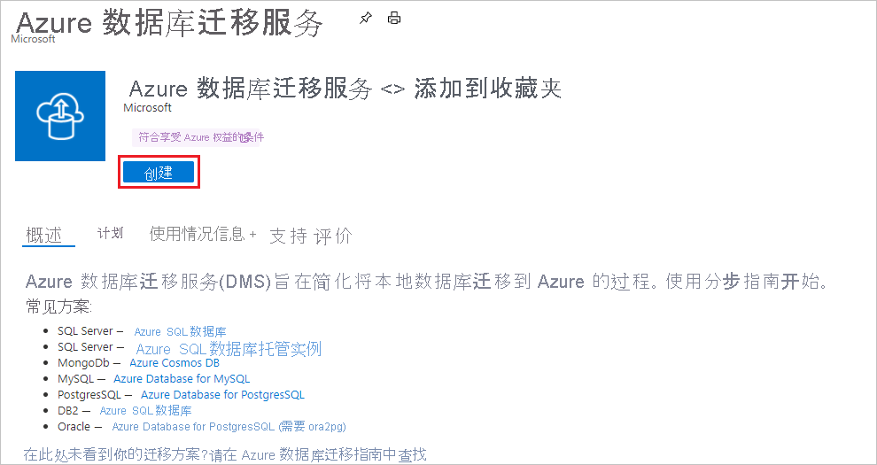
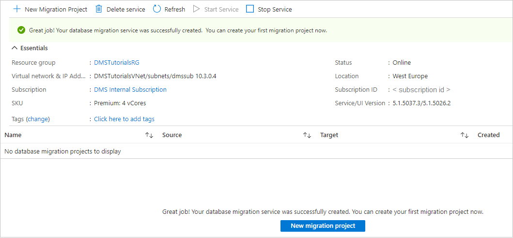

# 快速入门：使用 Azure 门户创建 Azure 数据库迁移服务实例

在本快速入门中，你将使用 Azure 门户创建 Azure 数据库迁移服务的实例。 创建实例后，可以使用该实例将多个数据库源的数据迁移到 Azure 数据平台，例如从 SQL Server 迁移到 Azure SQL 数据库或从 SQL Server 迁移到 Azure SQL 托管实例。

如果没有 Azure 订阅，请在开始之前创建一个[免费](https://azure.microsoft.com/free/)帐户。

## 登录到 Azure 门户

打开 Web 浏览器，导航到 [Microsoft Azure 门户](https://portal.azure.com/)，然后输入登录到门户所需的凭据。 默认视图是服务仪表板。

> [!NOTE]
> 每个订阅在每个区域最多可创建 10 个 DMS 实例。 如果需要更多实例，请创建支持票证。

## 注册资源提供程序

在创建数据库迁移服务的第一个实例之前，请注册 Microsoft.DataMigration 资源提供程序。

1. 在 Azure 门户中，搜索并选择“订阅”。

   

2. 选择要在其中创建 Azure 数据库迁移服务实例的订阅，再选择“资源提供程序”。

    

3. 搜索迁移，然后选择 Microsoft.DataMigration 旁的“注册” 。

    

## 创建服务的实例

1. 在 Azure 门户菜单或“主页”页上，选择“创建资源” 。 搜索并选择“Azure 数据库迁移服务”。

    

2. 在“Azure 数据库迁移服务”屏幕上，选择“创建”   。

    

3. 在“创建迁移服务”基本信息屏幕中：

     - 选择订阅。
     - 新建资源组或使用现有资源组。
     - 指定 Azure 数据库迁移服务实例的名称。
     - 选择要在其中创建 Azure 数据库迁移服务实例的位置。
     - 选择“Azure”作为服务模式。
     - 选择定价层。 有关成本和定价层的详细信息，请参阅[价格页](https://aka.ms/dms-pricing)。
     
    

     - 选择“下一页:网络”。

4. 在“创建迁移服务”网络屏幕中：

    - 选择现有虚拟网络或新建一个。 虚拟网络为 Azure 数据库迁移服务提供了对源数据库和目标环境的访问权限。 有关如何在 Azure 门户中创建虚拟网络的详细信息，请参阅[使用 Azure 门户创建虚拟网络](../virtual-network/quick-create-portal.md)一文。

    

    - 选择“查看 + 创建”以创建服务。 
    
    - 片刻之后，Azure 数据库迁移服务的实例即会创建并可供使用：

    

## 清理资源

可以通过删除 [Azure 资源组](../azure-resource-manager/management/overview.md)来清理在本快速入门中创建的资源。 若要删除资源组，请导航到所创建的 Azure 数据库迁移服务实例。 选择该 **资源组** 的名称，然后选择“删除资源组”。 此操作会删除资源组本身及其包含的所有资产。

## 后续步骤

* [将 SQL Server 脱机迁移到 Azure SQL 数据库](tutorial-sql-server-to-azure-sql.md)
* [将 SQL Server 联机迁移到 Azure SQL 数据库](./tutorial-sql-server-to-azure-sql.md)
* [将 SQL Server 脱机迁移到 Azure SQL 托管实例](tutorial-sql-server-to-managed-instance.md)
* [将 SQL Server 联机迁移到 Azure SQL 托管实例](tutorial-sql-server-managed-instance-online.md)