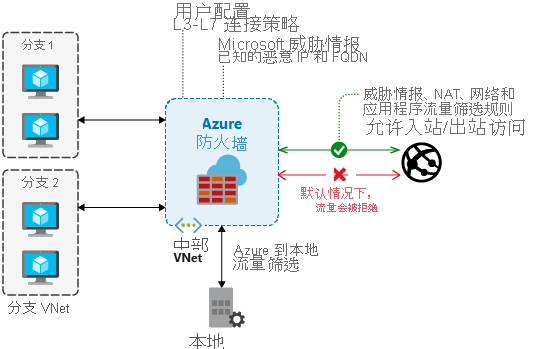

# 什么是 Azure 防火墙？

Azure 防火墙是托管的基于云的网络安全服务，可保护 Azure 虚拟网络资源。 它是一个服务形式的完全有状态防火墙，具有内置的高可用性和不受限制的云可伸缩性。

可以跨订阅和虚拟网络集中创建、实施和记录应用程序与网络连接策略。 Azure 防火墙对虚拟网络资源使用静态公共 IP 地址，使外部防火墙能够识别来自你的虚拟网络的流量。  该服务与用于日志记录和分析的 Azure Monitor 完全集成。

## 功能

若要了解 Azure 防火墙的功能，请参阅 [Azure 防火墙功能](features.md)。

## 定价和 SLA

有关 Azure 防火墙定价的信息，请参阅 [Azure 防火墙定价](https://azure.microsoft.com/pricing/details/azure-firewall/)。

有关 Azure 防火墙 SLA 的信息，请参阅 [Azure 防火墙 SLA](https://azure.microsoft.com/support/legal/sla/azure-firewall/)。

## 新增功能

若要了解 Azure 防火墙的新增功能，请参阅 [Azure 更新](https://azure.microsoft.com/updates/?category=networking&query=Azure%20Firewall)。

## 已知问题

Azure 防火墙存在以下已知问题：

|问题  |说明  |缓解措施  |
|---------|---------|---------|
针对非 TCP/UDP 协议（例如 ICMP）的网络筛选规则不适用于 Internet 绑定的流量|针对非 TCP/UDP 协议的网络筛选规则不支持公共 IP 地址的 SNAT。 在分支子网与 VNet 之间支持非 TCP/UDP 协议。|Azure 防火墙使用[目前不支持 IP 协议 SNAT](../load-balancer/load-balancer-overview.md) 的标准负载均衡器。 我们正在探索如何在将来的版本中推出支持此方案的选项。|
|缺少对 ICMP 的 PowerShell 和 CLI 支持|Azure PowerShell 和 CLI 不支持使用 ICMP 作为网络规则中的有效协议。|仍然可以通过门户和 REST API 使用 ICMP 作为协议。 我们正在致力于在不久之后在 PowerShell 和 CLI 中添加 ICMP。|
|FQDN 标记要求设置 protocol: port|带有 FQDN 标记的应用程序规则需要 port:protocol 定义。|可以将 **https** 用作 port: protocol 值。 我们正在致力于使此字段在使用了 FQDN 标记时可选。|
|不支持将防火墙移动到不同的资源组或订阅|不支持将防火墙移动到不同的资源组或订阅。|我们已计划提供此功能的支持。 若要将防火墙移动到不同的资源组或订阅，必须删除当前实例并在新的资源组或订阅中重新创建它。|
|威胁智能警报可能会被屏蔽|配置为仅警报模式时，目标为 80/443 的用于出站筛选的网络规则会屏蔽威胁智能警报。|使用应用程序规则为 80/443 创建出站筛选。 或者，将威胁智能模式更改为“提醒和拒绝”。|
|Azure 防火墙 DNAT 不适用于专用 IP 目标|Azure 防火墙 DNAT 支持仅限于 Internet 出口/入口。 DNAT 目前不适用于专用 IP 目标。 例如，分支到分支。|这是当前的一项限制。|
|无法删除第一个公共 IP 配置|每个 Azure 防火墙公共 IP 地址都分配给一个 IP 配置。  第一个 IP 配置在防火墙部署过程中分配，通常还包含对防火墙子网的引用（除非通过模板部署以不同的方式进行了显式配置）。 无法删除此 IP 配置，因为它会取消分配防火墙。 如果防火墙至少包含另一个可用的公共 IP 地址，则你仍然可以更改或删除与此 IP 配置相关联的公共 IP 地址。|这是设计的结果。|
|只能在部署期间配置可用性区域。|只能在部署期间配置可用性区域。 部署防火墙后无法配置可用性区域。|这是设计的结果。|
|对入站连接的 SNAT|除了 DNAT 以外，通过防火墙公共 IP 地址（入站）建立的连接将通过 SNAT 转换为某个防火墙专用 IP。 当前提出此项要求（也适用于主动/主动 NVA）的目的是确保对称路由。|若要保留 HTTP/S 的原始源，请考虑使用 [XFF](https://en.wikipedia.org/wiki/X-Forwarded-For) 标头。 例如，在防火墙前面使用 [Azure Front Door](../frontdoor/front-door-http-headers-protocol.md#front-door-to-backend) 或 [Azure 应用程序网关](../application-gateway/rewrite-http-headers.md)等服务。 还可以添加 WAF 作为 Azure Front Door 的一部分，并链接到防火墙。
|仅在代理模式下支持 SQL FQDN 筛选（端口 1433）|对于 Azure SQL 数据库、Azure Synapse Analytics 和 Azure SQL 托管实例：  仅在代理模式下支持 SQL FQDN 筛选（端口 1433）。  对于 Azure SQL IaaS：  如果使用的是非标准端口，则可以在应用程序规则中指定这些端口。|对于采用重定向模式的 SQL（这是从 Azure 内连接时采用的默认设置），可以将 SQL 服务标记用作 Azure 防火墙网络规则的一部分，改为对访问进行筛选。
|不允许 TCP 端口 25 上的出站流量| 将阻止使用 TCP 端口 25 的出站 SMTP 连接。 端口 25 主要用于未经身份验证的电子邮件传递。 这是虚拟机的默认平台行为。 有关详细信息，请参阅[排查 Azure 中的出站 SMTP 连接问题](../virtual-network/troubleshoot-outbound-smtp-connectivity.md)。 但是，与虚拟机不同，目前无法在 Azure 防火墙上启用此功能。 注意：若要允许经过身份验证的 SMTP（端口 587）或基于除 25 之外的端口的 SMTP，请确保配置网络规则而不是应用程序规则，因为目前不支持 SMTP 检查。|请按照 SMTP 故障排除文章中所述的建议方法发送电子邮件。 或者，排除需要从默认路由对防火墙进行出站 SMTP 访问的虚拟机。 改为配置直接对 Internet 进行出站访问。
|主动 FTP 不受支持|在 Azure 防火墙上禁用主动 FTP，防范使用 FTP PORT 命令进行的 FTP 弹跳攻击。|可以改用被动 FTP。 仍需在防火墙上显式打开 TCP 端口 20 和 21。
|SNAT 端口使用率指标显示 0%|即使使用 SNAT 端口，Azure 防火墙 SNAT 端口使用率指标也可能显示 0%。 在这种情况下，将此指标用作防火墙运行状况指标的一部分会导致不正确的结果。|此问题已修复，预计在 2020 年 5 月推出生产版。 在某些情况下，重新部署防火墙即可解决此问题，但存在偶然性。 可以只使用防火墙运行状况状态来查找 *status=degraded* 而非 *status=unhealthy*，但这是一种权宜解决方法。 端口耗尽会显示为“已降级”。 “不正常”保留给将来使用，到时会有更多指标影响防火墙运行状况。
|在启用了强制隧道的情况下不支持 DNAT|由于采用非对称路由，在启用了强制隧道的情况下部署的防火墙无法支持从 Internet 进行入站访问。|这种限制是根据非对称路由设计的。 入站连接的返回路径通过本地防火墙，而该防火墙看不到已建立的连接。
|出站被动 FTP 可能不适用于具有多个公共 IP 的防火墙，具体取决于你的 FTP 服务器配置。|被动 FTP 为控制通道和数据通道建立不同的连接。 当具有多个公共 IP 地址的防火墙发送出站数据时，它会随机选择一个公共 IP 地址作为源 IP 地址。 当数据和控制通道使用不同的源 IP 地址时，FTP 可能会失败，具体取决于你的 FTP 服务器配置。|规划显式 SNAT 配置。 同时，你可将 FTP 服务器配置为接受来自不同源 IP 地址的数据和控制通道（请参阅 [IIS 的示例](/iis/configuration/system.applicationhost/sites/sitedefaults/ftpserver/security/datachannelsecurity)）。 或者，请考虑在此情况中使用单个 IP 地址。|
|入站被动 FTP 可能无法工作，具体取决于你的 FTP 服务器配置 |被动 FTP 为控制通道和数据通道建立不同的连接。 Azure 防火墙上的入站连接经过 SNAT 转换为防火墙的某个专用 IP 地址，以确保对称路由。 当数据和控制通道使用不同的源 IP 地址时，FTP 可能会失败，具体取决于你的 FTP 服务器配置。|保留原始源 IP 地址的操作正在接受调查。 在此期间，你可将 FTP 服务器配置为接受来自不同源 IP 地址的数据和控制通道。|
|NetworkRuleHit 指标缺少协议维度|ApplicationRuleHit 指标允许基于筛选的协议，但相应的 NetworkRuleHit 指标中缺少此功能。|我们正在研究修复措施。|
|不支持端口介于 64000 和 65535 之间的 NAT 规则|Azure 防火墙允许网络和应用程序规则中 1-65535 范围内的任何端口，但是 NAT 规则仅支持 1-63999 范围内的端口。|这是当前的一项限制。
|配置更新平均可能需要 5 分钟|Azure 防火墙配置更新平均可能需要 3 到 5 分钟，且不支持并行更新。|我们正在研究修复措施。|
|Azure 防火墙使用 SNI TLS 标头筛选 HTTPS 和 MSSQL 流量|如果浏览器或服务器软件不支持服务器名称指示 (SNI) 扩展，则无法通过 Azure 防火墙进行连接。|如果浏览器或服务器软件不支持 SNI，也许可以使用网络规则（而不是应用程序规则）控制连接。 有关支持 SNI 的软件，请参阅[服务器名称指示](https://wikipedia.org/wiki/Server_Name_Indication)。|
|自定义 DNS 不适用于强制隧道|如果启用了强制隧道，自定义 DNS 将无法使用。|我们正在研究修复措施。|
|启动/停止操作不适用于在强制隧道模式下配置的防火墙|启动/停止操作不适用于在强制隧道模式下配置的 Azure 防火墙。 如果尝试在配置了强制隧道的情况下启动 Azure 防火墙，会导致以下错误：  *Set-AzFirewall:AzureFirewall FW-xx 管理 IP 配置无法添加到现有防火墙中。如果要使用强制隧道支持，请使用管理 IP 配置重新部署。 StatusCode:400 ReasonPhrase：请求错误*|正在调查中。  一种解决方法是，删除现有的防火墙，并使用相同的参数创建一个新的防火墙。|
|无法使用门户添加防火墙策略标记|Azure 防火墙策略具有修补程序支持限制，可防止使用 Azure 门户添加标记。 生成以下错误：无法保存资源的标记。|我们正在研究修复措施。 或者，可以使用 Azure PowerShell cmdlet `Set-AzFirewallPolicy` 更新标记。|
|尚不支持 IPv6|如果将 IPv6 地址添加到规则，防火墙会失败。|仅使用 IPv4 地址。 正在调查 IPv6 支持。|

## 后续步骤

- [教程：使用 Azure 门户部署和配置 Azure 防火墙](tutorial-firewall-deploy-portal.md)
- [使用模板部署 Azure 防火墙](deploy-template.md)
- [创建 Azure 防火墙测试环境](scripts/sample-create-firewall-test.md)