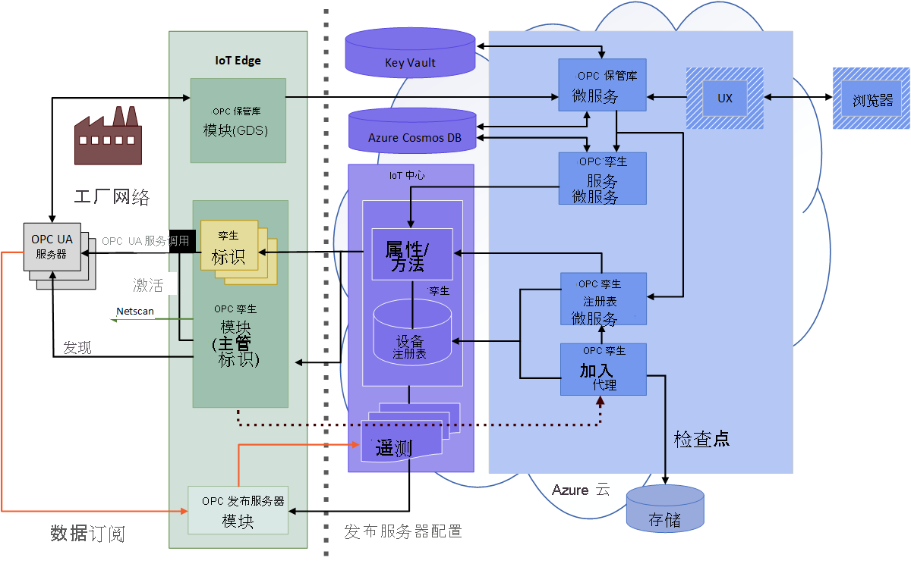

# OPC 保管库体系结构

> [!IMPORTANT]
> 当我们更新本文时，请参阅 [Azure 工业 IoT](https://azure.github.io/Industrial-IoT/) 来了解最新内容。

本文概述了 OPC 保管库微服务和 OPC 保管库 IoT Edge 模块。

OPC UA 应用程序使用应用程序实例证书来提供应用程序级别的安全性。 安全连接通过非对称加密建立，应用程序证书为其提供公钥和私钥对。 证书可以自签名，也可以由证书颁发机构 (CA) 签名。

OPC UA 应用程序提供受信任证书（代表它所信任的应用程序）的列表。 这些证书可以是自签名证书或 CA 签名的证书，也可以是根 CA 或子 CA 本身。 如果受信任的证书是较大证书链的一部分，则应用程序会信任与信任列表中的证书相链接的所有证书， 前提是可以验证完整的证书链。

信任自签名证书与信任 CA 证书之间的主要区别在于部署和维护信任所需的安装工作量。 托管特定于公司的 CA 也需要额外的工作量。 

若要使用单个客户端应用程序分发多台服务器的自签名证书的信任，必须在客户端应用程序信任列表上安装所有服务器应用程序证书。 另外，必须在所有服务器应用程序信任列表上安装客户端应用程序证书。 这种管理工作相当繁重，在需要考虑证书生存期和续订证书时，工作量甚至会加大。

使用特定于公司的 CA 可以大幅简化与多个服务器和客户端之间的信任的管理。 在这种情况下，管理员可为使用的每个客户端和服务器生成 CA 签名的应用程序实例证书一次。 此外，CA 证书安装在所有服务器和客户端上的每个应用程序信任列表中。 使用这种方法，只需为受影响的应用程序续订和替换过期的证书。

可以使用 Azure 工业 IoT OPC UA 证书管理服务为 OPC UA 应用程序管理特定于公司的 CA。 该服务基于 OPC 保管库微服务。 OPC 保管库提供一个微服务，用于在安全云中托管特定于公司的 CA。 该解决方案由多项服务提供支持，这些服务受 Azure Active Directory (Azure AD)、使用硬件安全模块 (HSM) 的 Azure Key Vault、Azure Cosmos DB 以及用作应用程序存储的 IoT 中心（可选）保护。

OPC 保管库微服务旨在支持基于角色的工作流，其中，在 Azure Key Vault 中拥有签名权限的安全管理员和审批者可以批准或拒绝请求。

为了与现有的 OPC UA 解决方案保持兼容，这些服务支持以 OPC 保管库微服务为后盾的 Edge 模块。 这样就可以实现 **OPC UA 全局发现服务器和证书管理** 接口，以根据规范的第 12 部分分发证书和信任列表。 

## 体系结构

该体系结构基于 OPC 保管库微服务，其中包含工厂网络的 OPC 保管库 IoT Edge 模块，以及用于控制工作流的 Web 示例 UX：

## OPC 保管库微服务

OPC 保管库微服务中的以下接口可以实施相关工作流，为 OPC UA 应用程序分发和管理特定于公司的 CA。

### 应用程序 
- OPC UA 应用程序可以是服务器和/或客户端。 在这种情况下，OPC 保管库充当应用程序注册机构。 
- 除了用于注册、更新和取消注册应用程序的基本操作以外，还有一些接口，用于通过搜索表达式查找和查询应用程序。 
- 证书请求必须引用有效的应用程序才能处理请求，以及使用所有特定于 OPC UA 的扩展来颁发签名证书。 
- 应用程序服务受 Azure Cosmos DB 中的数据库的支持。

### 证书组
- 证书组是用于存储根 CA 或子 CA 证书（包括用于签署证书的私钥）的实体。 
- 对于颁发者 CA 和签名的应用程序证书，RSA 密钥长度、SHA-2 哈希长度和生存期是可配置的。 
- CA 证书存储在通过 FIPS 140-2 级别 2 HSM 支持的 Azure Key Vault 中。 私钥永远不会离开安全存储，因为签名通过 Azure AD 保护的 Key Vault 操作完成。 
- 由于维护了 Key Vault 历史记录，因此可续订一段时间内的 CA 证书，并将其保留在安全存储中。 
- 每个 CA 证书的吊销列表也作为机密存储在 Key Vault 中。 取消注册应用程序后，管理员还会在证书吊销列表 (CRL) 中吊销应用程序证书。
- 可以吊销单个证书，还可以吊销成批的证书。

### 证书请求
证书请求实施可使用 OPC UA 应用程序的证书签名请求 (CSR) 生成新密钥对或签名证书的工作流。 
- 该请求连同附带信息（例如使用者或 CSR，以及对 OPC UA 应用程序的引用）一起存储在数据库中。 
- 服务中的业务逻辑根据应用程序数据库中存储的信息验证该请求。 例如，数据库中的应用程序 URI 必须与 CSR 中的应用程序 URI 相匹配。
- 拥有签名权限（即“审批者”角色）的安全管理员可以批准或拒绝请求。 如果请求获得批准，则会生成新的密钥对和/或签名的证书。 新私钥安全地存储在 Key Vault 中，新的已签名公共证书存储在证书请求数据库中。
- 在审批或撤销请求之前，请求者可以轮询其状态。 如果请求获得批准，则可以下载私钥和证书，并将其安装在 OPC UA 应用程序的证书存储中。
- 现在，请求者可以接受从请求数据库中删除不必要的信息的请求。 

在已签名证书的生存期内，可能会出现某个应用程序被删除或者某个密钥被泄露的情况。 在这种情况下，CA 管理者可以：
- 删除应用程序，此操作也会删除该应用的所有待处理的和已批准的证书请求。 
- 只有在密钥已续订或已泄露的情况下，才删除单个证书请求。

现在，已泄露的、已批准的和已接受的证书请求会被标记为已删除。

管理者可以定期续订颁发者 CA CRL。 在续订时，所有已删除的证书请求会被撤销，证书序列号会添加到 CRL 吊销列表。 已撤销的证书请求将标记为“已撤销”。 发生紧急事件时，也可以撤销单个证书请求。

最后，已更新的 CRL 可分发到参与的 OPC UA 客户端和服务器。

## OPC 保管库 IoT Edge 模块
若要支持工厂网络全局发现服务器，可以在边缘部署 OPC 保管库模块。 请将它作为本地 .NET Core 应用程序运行，或者在 Docker 容器中启动它。 请注意，由于当前的 OPC UA .NET Standard 堆栈中缺少 Auth2 身份验证支持，因此 OPC 保管库 Edge 模块的功能仅限“读取者”角色使用。 无法使用 OPC UA GDS 标准接口模拟从 Edge 模块到微服务的用户操作。

## 后续步骤

了解 OPC 保管库体系结构后，即可执行以下操作：

> [!div class="nextstepaction"]
> [构建和部署 OPC 保管库](howto-opc-vault-deploy.md)
