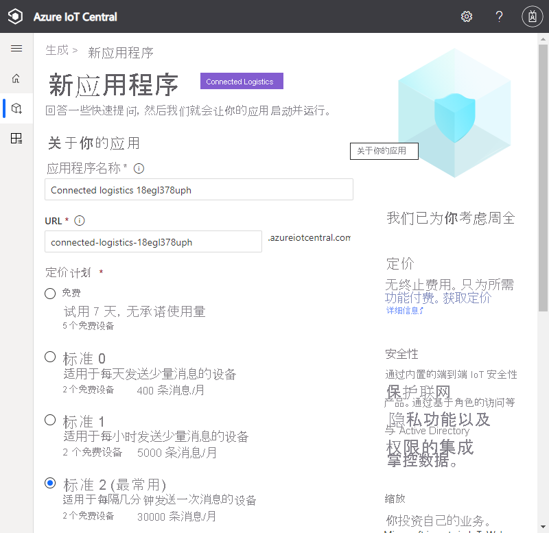

# 教程：部署并演练互联物流应用程序模板

本教程介绍如何开始 IoT Central 互联物流应用程序模板。 你将了解如何部署和使用模板。

在本教程中，你将了解如何执行以下操作：

> [!div class="checklist"]
> * 创建互联物流应用程序。
> * 使用应用程序中的关键功能。
> * 使用仪表板显示关键的物流设备操作活动。
> * 使用设备模板
> * 遵循规则
> * 使用作业

## 必备知识

* 无需满足特定的先决条件，就可以部署此应用。
* 你可以使用免费定价计划或使用 Azure 订阅。

## 创建互联物流应用程序

使用以下步骤创建应用程序：

1. 导航到 [Azure IoT Central 生成](https://aka.ms/iotcentral)站点。 然后使用 Microsoft 个人、工作或学校帐户登录。 从左侧导航栏中选择“生成”，然后选择“零售”选项卡 ：

    :::image type="content" source="media/tutorial-iot-central-connected-logistics/iotc-retail-homepage.png" alt-text="互联物流模版":::

1. 选择“互联物流应用程序”下的“创建应用” 。

1. 创建应用将打开“新建应用程序”窗体 。 输入以下详细信息：

    * **应用程序名称**：可以使用默认的建议名称，也可以输入易记的应用程序名称。
    * **URL**：可以使用建议的默认 URL，也可以输入唯一且容易记住的 URL。 接下来，如果已经具有 Azure 订阅，则建议使用默认设置。 你可以从 7 天免费试用定价计划开始，然后选择在免费试用过期之前随时转换为标准定价计划。
    * **计费信息**：预配资源需要目录、Azure 订阅和区域详细信息。
    * **创建**：选择页面底部的“创建”以部署应用程序。

    :::image type="content" source="media/tutorial-iot-central-connected-logistics/connected-logistics-app-create.png" alt-text="互联物流应用模版":::

    :::image type="content" source="media/tutorial-iot-central-connected-logistics/connected-logistics-app-create-billinginfo.png" alt-text="互联物流计费信息":::

## 演练应用程序

下面是展示如何选择互联物流应用程序模板的屏幕截图。

> [!div class="mx-imgBorder"]
> 

以下各部分将介绍应用程序的主要功能。

### 仪表板

部署应用程序模板后，默认仪表板是一个以互联物流操作员为中心的门户。 Northwind Trader 是一家虚构的物流服务提供商，负责管理海上和陆地上的货运队。 在此仪表板中，你会看到两个不同的网关，它们提供来自装运的遥测数据以及相关的命令、作业和操作。

> [!div class="mx-imgBorder"]
> 

> [!div class="mx-imgBorder"]
> 

此仪表板已预先配置为展示关键的物流设备操作活动。

仪表板支持两种不同的网关设备管理操作：

* 查看卡车装运的物流路线以及海运地点详细信息。
* 查看网关状态和其他相关信息。

:::image type="content" source="media/tutorial-iot-central-connected-logistics/connected-logistics-dashboard1.png" alt-text="互联物流仪表板":::

* 可以跟踪网关、活动和未知标记的总数。
* 可以执行设备管理操作，例如更新固件、禁用和启用传感器、更新传感器阈值、更新遥测间隔时间和更新设备服务协定。
* 查看设备电池消耗。

:::image type="content" source="media/tutorial-iot-central-connected-logistics/connected-logistics-dashboard2.png" alt-text="互联物流仪表板状态":::

#### 设备模板

选择“设备模版”以查看网关功能模型。 功能模型是围绕“网关遥测与属性”以及“网关命令”接口构建的 。

**网关遥测与属性** - 此接口定义与传感器、位置和设备信息相关的所有遥测数据。 该接口还定义了设备孪生属性功能，如传感器阈值和更新间隔。

:::image type="content" source="media/tutorial-iot-central-connected-logistics/connected-logistics-devicetemplate1.png" alt-text="遥测和属性接口":::

**网关命令** - 此接口组织所有网关命令功能：

:::image type="content" source="media/tutorial-iot-central-connected-logistics/connected-logistics-devicetemplate2.png" alt-text="网关命令接口":::

### 规则

选择此应用程序模板中规则的“规则”选项卡。 这些规则配置为通过电子邮件将通知发送给操作员以进行进一步调查：

**网关盗窃警报**：在行驶过程中，如果传感器意外检测到光源，则会触发此规则。 必须立即通知操作员调查潜在的盗窃行为。

**网关不响应**：如果网关长时间未向云报告，则会触发此规则。 网关可能会因低电量、连接丢失，或设备损坏而无响应。

:::image type="content" source="media/tutorial-iot-central-connected-logistics/connected-logistics-rules.png" alt-text="规则定义":::

### 作业

选择“作业”选项卡，查看此应用程序中的作业：

:::image type="content" source="media/tutorial-iot-central-connected-logistics/connected-logistics-jobs.png" alt-text="要运行的作业":::

可以使用作业执行应用程序范围内的操作。 此应用程序中的作业使用设备命令和孪生功能来执行各种任务，如在整个网关上禁用特定传感器，或根据装运模式和路线修改传感器阈值：

* 标准操作是禁用震动传感器，以在海洋运输过程中节省电池电量，或在冷链运输中降低温度阈值。

* 通过这些作业，你能够执行系统范围的操作（例如更新网关上的固件或更新服务协定），以及时了解最新的维护活动。

## 清理资源

如果不打算继续使用此应用程序，请访问“管理” > “应用程序设置”并选择“删除”，以删除应用程序模板  。

:::image type="content" source="media/tutorial-iot-central-connected-logistics/connected-logistics-cleanup.png" alt-text="模板清理":::

## 后续步骤

更多了解 ：

> [!div class="nextstepaction"]
> [互联物流概念](./architecture-connected-logistics.md)
