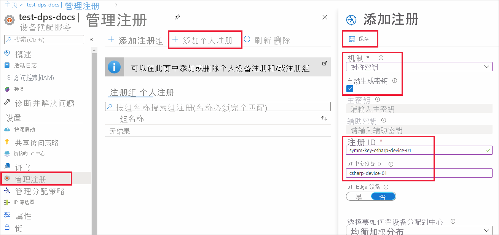
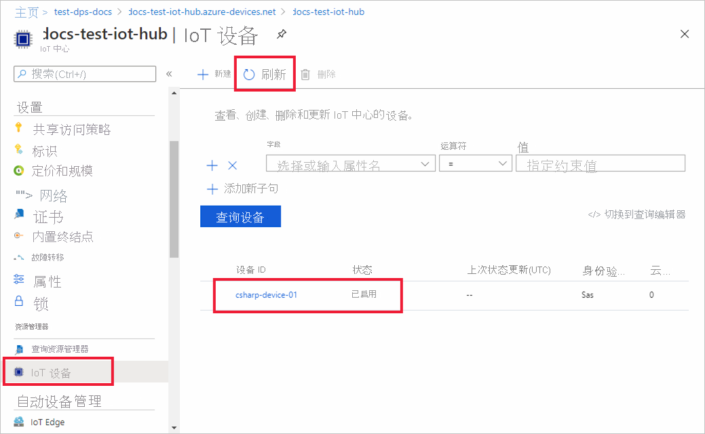

# <a name="quickstart-provision-a-symmetric-key-device-using-c"></a>快速入门：使用 C# 预配对称密钥设备

本快速入门将介绍如何使用 C# 将 Windows 开发计算机作为设备预配到 IoT 中心。 此设备将使用对称密钥和单个注册对设备预配服务 (DPS) 实例进行身份验证，以便被分配到 IoT 中心。 [C# 的 Azure IoT 示例](https://github.com/Azure-Samples/azure-iot-samples-csharp)中的示例代码将用于预配设备。 

虽然本文演示了使用单个注册进行预配，但你也可以使用注册组。 使用注册组时有一些不同之处。 例如，必须将派生的设备密钥与设备的唯一注册 ID 一起使用。 [使用对称密钥预配设备](how-to-legacy-device-symm-key.md)提供了注册组示例。 有关注册组的详细信息，请参阅[对称密钥证明的组注册](concepts-symmetric-key-attestation.md#group-enrollments)。

如果不熟悉自动预配过程，请查看[预配](about-iot-dps.md#provisioning-process)概述。 

另外，在继续学习本快速入门之前，请确保已完成[通过 Azure 门户设置 IoT 中心设备预配服务](./quick-setup-auto-provision.md)中的步骤。 本快速入门需要你已创建设备预配服务实例。

本文面向基于 Windows 的工作站。 但是，你也可以在 Linux 上执行过程。 对于 Linux 示例，请参阅[多租户预配](how-to-provision-multitenant.md)。


[!INCLUDE [quickstarts-free-trial-note](../../includes/quickstarts-free-trial-note.md)]


## <a name="prerequisites"></a>必备条件

* 确保在基于 Windows 的计算机上安装了 [.NET Core 2.1 SDK](https://dotnet.microsoft.com/download) 或更高版本。

* 已安装最新版本的 [Git](https://git-scm.com/download/)。

<a id="setupdevbox"></a>


## <a name="create-a-device-enrollment"></a>创建设备注册

1. 登录到 [Azure 门户](https://portal.azure.com)，选择左侧菜单上的“所有资源”按钮，打开设备预配服务 (DPS) 实例。

2. 选择“管理注册”选项卡，然后选择顶部的“添加个人注册”按钮   。 

3. 在“添加注册”面板中输入以下信息，然后按“保存”按钮   。

   - **机制**：选择“对称密钥”作为标识证明“机制”   。

   - **自动生成密钥**：选中此框。

   - **注册 ID**：输入注册 ID 以标识注册。 仅使用小写字母数字和短划线（“-”）字符。 例如 symm-key-csharp-device-01。

   - **IoT 中心设备 ID：** 输入设备标识符。 例如 csharp-device-01。

     

4. 保存注册后，将生成“主要密钥”和“辅助密钥”，并将其添加到注册条目   。 对称密钥设备注册会在“单个注册”选项卡的“注册 ID”列下显示为“symm-key-csharp-device-01” 。 

5. 打开注册并复制生成的“主要密钥”  的值。 稍后你将在运行设备预配示例代码时使用此密钥值和注册 ID。


## <a name="prepare-the-c-environment"></a>准备 C# 环境 

1. 打开 Git CMD 或 Git Bash 命令行环境。 使用以下命令克隆 [C# 的 Azure IoT 示例](https://github.com/Azure-Samples/azure-iot-samples-csharp) GitHub 存储库：

    ```cmd
    git clone https://github.com/Azure-Samples/azure-iot-samples-csharp.git
    ```


<a id="firstbootsequence"></a>

## <a name="run-the-device-provisioning-code"></a>运行设备预配代码

在本部分，你将使用 3 个参数运行设备预配示例，这些参数将验证设备预配示例代码是在 DPS 资源中用于注册的对称密钥设备。 这三个参数是：

* ID 范围
* 个人注册的注册 ID。
* 个人注册的主要对称密钥。

预配代码将使用这些参数连接 DPS 资源来对设备进行身份验证。 然后，会根据单个注册配置将设备分配到已链接到 DPS 实例的 IoT 中心。 预配后，示例代码将向 IoT 中心发送一条测试遥测消息。

1. 在 [Azure 门户](https://portal.azure.com)中的“设备预配服务”菜单上，选择“概述”，然后复制“ID 范围”值 。 在运行示例代码时，将对 `IdScope` 参数使用此值。

2. 打开命令提示符，导航到克隆的示例存储库中的 SymmetricKeySample：

    ```cmd
    cd azure-iot-samples-csharp\provisioning\Samples\device\SymmetricKeySample
    ```

3. 在 SymmetricKeySample 文件夹中，在文本编辑器中打开 Parameters.cs 。 此文件显示该示例支持的参数。 运行示例时，本文中将仅使用前三个必需的参数。 查看此文件中的代码。 无需任何更改。
 
    | 参数                         | 必需 | 说明     |
    | :-------------------------------- | :------- | :-------------- |
    | `--s` 或 `--IdScope`              | 正确     | DPS 实例的 ID 范围 |
    | `--i` 或 `--Id`                   | 正确     | 使用个人注册时的注册 ID，或者使用组注册时所需的设备 ID。 |
    | `--p` 或 `--PrimaryKey`           | 正确     | 个人注册或组注册的主密钥。 |
    | `--e` 或 `--EnrollmentType`       | 错误    | 注册类型：`Individual` 或 `Group`。 默认为 `Individual` |
    | `--g` 或 `--GlobalDeviceEndpoint` | 错误    | 设备要连接到的全局终结点。 默认为 `global.azure-devices-provisioning.net` |
    | `--t` 或 `--TransportType`        | 错误    | 用于与设备预配实例通信的传输。 默认为 `Mqtt`。 可能的值包括 `Mqtt`、`Mqtt_WebSocket_Only`、`Mqtt_Tcp_Only`、`Amqp`、`Amqp_WebSocket_Only`、`Amqp_Tcp_only` 和 `Http1`。|
     
4. 在 SymmetricKeySample 文件夹中，在文本编辑器中打开 ProvisioningDeviceClientSample.cs 。 此文件显示了如何结合使用 [SecurityProviderSymmetricKey](/dotnet/api/microsoft.azure.devices.shared.securityprovidersymmetrickey?view=azure-dotnet&preserve-view=true) 类和 [ProvisioningDeviceClient](/dotnet/api/microsoft.azure.devices.provisioning.client.provisioningdeviceclient?view=azure-dotnet&preserve-view=true) 类来预配对称密钥设备。 查看此文件中的代码。  无需任何更改。
 
5. 替换 3 个示例参数后，使用以下命令生成并运行示例代码。 对 ID 范围、注册 ID 和注册主密钥使用正确的值。
    
    ```console
    dotnet run --s 0ne00000A0A --i symm-key-csharp-device-01 --p sbDDeEzRuEuGKag+kQKV+T1QGakRtHpsERLP0yPjwR93TrpEgEh/Y07CXstfha6dhIPWvdD1nRxK5T0KGKA+nQ==
    ```    


6. 预期输出应与以下输出类似，其中显示已根据个人注册设置将设备分配到的已关联的 IoT 中心。 示例“TestMessage”字符串将作为测试发送到此中心：

    ```output
    D:\azure-iot-samples-csharp\provisioning\Samples\device\SymmetricKeySample>dotnet run --s 0ne00000A0A --i symm-key-csharp-device-01 --p sbDDeEzRuEuGKag+kQKV+T1QGakRtHpsERLP0yPjwR93TrpEgEh/Y07CXstfha6dhIPWvdD1nRxK5T0KGKA+nQ==

    Initializing the device provisioning client...
    Initialized for registration Id symm-key-csharp-device-01.
    Registering with the device provisioning service...
    Registration status: Assigned.
    Device csharp-device-01 registered to ExampleIoTHub.azure-devices.net.
    Creating symmetric key authentication for IoT Hub...
    Testing the provisioned device with IoT Hub...
    Sending a telemetry message...
    Finished.
    Enter any key to exit.
    ```
    
7. 在 Azure 门户中，导航到已链接到预配服务的 IoT 中心，并打开“IoT 设备”边栏选项卡。 成功将对称密钥设备预配到中心后，设备 ID 的“状态”会显示为“已启用”。 如果在运行设备示例代码前已打开边栏选项卡，则可能需要按顶部的“刷新”按钮。 

     

> [!NOTE]
> 如果从设备的注册项中的默认值更改了“初始设备孪生状态”，则它会从中心拉取所需的孪生状态，并执行相应的操作。 有关详细信息，请参阅[了解并在 IoT 中心内使用设备孪生](../iot-hub/iot-hub-devguide-device-twins.md)。
>


## <a name="clean-up-resources"></a>清理资源

如果打算继续使用和探索设备客户端示例，请勿清理在本快速入门中创建的资源。 如果不打算继续学习，请按以下步骤删除本快速入门中创建的所有资源。

1. 在 Azure 门户的左侧菜单中选择“所有资源”，然后选择设备预配服务。 打开服务的“管理注册”，然后选择“个人注册”选项卡   。选中在本快速入门中注册的设备的“注册 ID”旁边的复选框，然后按窗格顶部的“删除”按钮   。 
1. 在 Azure 门户的左侧菜单中选择“所有资源”，然后选择 IoT 中心  。 打开中心的“IoT 设备”，选中在本快速入门中注册的设备的“设备 ID”旁边的复选框，然后按窗格顶部的“删除”按钮    。

## <a name="next-steps"></a>后续步骤

在此快速入门中，你使用 IoT 中心设备预配服务将基于 Windows 的对称密钥设备预配到了 IoT 中心。 若要了解如何使用 C# 预配 X.509 证书设备，请继续阅读下面的 X.509 设备快速入门。 

> [!div class="nextstepaction"]
> [Azure 快速入门 - 使用 DPS 和 C# 预配 X.509 设备](quick-create-simulated-device-x509-csharp.md)
