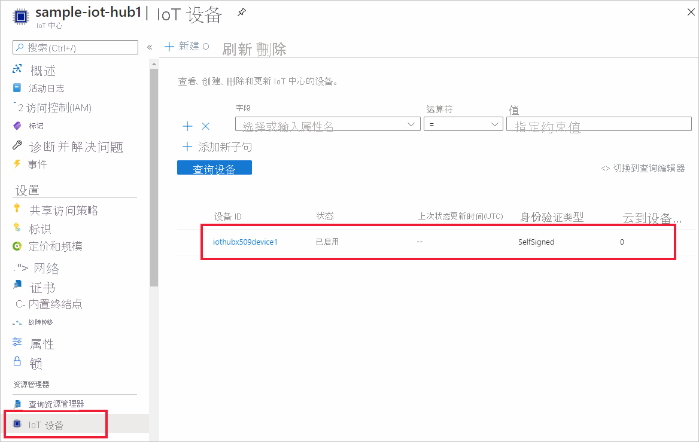

# <a name="quickstart-create-and-provision-an-x509-device-using-c-device-sdk-for-iot-hub-device-provisioning-service"></a>快速入门：使用适用于 IoT 中心设备预配服务的 C 设备 SDK 创建和预配 X.509 设备

[!INCLUDE [iot-dps-selector-quick-create-simulated-device-x509](../../includes/iot-dps-selector-quick-create-simulated-device-x509.md)]

这些步骤显示了如何使用 [C# 的 Azure IoT 示例](https://github.com/Azure-Samples/azure-iot-samples-csharp)中的设备代码来预配 X.509 设备。 在本文中，你将在开发计算机上运行设备示例代码，以使用设备预配服务连接到 IoT 中心。

## <a name="prerequisites"></a>必备条件

如果不熟悉自动预配过程，请查看[预配](about-iot-dps.md#provisioning-process)概述。 另外，在继续操作之前，请确保已完成[通过 Azure 门户设置 IoT 中心设备预配服务](./quick-setup-auto-provision.md)中的步骤。

Azure IoT 设备预配服务支持两类注册：
- [注册组](concepts-service.md#enrollment-group)：用于注册多个相关设备。
- [单独注册](concepts-service.md#individual-enrollment)：用于注册单个设备。

本文将演示单个注册。

[!INCLUDE [IoT Device Provisioning Service basic](../../includes/iot-dps-basic.md)]

<a id="setupdevbox"></a>
## <a name="prepare-the-development-environment"></a>准备开发环境 

1. 确保在计算机上安装 `git` 并将其添加到可供命令窗口访问的环境变量。 请参阅[软件自由保护组织提供的 Git 客户端工具](https://git-scm.com/download/)，了解要安装的最新版 `git` 工具，其中包括 Git Bash，这是一个命令行应用，可以用来与本地 Git 存储库交互。 

1. 打开命令提示符或 Git Bash。 克隆用于 C# GitHub 存储库的 Azure IoT 示例：
    
    ```bash
    git clone https://github.com/Azure-Samples/azure-iot-samples-csharp.git
    ```

1. 确保已在计算机上安装 [.NET Core 3.1 SDK 或更高版本](https://dotnet.microsoft.com/download)。 可使用以下命令来检查你的版本。

    ```bash
    dotnet --info
    ```

## <a name="create-a-self-signed-x509-device-certificate"></a>创建自签名的 X.509 设备证书

在本部分中，你将使用 `iothubx509device1` 作为使用者共用名称来创建自签名 X.509 测试证书。 请务必记住以下几点：

* 自签名证书仅用于测试，不应在生产环境中使用。
* 自签名证书的默认过期日期为一年。
* IoT 设备的设备 ID 将是证书上的使用者共用名称。 确保使用符合[设备 ID 字符串要求](../iot-hub/iot-hub-devguide-identity-registry.md#device-identity-properties)的使用者名称。

你将使用来自 [X509Sample](https://github.com/Azure-Samples/azure-iot-samples-csharp/tree/master/provisioning/Samples/device/X509Sample) 的示例代码创建要与设备的个人注册项一起使用的证书。


1. 在 PowerShell 提示符处，将目录更改为 X.509 设备预配示例的项目目录。

    ```powershell
    cd .\azure-iot-samples-csharp\provisioning\Samples\device\X509Sample
    ```

2. 示例代码设置为使用在受密码保护的 PKCS12 格式文件 (certificate.pfx) 中存储的 X.509 证书。 另外，还需要一个公钥证书文件 (certificate.cer)，用于在本快速入门的后面部分创建单个注册。 若要生成自签名证书及其关联的 .cer 和 .pfx 文件，请运行以下命令：

    ```powershell
    PS D:\azure-iot-samples-csharp\provisioning\Samples\device\X509Sample> .\GenerateTestCertificate.ps1 iothubx509device1
    ```

3. 脚本会提示输入 PFX 密码。 请记住此密码，你稍后在运行示例时必须使用它。 可运行 `certutil` 来转储证书并验证使用者名称。

    ```powershell
    PS D:\azure-iot-samples-csharp\provisioning\Samples\device\X509Sample> certutil .\certificate.pfx
    Enter PFX password:
    ================ Certificate 0 ================
    ================ Begin Nesting Level 1 ================
    Element 0:
    Serial Number: 7b4a0e2af6f40eae4d91b3b7ff05a4ce
    Issuer: CN=iothubx509device1, O=TEST, C=US
     NotBefore: 2/1/2021 6:18 PM
     NotAfter: 2/1/2022 6:28 PM
    Subject: CN=iothubx509device1, O=TEST, C=US
    Signature matches Public Key
    Root Certificate: Subject matches Issuer
    Cert Hash(sha1): e3eb7b7cc1e2b601486bf8a733887a54cdab8ed6
    ----------------  End Nesting Level 1  ----------------
      Provider = Microsoft Strong Cryptographic Provider
    Signature test passed
    CertUtil: -dump command completed successfully.    
    ```

 ## <a name="create-an-individual-enrollment-entry-for-the-device"></a>为设备创建个人注册项


1. 登录到 Azure 门户，选择左侧菜单上的“所有资源”按钮，打开预配服务。

2. 在“设备预配服务”菜单中，选择“管理注册”。 选择“个人注册”选项卡，然后选择顶部的“添加个人注册”按钮 。 

3. 在“添加注册”面板中，输入以下信息：
   - 选择“X.509”  作为标识证明机制  。
   - 在“主要证书 .pem 或 .cer 文件”下，选择“选择文件”选择在前述步骤中创建的证书文件 certificate.cer    。
   - 将“设备 ID”保留为空。  对设备进行预配时，其设备 ID 将设置为 X.509 证书 **iothubx509device1** 中的公用名称 (CN)。 此共用名称也将是用于单个注册项的注册 ID 的名称。 
   - （可选）可以提供以下信息：
       - 选择与预配服务链接的 IoT 中心。
       - 使用设备所需的初始配置更新“初始设备孪生状态”  。
   - 完成后，按“保存”按钮。 

     [](./media/quick-create-simulated-device-x509-csharp/device-enrollment.png#lightbox)
    
   成功注册以后，X.509 注册项会在“单个注册”选项卡的“注册 ID”栏下显示为 **iothubx509device1**。   


## <a name="provision-the-device"></a>预配设备

1. 在预配服务的“概览”边栏选项卡中，记下“ID 范围”的值。  

     


2. 键入以下命令，生成并运行 X.509 设备预配示例。 将 `<IDScope>` 值替换为预配服务的 ID 范围。 

    证书文件将默认为 ./certificate.pfx，还将提示输入 .pfx 密码。  

    ```powershell
    dotnet run -- -s <IDScope>
    ```

    如果要将所有内容都作为参数传递，可采用以下示例格式。

    ```powershell
    dotnet run -- -s 0ne00000A0A -c certificate.pfx -p 1234
    ```


3. 设备将连接到 DPS 并分配给 IoT 中心。 设备还将向中心发送遥测消息。

    ```output
    Loading the certificate...
    Found certificate: 10952E59D13A3E388F88E534444484F52CD3D9E4 CN=iothubx509device1, O=TEST, C=US; PrivateKey: True
    Using certificate 10952E59D13A3E388F88E534444484F52CD3D9E4 CN=iothubx509device1, O=TEST, C=US
    Initializing the device provisioning client...
    Initialized for registration Id iothubx509device1.
    Registering with the device provisioning service...
    Registration status: Assigned.
    Device iothubx509device2 registered to sample-iot-hub1.azure-devices.net.
    Creating X509 authentication for IoT Hub...
    Testing the provisioned device with IoT Hub...
    Sending a telemetry message...
    Finished.
    ```

4. 验证设备是否已预配。 将设备成功预配到与预配服务链接的 IoT 中心后，该中心的“IoT 设备”边栏选项卡上会显示设备 ID。 

     

    如果从设备的注册项中的默认值更改了“初始设备孪生状态”，则它会从中心拉取所需的孪生状态，并执行相应的操作。 有关详细信息，请参阅[了解并在 IoT 中心内使用设备孪生](../iot-hub/iot-hub-devguide-device-twins.md)


## <a name="clean-up-resources"></a>清理资源

如果打算继续使用和探索设备客户端示例，请勿清理在本快速入门中创建的资源。 如果不打算继续学习，请按以下步骤删除本快速入门中创建的所有资源。

1. 关闭计算机上的设备客户端示例输出窗口。
1. 在 Azure 门户的左侧菜单中选择“所有资源”，然后选择设备预配服务  。 在“概述”边栏选项卡顶部，按窗格顶部的“删除”   。  
1. 在 Azure 门户的左侧菜单中选择“所有资源”，然后选择 IoT 中心  。 在“概述”边栏选项卡顶部，按窗格顶部的“删除”   。  

## <a name="next-steps"></a>后续步骤

在此快速入门中，你使用 Azure IoT 中心设备预配服务将 X.509 设备预配到了 IoT 中心。 若要了解如何以编程方式注册 X.509 设备，请继续阅读快速入门中关于 X.509 设备的编程注册内容。 

> [!div class="nextstepaction"]
> [Azure 快速入门 - 将 X.509 设备注册到 Azure IoT 中心设备预配服务](quick-enroll-device-x509-csharp.md)
