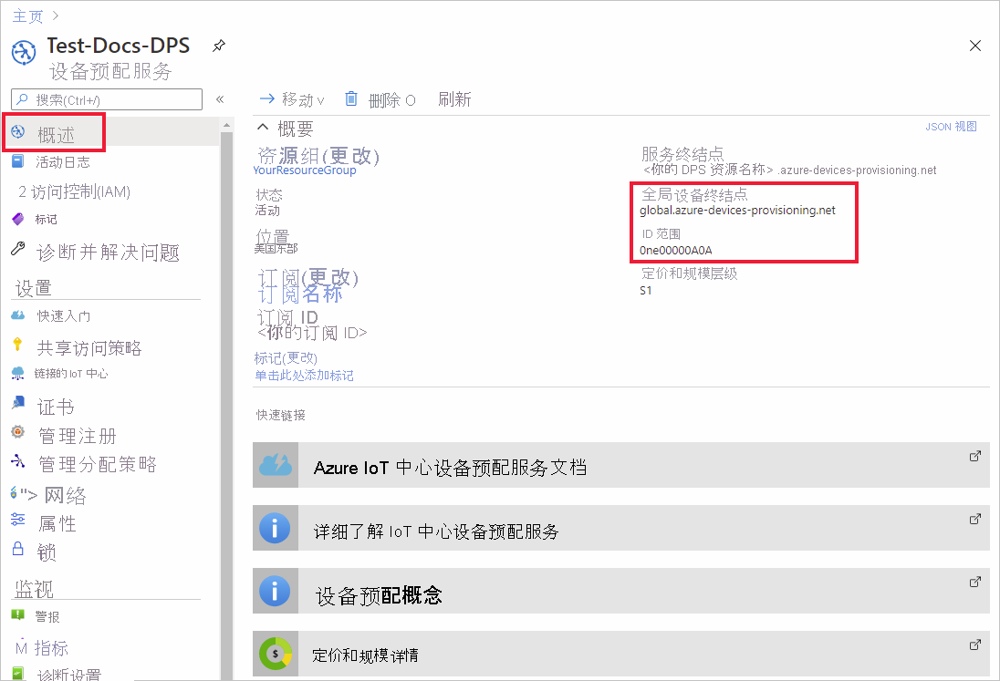
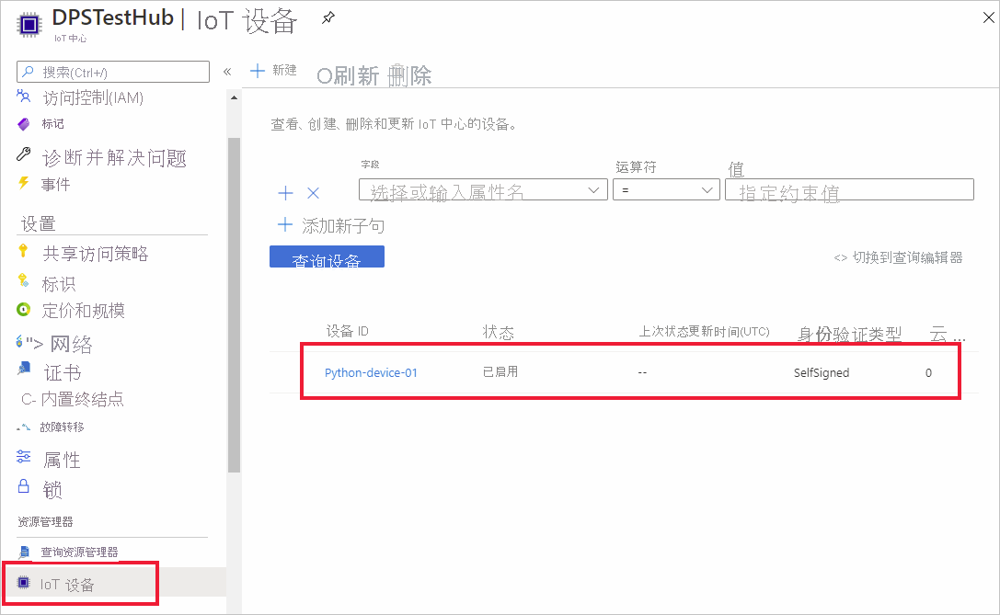

# <a name="quickstart-create-and-provision-a-simulated-x509-device-using-python-device-sdk-for-iot-hub-device-provisioning-service"></a>快速入门：使用适用于 IoT 中心设备预配服务的 Python 设备 SDK 创建和预配模拟的 X.509 设备

[!INCLUDE [iot-dps-selector-quick-create-simulated-device-x509](../../includes/iot-dps-selector-quick-create-simulated-device-x509.md)]

在本快速入门中，要将开发计算机设置为 Python X.509 设备。 使用 [Azure IoT Python SDK](https://github.com/Azure/azure-iot-sdk-python) 中的示例设备代码将设备连接到 IoT 中心。 本示例结合使用了设备预配服务 (DPS) 和单个注册过程。

## <a name="prerequisites"></a>先决条件

- 熟悉[预配](about-iot-dps.md#provisioning-process)概念。
- 完成[通过 Azure 门户设置 IoT 中心设备预配服务](./quick-setup-auto-provision.md)。
- 具有活动订阅的 Azure 帐户。 [免费创建一个](https://azure.microsoft.com/free/?ref=microsoft.com&utm_source=microsoft.com&utm_medium=docs&utm_campaign=visualstudio)。
- [Python 3.6 或更高版本](https://www.python.org/downloads/)
- [Git](https://git-scm.com/download/)。


[!INCLUDE [IoT Device Provisioning Service basic](../../includes/iot-dps-basic.md)]

## <a name="prepare-the-environment"></a>准备环境 

1. 确保在计算机上安装 `git` 并将其添加到可供命令窗口访问的环境变量。 请参阅[软件自由保护组织提供的 Git 客户端工具](https://git-scm.com/download/)，了解要安装的最新版 `git` 工具，其中包括 Git Bash，这是一个命令行应用，可以用来与本地 Git 存储库交互。 

2. 打开 Git Bash 提示符。 克隆 [Azure IoT Python SDK](https://github.com/Azure/azure-iot-sdk-python) 的 GitHub 存储库。
    
    ```cmd/sh
    git clone https://github.com/Azure/azure-iot-sdk-python.git --recursive
    ```


## <a name="create-a-self-signed-x509-device-certificate"></a>创建自签名的 X.509 设备证书 

在本部分中，将创建自签名的 X.509 证书。 请务必记住以下几点：

* 自签名证书仅用于测试，不应在生产环境中使用。
* 自签名证书的默认过期日期为一年。

如果还没有用于对设备进行身份验证的设备证书，可以使用 OpenSSL 创建一个自签名证书，以便完成本文内容。  Git 安装内容中附带了 OpenSSL。 

1. 在 Git Bash 提示符下运行以下命令。

    # <a name="windows"></a>[Windows](#tab/windows)
    
    ```bash
    winpty openssl req -outform PEM -x509 -sha256 -newkey rsa:4096 -keyout ./python-device.key.pem -out ./python-device.pem -days 365 -extensions usr_cert -subj "//CN=Python-device-01"
    ```

    > [!IMPORTANT]
    > 仅当需要在 Windows 平台上使用 Git 来转义字符串时，才需要为使用者名称 (`//CN=Python-device-01`) 提供额外的西文斜杠。 

    # <a name="linux"></a>[Linux](#tab/linux)
    
    ```bash
    openssl req -outform PEM -x509 -sha256 -newkey rsa:4096 -keyout ./python-device.key.pem -out ./python-device.pem -days 365 -extensions usr_cert -subj "/CN=Python-device-01"
    ```
    
    ---
    
2. 当系统要求“输入 PEM 通行短语：”时，请使用通行短语 `1234` 进行测试。    

3. 如果系统再次要求“验证 - 输入 PEM 通行短语：”，请再次使用通行短语 `1234`。    

将在运行 `openssl` 命令的目录中生成测试证书文件 (python-device.pem) 和私钥文件 (python-device.key.pem)。


## <a name="create-an-individual-enrollment-entry-in-dps"></a>在 DPS 中创建单个注册条目


Azure IoT 设备预配服务支持两类注册：

- [注册组](concepts-service.md#enrollment-group)：用于注册多个相关设备。
- [单个注册](concepts-service.md#individual-enrollment)：用于注册单个设备。

本文演示要使用 IoT 中心预配的单个设备的单个注册过程。

1. 登录到 Azure 门户，选择左侧菜单上的“所有资源”按钮，打开预配服务。

2. 在“设备预配服务”菜单中，选择“管理注册”。 选择“个人注册”选项卡，然后选择顶部的“添加个人注册”按钮 。 

3. 在“添加注册”面板中，输入以下信息：
   - 选择“X.509”作为标识证明机制。
   - 如果使用之前创建的测试证书，则在“主要证书 .pem 或 .cer 文件”下，选择“选择文件”，并选择证书文件“python-device.pem” 。
   - （可选）可以提供以下信息：
     - 选择与预配服务链接的 IoT 中心。
     - 使用设备所需的初始配置更新“初始设备孪生状态”  。
   - 完成后，按“保存”按钮。 

     [](./media/python-quick-create-simulated-device-x509/device-enrollment.png#lightbox)

   成功注册以后，X.509 设备会在“单个注册”选项卡的“注册 ID”列下显示为“Python-device-01” 。此注册值取自设备证书上的使用者名称。 

## <a name="simulate-the-device"></a>模拟设备

Python 设置示例 [provision_x509.py](https://github.com/Azure/azure-iot-sdk-python/blob/master/azure-iot-device/samples/async-hub-scenarios/provision_x509.py) 可在 `azure-iot-sdk-python/azure-iot-device/samples/async-hub-scenarios` 目录中找到。 此示例使用六个环境变量，通过 DPS 对 IoT 设备进行身份验证和预配。 这些环境变量包括：

| 变量名称              | 说明                                     |
| :------------------------- | :---------------------------------------------- |
| `PROVISIONING_HOST`        |  此值是用于连接 DPS 资源的全局终结点 |    
| `PROVISIONING_IDSCOPE`     |  此值是 DPS 资源的 ID 范围 |    
| `DPS_X509_REGISTRATION_ID` |  此值为设备的 ID。 它还必须与设备证书上的使用者名称相符 |    
| `X509_CERT_FILE`           |  设备证书文件名 |    
| `X509_KEY_FILE`            |  设备证书的私钥文件名 |
| `PASS_PHRASE`              |  用于对证书和私钥文件进行加密的密码 (`1234`)。 |    

1. 在“设备预配服务”菜单中，选择“概述”。 记下“ID 范围”和“全局设备终结点” 。

    

2. 在 Git Bash 提示符下，使用以下命令为全局设备终结点和 ID 范围添加环境变量。

    ```bash
    $export PROVISIONING_HOST=global.azure-devices-provisioning.net
    $export PROVISIONING_IDSCOPE=<ID scope for your DPS resource>
    ```

3. IoT 设备的注册 ID 必须与设备证书上的使用者名称相符。 如果生成了自签名测试证书，则 `Python-device-01` 是设备的使用者名称和注册 ID。 

    如果已有设备证书，可以使用 `certutil` 来验证用于设备的使用者公用名，如以下自签名测试证书示例所示：

    ```bash
    $ certutil python-device.pem
    X509 Certificate:
    Version: 3
    Serial Number: fa33152fe1140dc8
    Signature Algorithm:
        Algorithm ObjectId: 1.2.840.113549.1.1.11 sha256RSA
        Algorithm Parameters:
        05 00
    Issuer:
        CN=Python-device-01
      Name Hash(sha1): 1dd88de40e9501fb64892b698afe12d027011000
      Name Hash(md5): a62c784820daa931b9d3977739b30d12
    
     NotBefore: 1/29/2021 7:05 PM
     NotAfter: 1/29/2022 7:05 PM
    
    Subject:
        ===> CN=Python-device-01 <===
      Name Hash(sha1): 1dd88de40e9501fb64892b698afe12d027011000
      Name Hash(md5): a62c784820daa931b9d3977739b30d12
    ```

    在 Git Bash 提示符下，按如下所示设置注册 ID 的环境变量：

    ```bash
    $export DPS_X509_REGISTRATION_ID=Python-device-01
    ```

4. 在 Git Bash 提示符下，为证书文件、私钥文件和通行短语设置环境变量。

    ```bash
    $export X509_CERT_FILE=./python-device.pem
    $export X509_KEY_FILE=./python-device.key.pem
    $export PASS_PHRASE=1234
    ```

5. 查看 [provision_x509.py](https://github.com/Azure/azure-iot-sdk-python/blob/master/azure-iot-device/samples/async-hub-scenarios/provision_x509.py) 的代码，如果未使用 Python 版本 3.7 或更高版本，请执行[此处所述的代码更改](https://github.com/Azure/azure-iot-sdk-python/tree/master/azure-iot-device/samples/async-hub-scenarios#advanced-iot-hub-scenario-samples-for-the-azure-iot-hub-device-sdk)以替换 `asyncio.run(main())` 并保存更改。 

6. 运行该示例。 该示例将设备连接并预配到中心，并向中心发送一些测试消息。

    ```bash
    $ winpty python azure-iot-sdk-python/azure-iot-device/samples/async-hub-scenarios/provision_x509.py
    RegistrationStage(RequestAndResponseOperation): Op will transition into polling after interval 2.  Setting timer.
    The complete registration result is
    Python-device-01
    TestHub12345.azure-devices.net
    initialAssignment
    null
    Will send telemetry from the provisioned device
    sending message #4
    sending message #7
    sending message #2
    sending message #8
    sending message #5
    sending message #9
    sending message #1
    sending message #6
    sending message #10
    sending message #3
    done sending message #4
    done sending message #7
    done sending message #2
    done sending message #8
    done sending message #5
    done sending message #9
    done sending message #1
    done sending message #6
    done sending message #10
    done sending message #3
    ```

7. 在门户中，导航到链接到预配服务的 IoT 中心，并打开左侧菜单中“资源管理器”部分下的“IoT 设备”边栏选项卡。 将模拟的 X.509 设备成功预配到中心以后，设备 ID 会显示在“Device Explorer”边栏选项卡上，“状态”为“已启用”。 如果在运行示例设备应用程序之前已打开边栏选项卡，则可能需要按顶部的“刷新”按钮。 

     

> [!NOTE]
> 如果从设备的注册项中的默认值更改了“初始设备孪生状态”，则它会从中心拉取所需的孪生状态，并执行相应的操作。 有关详细信息，请参阅[了解并在 IoT 中心内使用设备孪生](../iot-hub/iot-hub-devguide-device-twins.md)。
>

## <a name="clean-up-resources"></a>清理资源

如果打算继续使用和探索设备客户端示例，请勿清理在本快速入门中创建的资源。 如果不打算继续学习，请按以下步骤删除本快速入门中创建的所有资源。

1. 关闭计算机上的设备客户端示例输出窗口。
2. 在 Azure 门户的左侧菜单中选择“所有资源”，然后选择设备预配服务。 打开服务的“管理注册”边栏选项卡，然后选择“单个注册”选项卡 。选中在本快速入门中注册的设备的“注册 ID”旁边的复选框，然后按窗格顶部的“删除”按钮。 
3. 在 Azure 门户的左侧菜单中选择“所有资源”，然后选择 IoT 中心  。 打开中心的“IoT 设备”边栏选项卡，选中在本快速入门中注册的设备的“设备 ID”旁边的复选框，然后按窗格顶部的“删除”按钮。

## <a name="next-steps"></a>后续步骤

本快速入门介绍了如何在部署计算机上创建模拟 X.509 设备，以及如何使用门户中的 Azure IoT 中心设备预配服务将其预配到 IoT 中心。 若要了解如何以编程方式注册 X.509 设备，请继续阅读快速入门中关于 X.509 设备的编程注册内容。 

> [!div class="nextstepaction"]
> [Azure 快速入门 - 将 X.509 设备注册到 Azure IoT 中心设备预配服务](quick-enroll-device-x509-python.md)
