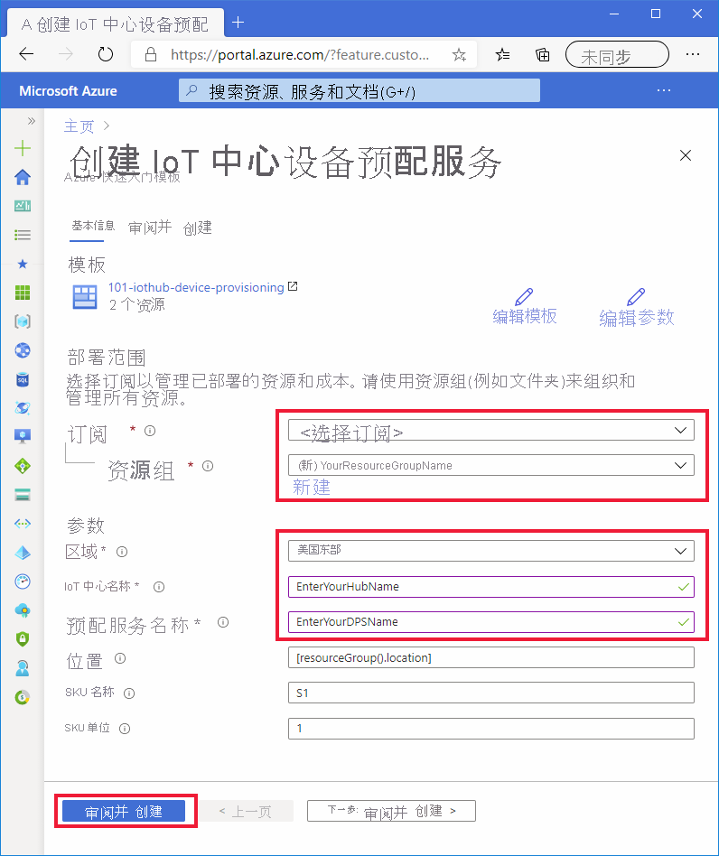

# <a name="quickstart-set-up-the-iot-hub-device-provisioning-service-dps-with-an-arm-template"></a>快速入门：使用 ARM 模板设置 IoT 中心设备预配服务 (DPS)

可以使用 [Azure 资源管理器](../azure-resource-manager/management/overview.md)模板（ARM 模板）以编程方式设置预配设备所需的 Azure 云资源。 这些步骤显示如何使用 ARM 模板创建 IoT 中心和新的 IoT 中心设备预配服务。 也使用模板将 IoT 中心链接到 DPS 资源。 此链接支持 DPS 资源根据配置的分配策略将设备分配到中心。

[!INCLUDE [About Azure Resource Manager](../../includes/resource-manager-quickstart-introduction.md)]

本快速入门使用 [Azure 门户](../azure-resource-manager/templates/deploy-portal.md)和 [Azure CLI](../azure-resource-manager/templates/deploy-cli.md) 执行创建资源组和部署模板所需的编程步骤，但你也可以使用 [PowerShell](../azure-resource-manager/templates/deploy-powershell.md)、.NET、Ruby 或其他编程语言轻松执行这些步骤和部署模板。 

如果环境满足先决条件，并且你已经熟悉使用 ARM 模板，则选择下面的“部署到 Azure”按钮将在 Azure 门户中打开用于部署的模板。

[](https://portal.azure.com/#create/Microsoft.Template/uri/https%3a%2f%2fraw.githubusercontent.com%2fAzure%2fazure-quickstart-templates%2fmaster%2f101-iothub-device-provisioning%2fazuredeploy.json)

[!INCLUDE [quickstarts-free-trial-note](../../includes/quickstarts-free-trial-note.md)]

[!INCLUDE [azure-cli-prepare-your-environment.md](../../includes/azure-cli-prepare-your-environment.md)]


## <a name="review-the-template"></a>查看模板

本快速入门中使用的模板来自 [Azure 快速启动模板](https://azure.microsoft.com/resources/templates/101-iothub-device-provisioning/)。

> [!NOTE]
> 目前没有 ARM 模板支持使用新的 DPS 资源创建注册。 关于此功能的请求很常见，我们已知晓，且正在考虑实现它。

:::code language="json" source="~/quickstart-templates/101-iothub-device-provisioning/azuredeploy.json":::

上述模板中定义了两个 Azure 资源：

* [**Microsoft.Devices/iothubs**](/azure/templates/microsoft.devices/iothubs)：创建新 Azure IoT 中心。
* [**Microsoft.Devices/provisioningservices**](/azure/templates/microsoft.devices/provisioningservices)：创建新的 Azure IoT 中心设备预配服务，其中新 IoT 中心已链接到该服务。


## <a name="deploy-the-template"></a>部署模板

#### <a name="deploy-with-the-portal"></a>使用门户进行部署

1. 选择下图登录到 Azure 并打开模板以进行部署。 该模板创建新的 IoT 中心和 DPS 资源。 该中心将链接到 DPS 资源。

    [](https://portal.azure.com/#create/Microsoft.Template/uri/https%3a%2f%2fraw.githubusercontent.com%2fAzure%2fazure-quickstart-templates%2fmaster%2f101-iothub-device-provisioning%2fazuredeploy.json)

2. 选择或输入以下值，并单击“查看 + 创建”。

        

    除非下面已指定，否则请使用默认值创建 IoT 中心和 DPS 资源。

    | 字段 | 说明 |
    | :---- | :---------- |
    | **订阅** | 选择 Azure 订阅。 |
    | **资源组** | 单击“新建”，输入资源组的唯一名称，然后单击“确定” 。 |
    | **区域** | 选择资源的区域。 例如“美国东部”。 |
    | **IoT 中心名称** | 输入 IoT 中心的名称，该名称在 .azure-devices.net 命名空间内必须是全局唯一的。 在下一部分验证部署时，需要中心名称。 |
    | **预配服务名称** | 输入新设备预配服务 (DPS) 资源的名称。 该名称在 .azure-devices-provisioning.net 命名空间内必须是全局唯一的。 在下一部分验证部署时，需要 DPS 名称。 |
    
3. 在下一个屏幕上，阅读条款。 如果同意所有条款，请单击“创建”。 

    部署需要几分钟时间才能完成。 

    除了 Azure 门户，还可以使用 Azure PowerShell、Azure CLI 和 REST API。 若要了解其他部署方法，请参阅[部署模板](../azure-resource-manager/templates/deploy-powershell.md)。


#### <a name="deploy-with-the-azure-cli"></a>使用 Azure CLI 进行部署

使用 Azure CLI 需要版本 2.6 或更高版本。 如果在本地运行 Azure CLI，请通过运行 `az --version` 来验证版本

登录到 Azure 帐户，并选择订阅。

1. 如果在本地运行 Azure CLI 而不是在门户中运行 Azure CLI，则需要登录。 若要在提示符中登录，请运行[登录命令](/cli/azure/get-started-with-az-cli2)：
    
    ```azurecli
    az login
    ```

    按照说明使用代码进行身份验证，并通过 Web 浏览器登录 Azure 帐户。

2. 如果有多个 Azure 订阅，登录 Azure 可获得与凭据关联的所有 Azure 帐户的访问权限。 使用[以下命令列出可供使用的 Azure 帐户](/cli/azure/account)：
    
    ```azurecli
    az account list -o table
    ```

    使用以下命令，选择想要用于运行命令以创建 IoT 中心和 DPS 资源的订阅。 可使用上一命令输出中的订阅名称或 ID：

    ```azurecli
    az account set --subscription {your subscription name or id}
    ```

3. 将以下命令复制并粘贴到 CLI 提示符。 然后按 ENTER 执行命令。
   
    > [!TIP]
    > 命令将提示输入资源组位置。 可以先运行以下命令，查看可用位置的列表：
    >
    > `az account list-locations -o table`
    >
    >
    
    ```azurecli-interactive
    read -p "Enter a project name that is used for generating resource names:" projectName &&
    read -p "Enter the location (i.e. centralus):" location &&
    templateUri="https://raw.githubusercontent.com/Azure/azure-quickstart-templates/master/101-iothub-device-provisioning/azuredeploy.json" &&
    resourceGroupName="${projectName}rg" &&
    az group create --name $resourceGroupName --location "$location" &&
    az deployment group create --resource-group $resourceGroupName --template-uri  $templateUri &&
    echo "Press [ENTER] to continue ..." &&
    read
    ```

4. 这些命令将提示你输入以下信息。 提供每个值，并按 ENTER。

    | 参数 | 说明 |
    | :-------- | :---------- |
    | **项目名称** | 此参数的值将用于创建资源组以保存所有资源。 字符串 `rg` 将添加到资源组名称的值末尾。 |
    | **location** | 此值是所有资源将驻留的区域。 |
    | **iotHubName** | 输入 IoT 中心的名称，该名称在 .azure-devices.net 命名空间内必须是全局唯一的。 在下一部分验证部署时，需要中心名称。 |
    | **provisioningServiceName** | 输入新设备预配服务 (DPS) 资源的名称。 该名称在 .azure-devices-provisioning.net 命名空间内必须是全局唯一的。 在下一部分验证部署时，需要 DPS 名称。 |

    Azure CLI 用于部署模板。 除了 Azure CLI，还可以使用 Azure PowerShell、Azure 门户和 REST API。 若要了解其他部署方法，请参阅[部署模板](../azure-resource-manager/templates/deploy-powershell.md)。


## <a name="review-deployed-resources"></a>查看已部署的资源

1. 若要验证部署，请运行下述[用于列出资源的命令](/cli/azure/resource#az_resource_list)，然后在输出中查找新预配服务和 IoT 中心：

    ```azurecli
     az resource list -g "${projectName}rg"
    ```

2. 若要验证中心是否已链接到 DPS 资源，请运行以下 [DPS extension show 命令](/cli/azure/iot/dps#az_iot_dps_show)。

    ```azurecli
     az iot dps show --name <Your provisioningServiceName>
    ```

    请注意 `iotHubs` 成员上链接的中心。


## <a name="clean-up-resources"></a>清理资源

本教程系列中的其他快速入门教程是在本文的基础上制作的。 如果打算继续学习后续的快速入门或相关教程，请不要清除在本快速入门中创建的资源。 如果不打算继续，可以使用 Azure 门户或 Azure CLI 删除资源组及其所有资源。

若要从 Azure 门户中删除资源组及其所有资源，只需打开资源组并单击顶部的“删除资源组”。

删除使用 Azure CLI 部署的资源组：

```azurecli
az group delete --name "${projectName}rg"
```

也可以使用 Azure 门户、PowerShell 或 REST API，以及针对 Azure 资源管理器或 IoT 中心设备预配服务发布的受支持平台 SDK，来删除资源组和单个资源。

## <a name="next-steps"></a>后续步骤

在本快速入门中，你已部署 IoT 中心和设备预配服务实例，并链接了这两个资源。 若要了解如何使用此设置来预配设备，请继续学习本快速入门中关于如何创建设备的内容。

> [!div class="nextstepaction"]
> [预配设备的快速入门](./quick-create-simulated-device-symm-key.md)
