# 快速入门：在机器学习工作室（经典）中创建第一个数据科学试验

**适用对象：** 机器学习工作室（经典版）   [Azure 机器学习](../overview-what-is-machine-learning-studio.md#ml-studio-classic-vs-azure-machine-learning-studio)

[!INCLUDE [Designer notice](../../../includes/designer-notice.md)]

在本快速入门中，你将在 [Azure 机器学习工作室（经典版）](../overview-what-is-machine-learning-studio.md#ml-studio-classic-vs-azure-machine-learning-studio)中创建一个机器学习试验，用于根据制造商和技术规格等不同变量来预测汽车的价格。

如果你不熟悉机器学习，请观看视频系列 [Data Science for Beginners](data-science-for-beginners-the-5-questions-data-science-answers.md)（适合初学者的数据科学），其中使用日常语言和概念对机器学习做了精彩的介绍。

本快速入门遵循默认的工作流开展试验：

1. **创建模型**
    - [获取数据]
    - [准备数据]
    - [定义特征]
1. **模型**
    - [选择并应用算法]
1. **对模型进行评分和测试**
    - [预测新汽车价格]

[获取数据]: #get-the-data
[准备数据]: #prepare-the-data
[定义特征]: #define-features
[选择并应用算法]: #choose-and-apply-an-algorithm
[预测新汽车价格]: #predict-new-automobile-prices

## 获取数据

若要进行机器学习，首先需要获取数据。
可以使用工作室（经典）随附的多个示例数据集，也可以从多种源导入数据。 本示例将使用工作区中包含的示例数据集“汽车价格数据(原始)”。
此数据集包含各辆汽车的条目，包括制造商、车型、技术规格、价格等方面的信息。

> [!TIP]
> 可在 [Azure AI Gallery](https://gallery.azure.ai)（Azure AI 库）中找到以下试验的工作副本。 请转到 [Your first data science experiment - Automobile price prediction](https://gallery.azure.ai/Experiment/Your-first-data-science-experiment-Automobile-price-prediction-1)（第一个数据科学试验 - 汽车价格预测），并单击“在工作室中打开”将试验副本下载到机器学习工作室（经典版）的工作区。

下面介绍如何将数据集导入试验中。

1. 单击机器学习工作室（经典版）窗口底部的“+新建”以创建新试验。 选择“试验” >  “空白试验”。

1. 试验有一个默认名称，显示在画布顶部。 选中该名称，将试验重命名为某个有意义的名称，例如“汽车价格预测”。 名称不需唯一。

    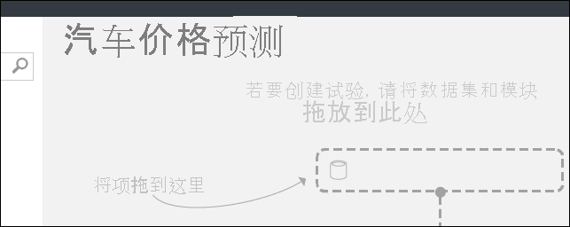

1. 试验画布左侧是数据集和模块的控制板。 在此控制板顶部的“搜索”框中键入 **汽车**，找到标有“汽车价格数据(原始)”的数据集。 将该数据集拖放到试验画布上。

    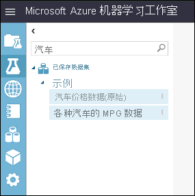

若要查看此数据的大致外观，请单击汽车数据集底部的输出端口，并选择“可视化”。

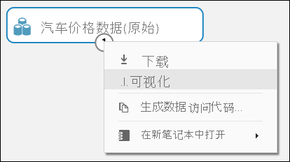

> [!TIP]
> 数据集和模块都有由小圆圈表示的输入和输出端口 - 输入端口位于顶部，输出端口位于底部。
要通过试验创建数据流，需将一个模块的输出端口连接到另一个模块的输入端口。
可以随时单击数据集或模块的输出端口，查看数据流中的数据在该时刻的情况。

在此数据集中，每行代表一辆汽车，与每辆汽车关联的变量显示为列。 使用特定汽车的变量在最右列（第 26 列，标题为“价格”）中预测价格。

单击右上角的“x”关闭可视化窗口。

## 准备数据

数据集通常需要经过一定的预处理才能进行分析。 可能已注意到在各个行的列中存在缺失值。 需要清除这些缺失值，使模型能够正确分析数据。 将删除包含缺失值的所有行。 此外，“规范化损失”列包含较大比例的缺失值，因此要将该列从模型中完全排除。

> [!TIP]
> 使用大多数模块时，都必须从输入数据中清除缺失值。

首先添加一个彻底删除“规范化损失”列的模块。 然后添加另一个删除任何有缺失数据的行的模块。

1. 在模块面板顶部的搜索框中键入“选择列”，以查找[选择数据集中的列][select-columns]模块。 然后将该模块拖放到试验画布上。 使用此模块可以选择要将哪些列包含在模型中，或者从模型中排除。

1. 将“汽车价格数据(原始)”数据集的输出端口连接到“选择数据集中的列”模块的输入端口。

    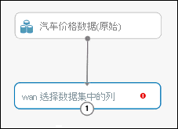

1. 单击[选择数据集中的列][select-columns]模块，并单击“属性”窗格中的“启动列选择器” 。

   - 在左侧单击“使用规则”
   - 在 **开头为** 下面，单击 **所有列**。 这些规则指示[选择数据集中的列][select-columns]传递所有列（但要排除的列除外）。
   - 在下拉列表中，选择“排除”和“列名称”，并在文本框内部单击。 此时会显示列的列表。 选择“规范化损失”，该列随即添加到文本框中。
   - 单击复选标记（“确定”）按钮，关闭列选择器（右下角）。

     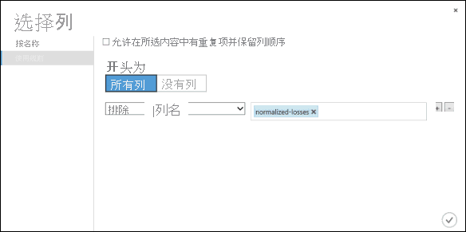

     此时“选择数据集中的列”的属性窗格指示它将传入数据集中的所有列，但“规范化损失”除外。

     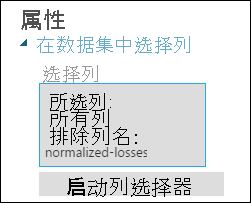

     > [!TIP] 
     > 可以双击模块并输入文本，为模块添加注释。 这有助于快速查看模块在实验中的运行情况。 在本例中，请双击[选择数据集中的列][select-columns]模块，并键入注释“排除规范化损失”。

     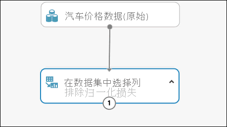

1. 将 [清理缺失数据][clean-missing-data] 模块拖到试验画布上，然后将其连接到 [在数据集中选择列][select-columns] 模块。 在“属性”窗格的“清理模式”下选择“删除整行” 。 这些选项指示 [清理缺失数据][clean-missing-data] 通过删除存在缺失值的行来清理数据。 双击该模块并键入注释“删除缺失值行”。

    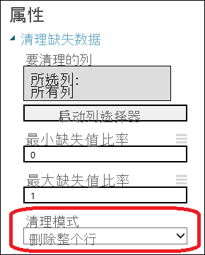

1. 通过单击页面底部的“运行”运行此试验。

    试验运行完以后，所有模块都会出现绿色复选标记，表示已成功完成。 另请留意右上角的“已完成运行”状态。

    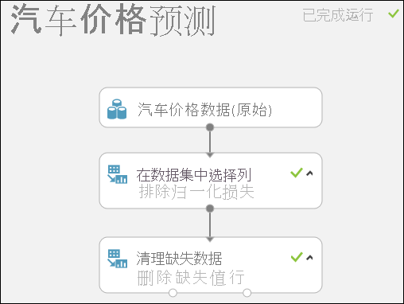

> [!TIP]
> 为什么我们现在运行此试验？ 运行此试验，数据的列定义就会从数据集传入[选择数据集中的列][select-columns]模块和[清理缺失数据][clean-missing-data]模块。 这意味着，只要连接到[清理缺失数据][clean-missing-data]，任何模块也都会有此类相同信息。

现已清理数据。 要查看已清理的数据集，请单击[清理缺失数据][clean-missing-data]模块左侧的输出端口，并选择“可视化”。 请注意，此时不再包含“规范化损失”列，并且也没有缺失值。

现已清理数据，接下来可以指定要在预测模型中使用哪些特征。

## 定义特征

在机器学习中，特征是你感兴趣的某些内容的各个可测量属性。 在此处的数据集中，每个行代表一辆汽车，每个列是该汽车的特征。

若要找到一组理想的特征来创建预测模型，需要针对要解决的问题进行试验，并且具有相关知识。 有些特征比其他特征更适合用于预测目标。 某些特征与其他特征有很强的关联性，可将其删除。 例如，city-mpg（市区油耗）和 highway-mpg（高速公路油耗）密切相关，因此可以保留一个，删除另一个，不会对预测产生明显影响。

让我们构建一个模型，它使用数据集中的一部分特征。 以后还可以返回此处，选择不同的特征，再次运行试验，并确认是否获得了理想的结果。 不过，让我们先尝试使用以下特征：

> 品牌、车体风格、轴距、引擎大小、马力、每分钟转数峰值、高速公路每加仑燃料所行英里数、价格

1. 将另一[选择数据集中的列][select-columns]模块拖放到试验画布上。 将[清理缺失数据][clean-missing-data]模块左侧的输出端口连接到[选择数据集中的列][select-columns]模块的输入。

    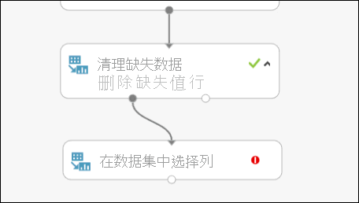

1. 双击该模块，并键入“选择要预测的特征”。

1. 单击“属性”窗格中的“启动列选择器”。

1. 单击“使用规则”。

1. 在“开头为”下面，单击“没有列”。 在筛选器行中，选择“包括”和“列名”，并在文本框中选择列名列表。 此筛选器指示模块不要传入任何列（特征），我们指定的列除外。

1. 单击复选标记（“确定”）按钮。

    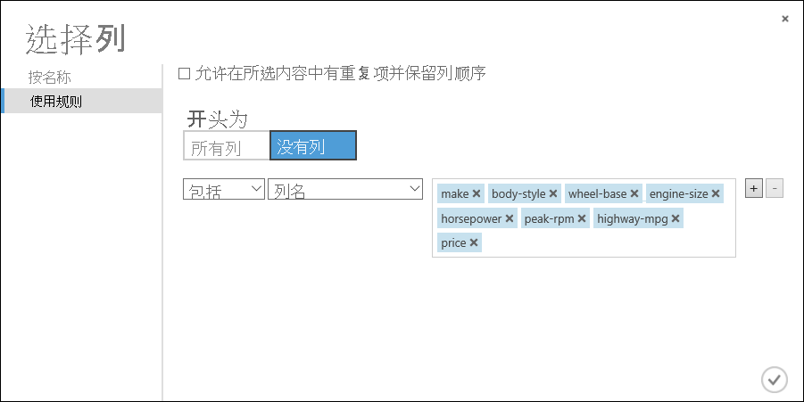

此模块生成经过筛选的数据集，只包含需要传递到下一步使用的学习算法中的特征。 稍后可以返回，选择不同的特征重试生成结果。

## 选择并应用算法

准备好数据后，构造预测模型的过程包括训练和测试。 我们将使用数据对模型定型，然后测试模型，看其预测价格时准确性如何。
<!-- For now, don't worry about *why* we need to train and then test a model.-->

*分类* 和 *回归* 是两种监督式机器学习算法。 分类可以从一组定义的类别预测答案，例如颜色（红、蓝或绿）。 回归用于预测数字。

由于要预测价格（一个数字），因此需使用回归算法。 本示例将使用线性回归模型。

对模型定型时，我们会为其提供一组包含价格的数据。 模型会扫描数据，查找汽车特征与其价格的关联性。 然后，我们会测试模型 - 我们会为模型提供一组熟悉的汽车特征，看模型预测已知价格的准确性如何。

我们会将数据拆分为单独的定型数据集和测试数据集，用于模型定型和测试。

1. 选择[拆分数据][split]模块并将其拖到试验画布，然后将其连接到最后一个[选择数据集中的列][select-columns]模块。

1. 单击[拆分数据][split]模块将其选中。 找到“第一个输出数据集中的行的比例”（位于画布右侧的“属性”窗格中），将其设置为 0.75。 这样，我们将使用 75% 的数据来训练模型，保留 25% 的数据用于测试。

    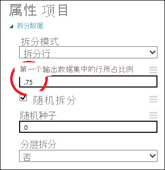

    > [!TIP]
    > 更改“随机种子”参数可为训练和测试生成不同的随机样本。 此参数控制伪随机数生成器的种子。

1. 运行试验。 运行试验时，[选择数据集中的列][select-columns]和[拆分数据][split]模块会将列定义传递到接下来要添加的模块。  

1. 要选择学习算法，请在画布左侧的模块控制板中展开“机器学习”类别，并展开“初始化模型”。 此时会显示多个可用于初始化机器学习算法的模块类别。 对于本试验，请选择“回归”类别下的[线性回归][linear-regression]模块，然后将其拖放到试验画布上。 （也可以在控制板的“搜索”框中键入“线性回归”找到该模块。）

1. 找到 [训练模型][train-model] 模块并将其拖到试验画布上。 将[线性回归][linear-regression]模块的输出连接到[训练模型][train-model]模块左侧的输入，将[拆分数据][split]模块的训练数据输出（左端口）连接到[训练模型][train-model]模块右侧的输入。

    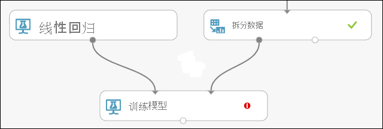

1. 选择[训练模型][train-model]模块，单击“属性”窗格中的“启动列选择器”，并选择“价格”列。 “价格”是模型要预测的值。

    在列选择器中选择“价格”列，方法是将其从“可用列”列表移至“所选列”列表。

    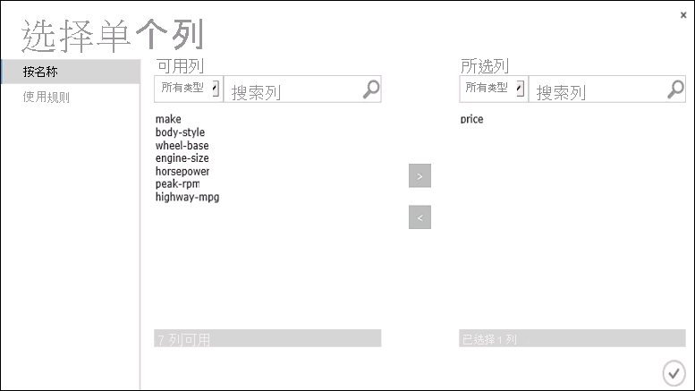

1. 运行试验。

我们现在获得了一个经过定型的回归模型，用来为新的汽车数据评分，以便进行价格预测。

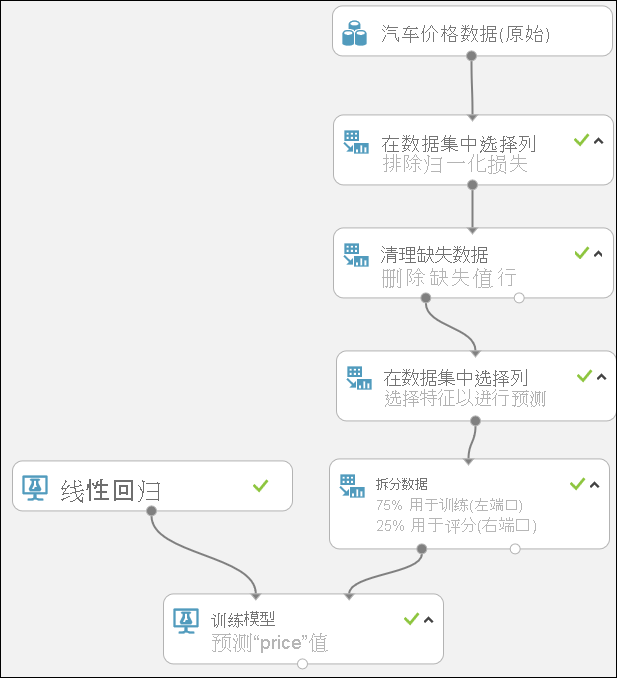

## 预测新汽车价格

使用 75% 的数据训练模型后，可以使用该模型为另外 25% 的数据评分，确定模型的运行情况。

1. 找到[评分模型][score-model]模块并将其拖放到试验画布上。 将 [训练模型][train-model] 模块的输出连接到 [评分模型][score-model] 的左侧输入端口。 将 [拆分数据][split] 模型的测试数据输出（右端口）连接到 [评分模型][score-model] 的右侧输入端口。

    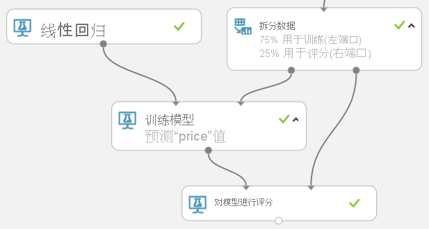

1. 运行试验，通过单击[评分模型][score-model]的输出端口并选择“可视化”来查看[评分模型][score-model]模块的输出。 输出显示价格预测值，以及来自测试数据的已知值。  

    

1. 最后，我们对结果的质量进行测试。 选择[评估模型][evaluate-model]模块并将其拖放到试验画布上，然后将[评分模型][score-model]模块的输出连接到[评估模型][evaluate-model]的左侧输入。 最终试验看起来应与下图类似：

    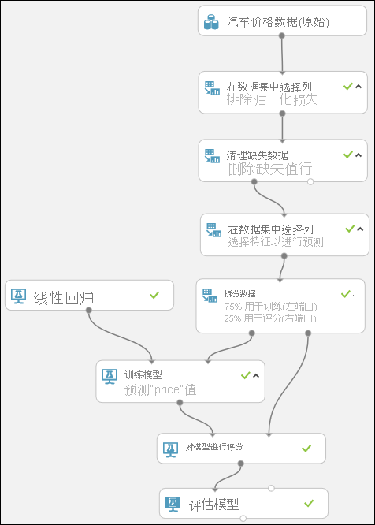

1. 运行试验。

要查看[评估模型][evaluate-model]模块的输出，请单击输出端口，并选择“可视化”。

针对本例中的模型显示了以下统计信息：

- **平均绝对误差** (MAE)：绝对误差的平均值（*误差* 是指预测值与实际值之间的差异）。
- **均方根误差** (RMSE)：对测试数据集所做预测的平均误差的平方根。
- **相对绝对误差**：相对于实际值与所有实际值平均值之间的绝对差异的绝对误差平均值。
- **相对平方误差**：相对于实际值与所有实际值平均值之间的平方差异的平方误差平均值。
- **决定系数**：也称为 **R 平方值**，这是一个统计度量值，表示模型的数据拟合度。

每个误差统计值越小越好。 值越小，表示预测越接近实际值。 对于 **决定系数**，其值越接近 1 (1.0)，预测就越精确。

## 清理资源

[!INCLUDE [machine-learning-studio-clean-up](../../../includes/machine-learning-studio-clean-up.md)]

## 后续步骤

在本快速入门中，你使用示例数据集创建了一个简单的试验。 若要更深入地了解创建和部署模型的过程，请继续阅读预测解决方案教程。

> [!div class="nextstepaction"]
> [教程：在工作室（经典版）中开发预测解决方案](tutorial-part1-credit-risk.md)

<!-- Module References -->
[evaluate-model]: /azure/machine-learning/studio-module-reference/evaluate-model
[linear-regression]: /azure/machine-learning/studio-module-reference/linear-regression
[clean-missing-data]: /azure/machine-learning/studio-module-reference/clean-missing-data
[select-columns]: /azure/machine-learning/studio-module-reference/select-columns-in-dataset
[score-model]: /azure/machine-learning/studio-module-reference/score-model
[split]: /azure/machine-learning/studio-module-reference/split-data
[train-model]: /azure/machine-learning/studio-module-reference/train-model