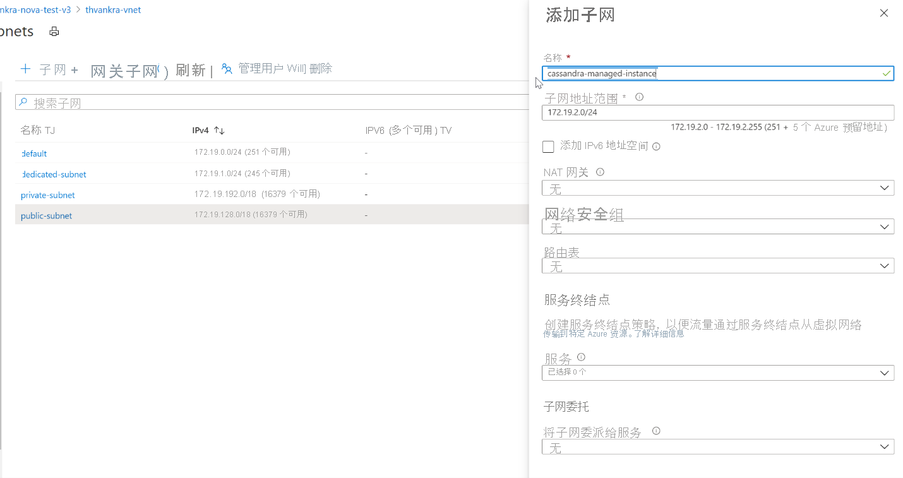

# <a name="quickstart-configure-a-hybrid-cluster-with-azure-managed-instance-for-apache-cassandra-preview"></a>快速入门：使用 Azure Managed Instance for Apache Cassandra（预览版）配置混合群集

Azure Managed Instance for Apache Cassandra 为托管的开源 Apache Cassandra 数据中心提供自动部署和缩放操作。 此服务有助于加速混合方案的部署，并减少日常维护。

> [!IMPORTANT]
> Azure Managed Instance for Apache Cassandra 目前以公共预览版形式提供。
> 此预览版在提供时没有附带服务级别协议，不建议将其用于生产工作负荷。 某些功能可能不受支持或者受限。
> 有关详细信息，请参阅 [Microsoft Azure 预览版补充使用条款](https://azure.microsoft.com/support/legal/preview-supplemental-terms/)。

本快速入门演示如何使用 Azure CLI 命令配置混合群集。 如果你的现有数据中心位于本地或自承载环境中，则可使用 Azure Managed Instance for Apache Cassandra 将其他数据中心添加到该群集并对其进行维护。

[!INCLUDE [azure-cli-prepare-your-environment.md](../../includes/azure-cli-prepare-your-environment.md)]

* 本文需要 Azure CLI 2.12.1 或更高版本。 如果你使用的是 Azure Cloud Shell，则表示已安装最新版本。

* 与自承载环境或本地环境连接的 [Azure 虚拟网络](../virtual-network/virtual-networks-overview.md)。 若要详细了解如何将本地环境连接到 Azure，请参阅[将本地网络连接到 Azure](https://docs.microsoft.com/azure/architecture/reference-architectures/hybrid-networking/) 一文。

## <a name="configure-a-hybrid-cluster"></a><a id="create-account"></a>配置混合群集

1. 登录 [Azure 门户](https://portal.azure.com/)并导航到你的虚拟网络资源。

1. 打开“子网”选项卡并创建新的子网。 若要详细了解“添加子网”窗体中的字段，请参阅[虚拟网络](../virtual-network/virtual-network-manage-subnet.md#add-a-subnet)一文：

   :::image type="content" source="./media/configure-hybrid-cluster/subnet.png" alt-text="将新子网添加到虚拟网络中。" lightbox="./media/configure-hybrid-cluster/subnet.png" border="true":::
    <!--  -->

1. 现在，我们将使用 Azure CLI 对 Cassandra 托管实例所需的 VNet 和子网应用一些特殊权限。 首先，我们需要为现有 VNet 查找 `Resource ID`。 复制此命令的输出值（即 `Resource ID`）供稍后使用。

   ```azurecli-interactive
    # discover the vnet id
    az network vnet show -n <your VNet name> -g <Resource Group Name> --query "id" --output tsv
   ```

1. 现在，我们应用特殊权限，并将前一个命令的输出作为 scope 参数传递：

   ```azurecli-interactive
    az role assignment create --assignee e5007d2c-4b13-4a74-9b6a-605d99f03501 --role 4d97b98b-1d4f-4787-a291-c67834d212e7 --scope <Resource ID>
   ```
    > [!NOTE]
    > 上面的 `assignee` 和 `role` 值分别是固定的服务主体和角色标识符。 

1. 接下来，我们将为混合群集配置资源。 你已经有一个群集，所以此处的群集名称将仅作为用于标识现有群集名称的逻辑资源。 在以下脚本中定义 `clusterName` 和 `clusterNameOverride` 变量时，请务必使用现有群集的名称。

   你还需要种子节点、公共客户端证书（如果已在 Cassandra 终结点上配置了公钥/私钥）和现有群集的 gossip 证书。 还需要使用上面复制的资源 ID 来定义 `delegatedManagementSubnetId` 变量。

   ```azurecli-interactive
   resourceGroupName='MyResourceGroup'
   clusterName='cassandra-hybrid-cluster-legal-name'
   clusterNameOverride='cassandra-hybrid-cluster-illegal-name'
   location='eastus2'
   delegatedManagementSubnetId='<Resource ID>'
    
   # You can override the cluster name if the original name is not legal for an Azure resource:
   # overrideClusterName='ClusterNameIllegalForAzureResource'
   # the default cassandra version will be v3.11
    
   az managed-cassandra cluster create \
      --cluster-name $clusterName \
      --resource-group $resourceGroupName \
      --location $location \
      --delegated-management-subnet-id $delegatedManagementSubnetId \
      --external-seed-nodes 10.52.221.2,10.52.221.3,10.52.221.4
      --client-certificates 'BEGIN CERTIFICATE-----\n...PEM format..\n-----END CERTIFICATE-----','BEGIN CERTIFICATE-----\n...PEM format...\n-----END CERTIFICATE-----' \
      --external-gossip-certificates 'BEGIN CERTIFICATE-----\n...PEM format 1...\n-----END CERTIFICATE-----','BEGIN CERTIFICATE-----\n...PEM format 2...\n-----END CERTIFICATE-----'
   ```

    > [!NOTE]
    > 你应了解现有的公共证书和/或 gossip 证书的保留位置。 如果你不确定，你应该能够运行 `keytool -list -keystore <keystore-path> -rfc -storepass <password>` 来打印证书。 

1. 创建群集资源后，运行以下命令获取群集设置详细信息：

   ```azurecli-interactive
   resourceGroupName='MyResourceGroup'
   clusterName='cassandra-hybrid-cluster'
    
   az managed-cassandra cluster show \
       --cluster-name $clusterName \
       --resource-group $resourceGroupName \
   ```

1. 上述命令会返回托管实例环境的相关信息。 你将需要 gossip 证书，以便可将它们安装在现有数据中心内的节点上。 以下屏幕截图显示了上一命令的输出和证书的格式：

   :::image type="content" source="./media/configure-hybrid-cluster/show-cluster.png" alt-text="从群集获取证书详细信息。" lightbox="./media/configure-hybrid-cluster/show-cluster.png" border="true":::
    <!--  -->

1. 接下来，在混合群集中创建新的数据中心。 请务必将变量值替换为群集详细信息：

   ```azurecli-interactive
   resourceGroupName='MyResourceGroup'
   clusterName='cassandra-hybrid-cluster'
   dataCenterName='dc1'
   dataCenterLocation='eastus2'
   delegatedSubnetId= '<Resource ID>'
    
   az managed-cassandra datacenter create \
       --resource-group $resourceGroupName \
       --cluster-name $clusterName \
       --data-center-name $dataCenterName \
       --data-center-location $dataCenterLocation \
       --delegated-subnet-id $delegatedSubnetId \
       --node-count 9 
   ```

1. 现已创建新的数据中心，接下来运行 show datacenter 命令查看其详细信息：

   ```azurecli-interactive
   resourceGroupName='MyResourceGroup'
   clusterName='cassandra-hybrid-cluster'
   dataCenterName='dc1'
    
   az managed-cassandra datacenter show \
       --resource-group $resourceGroupName \
       --cluster-name $clusterName \
       --data-center-name $dataCenterName 
   ```

1. 上述命令会输出新数据中心的种子节点。 将新数据中心的种子节点添加到现有数据中心在 cassandra.yaml 文件中的配置。 另外，请安装之前收集的托管实例 gossip 证书：

   :::image type="content" source="./media/configure-hybrid-cluster/show-datacenter.png" alt-text="获取数据中心详细信息。" lightbox="./media/configure-hybrid-cluster/show-datacenter.png" border="true":::
    <!--  -->

    > [!NOTE]
    > 若要添加更多数据中心，可重复以上步骤，但只需要种子节点。 

1. 最后，使用以下 CQL 查询更新每个密钥空间中的复制策略，使其包含整个群集中的所有数据中心：

   ```bash
   ALTER KEYSPACE "ks" WITH REPLICATION = {'class': 'NetworkTopologyStrategy', ‘on-premise-dc': 3, ‘managed-instance-dc': 3};
   ```
   还需要更新密码表：

   ```bash
    ALTER KEYSPACE "system_auth" WITH REPLICATION = {'class': 'NetworkTopologyStrategy', ‘on-premise-dc': 3, ‘managed-instance-dc': 3}
   ```

## <a name="clean-up-resources"></a>清理资源

如果不打算继续使用此托管实例群集，请按照以下步骤删除它：

1. 从 Azure 门户的左侧菜单中选择“资源组”。
1. 从列表中选择为本快速入门创建的资源组。
1. 在资源组的“概述”窗格上，选择“删除资源组” 。
3. 在下一窗口中输入要删除的资源组的名称，然后选择“删除”  。

## <a name="next-steps"></a>后续步骤

在本快速入门中，你了解了如何使用 Azure CLI 和 Azure Managed Instance for Apache Cassandra 创建混合群集。 现在你可开始使用该群集了。

> [!div class="nextstepaction"]
> [使用 Azure CLI 管理 Azure Managed Instance for Apache Cassandra 资源](manage-resources-cli.md)