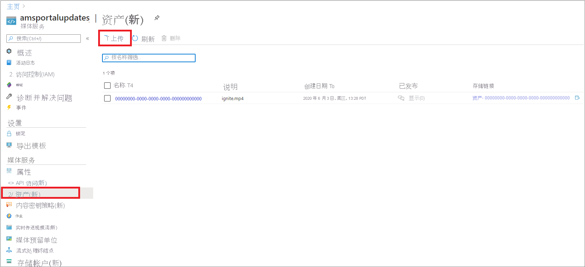
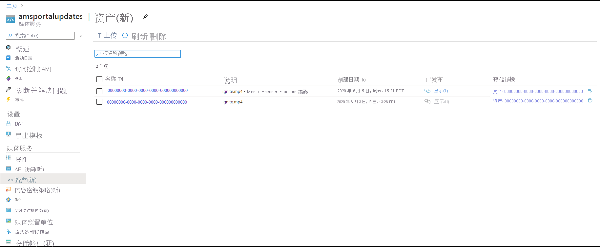
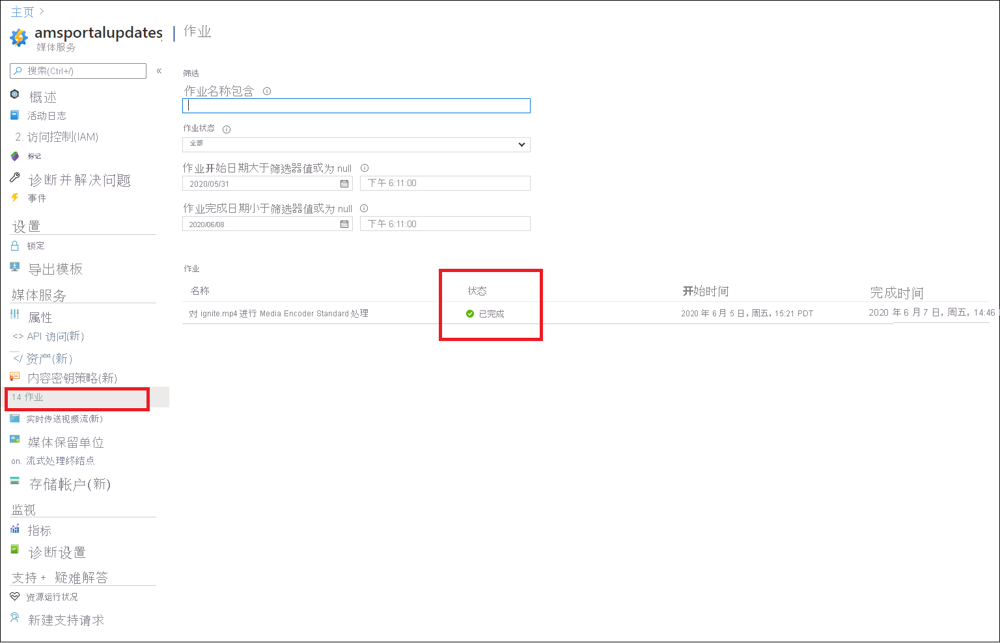
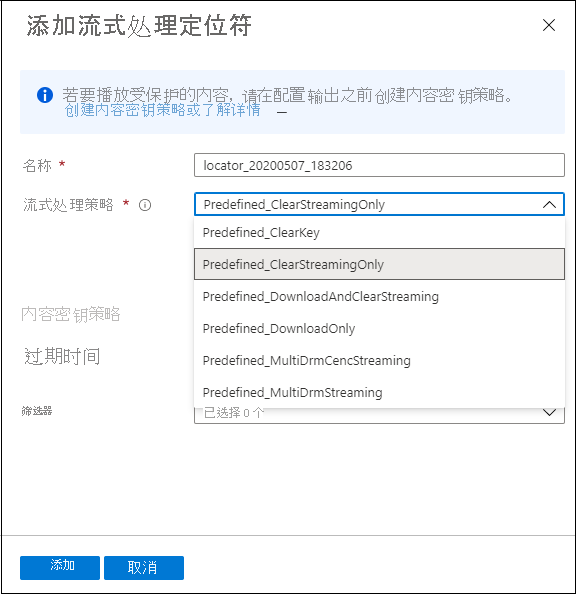
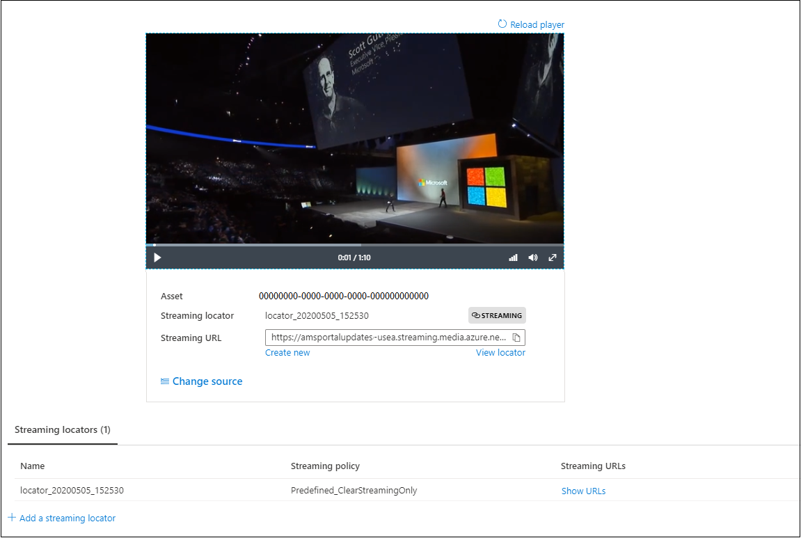

# 快速入门：使用门户上传、编码和流式传输内容

[!INCLUDE [media services api v3 logo](./includes/v3-hr.md)]

本快速入门介绍如何使用 Azure 门户 通过 Azure 媒体服务上传、编码和流式传输内容。
  
## 概述

* 若要开始管理、加密、编码、分析和流式传输 Azure 中的媒体内容，需要创建媒体服务帐户，并将高质量的数字媒体文件上传到资产中。 
    
    > [!NOTE]
    > 如果视频以前是使用媒体服务 v3 API 上传到媒体服务帐户的，或者该内容是基于实时输出生成的，则 Azure 门户中不会显示“编码”、“分析”或“加密”按钮  。 使用媒体服务 v3 API 来执行这些任务。

    查看以下内容： 

  * [云上传和存储](storage-account-concept.md)
  * [资产的概念](assets-concept.md)
* 将高质量的数字媒体文件上传到一个资产（输入资产）后，可对其进行处理（编码或分析）。 处理的内容将进入另一个资产（输出资产）。 
    * 将上传的文件[编码](encode-concept.md)为可在各种浏览器和设备上播放的格式。
    * [分析](analyze-video-audio-files-concept.md)上传的文件。 

        目前，使用 Azure 门户时，可以执行以下操作：生成 TTML 和 WebVTT 隐藏式字幕文件。 采用这些格式的文件可用于使有听力障碍的用户能够访问音频和视频文件。 你还可以从内容中提取关键字。

        要获得丰富的体验，使你能够从视频和音频文件中提取见解，请使用媒体服务 v3 预设（如[教程：使用媒体服务 v3 来分析视频](analyze-videos-tutorial.md)中所述）。  如果需要更详细的见解，请直接使用[视频索引器](../video-indexer/index.yml)。    
* 处理完内容后，即可将媒体内容交付给客户端播放器。 若要使输出资产中的视频可供客户端进行播放，必须创建流式处理定位符。 创建流式处理定位符时，需要指定流式处理策略 。 使用流式处理策略可为流式处理定位符定义流式处理协议和加密选项（如果有） 。
    
    审阅：

    * [流式处理定位符](stream-streaming-locators-concept.md)
    * [流式处理策略](stream-streaming-policy-concept.md)
    * [打包和交付](encode-dynamic-packaging-concept.md)
    * [筛选器](filters-concept.md)
* 可以通过使用高级加密标准 (AES-128) 或/和以下三种主要 DRM 系统中的任何一种对内容进行加密，以保护内容：内容。 [使用 Azure 门户加密内容](drm-encrypt-content-how-to.md)快速入门介绍如何配置内容保护。
        
## 先决条件

[!INCLUDE [quickstarts-free-trial-note](../../../includes/quickstarts-free-trial-note.md)]

[创建媒体服务帐户](account-create-how-to.md)

## 上传

1. 登录到 [Azure 门户](https://portal.azure.com/)。
1. 找到并单击你的媒体服务帐户。
1. 选择“资产(新)”。
1. 在该窗口顶部按“上传”。 
1. 拖放或浏览到要上传的文件。

如果导航到资产窗口，可看到一个新资产已添加到列表中：

## 编码

1. 选择“资产(新)”。
1. 选择新资产（已在上一步中添加）。
1. 单击窗口顶部的“编码”。

    按此按钮将启动编码作业。 作业成功完成后，生成一个包含已编码内容的输出资产。

如果导航到资产窗口，可看到该输出资产已添加到列表中：

## 监视作业进度

若要查看作业状态，请导航到“作业”。 作业通常会经历以下状态：已计划、已排队、正在处理、已完成（最终状态）。 如果作业出错，则显示“错误”状态。

## 发布和流式传输

若要发布资产，现需要向资产添加流式处理定位符。

### 流式处理定位符 

1. 在“流式处理定位符”部分，按“+ 添加流式处理定位符” 。
    该操作将发布资产并生成流式处理 URL。

    > [!NOTE]
    > 如果要对流进行加密，则需要创建内容密钥策略，并在流式处理定位符上对其进行设置。 有关详细信息，请参阅[使用 Azure 门户加密内容](drm-encrypt-content-how-to.md)。
1. 在“添加流式处理定位符”窗口中，选择一个预定义的流式处理策略。 有关详细信息，请参阅[流式处理策略](stream-streaming-policy-concept.md)

    

资产发布后，可直接在门户中对其进行流式传输。 

或者，复制流式处理 URL 并将其用于客户端播放器。

> [!NOTE]
> 确保[流式处理终结点](stream-streaming-endpoint-concept.md)正在运行。 在你首次创建媒体服务帐户时，系统将创建默认的流式处理终结点，且该终结点处于停止状态，因此你需要启动它，然后才能流式传输内容。 仅当流式处理终结点处于运行状态时才进行计费。

## 清理资源

如果想学习其他快速入门，请保留创建的资源。 否则，请转到 Azure 门户，浏览到资源组，选择运行本快速入门所用的资源组，并删除所有资源。

## 后续步骤

[使用门户加密内容](drm-encrypt-content-how-to.md)
