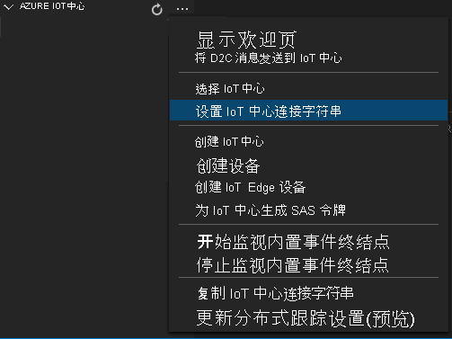

### <a name="examine-and-edit-the-sample-files"></a>检查和编辑示例文件

作为先决条件的一部分，请将示例代码下载到一个文件夹中。 按照以下步骤检查并编辑示例文件。

1. 在 Visual Studio Code 中，转到 src/edge。 你可看到 .env 文件以及一些部署模板文件。

    部署模板是指边缘设备的部署清单。 它包含一些占位符值。 该 .env 文件包含这些变量的值。

1. 转到 src/cloud-to-device-console-app 文件夹。 你可在此处看到 appsettings.json 文件和一些其他文件：

    * operations.json - 希望程序运行的操作的列表。
    * main.py - 示例程序代码。 此代码：

        * 加载应用设置。
        * 调用 IoT Edge 模块上的实时视频分析公开的直接方法。 可以通过调用模块的直接方法来使用该模块分析实时视频流。
        * 暂停以检查“终端”窗口中程序的输出，并检查“输出”窗口中模块生成的事件 。
        * 调用直接方法以清理资源。  
1. 编辑 operations.json 文件：
    * 将链接更改为图拓扑：

        `"topologyUrl" : "https://raw.githubusercontent.com/Azure/live-video-analytics/master/MediaGraph/topologies/httpExtension/2.0/topology.json"`

    * 在 `GraphInstanceSet` 下，编辑图拓扑的名称，使其与上一个链接中的值匹配：

      `"topologyName" : "InferencingWithHttpExtension"`

    * 在 `GraphTopologyDelete` 下，编辑名称：

      `"name": "InferencingWithHttpExtension"`

### <a name="generate-and-deploy-the-iot-edge-deployment-manifest"></a>生成并部署 IoT Edge 部署清单

1. 右键单击“src/edge/ deployment.yolov3.template.json”文件，然后选择“生成 IoT Edge 部署清单”。

      

    随即将在 src/edge/config 文件夹中创建一个清单文件 deployment.yolov3.amd64.json 。

1. 如果已完成[检测运动并发出事件](../../../detect-motion-emit-events-quickstart.md)快速入门，则跳过此步骤。 

    否则，请在左下角“AZURE IOT 中心”窗格附近选择“更多操作”图标，然后选择“设置 IoT 中心连接字符串”  。 可以从 appsettings.json 文件中复制字符串。 或者，为确保在 Visual Studio Code 中配置了正确的 IoT 中心，请使用[选择 IoT 中心命令](https://github.com/Microsoft/vscode-azure-iot-toolkit/wiki/Select-IoT-Hub)。
    
    

    > [!NOTE]
    > 系统可能会要求你提供 IoT 中心的内置终结点信息。 若要获取此信息，请在 Azure 门户中导航到 IoT 中心，然后在左侧导航窗格中查找“内置终结点”选项。 单击此处，在“与事件中心兼容的终结点”部分下查找“与事件中心兼容的终结点” 。 复制并使用框中的文本。 终结点将如下所示：  
        ```
        Endpoint=sb://iothub-ns-xxx.servicebus.windows.net/;SharedAccessKeyName=iothubowner;SharedAccessKey=XXX;EntityPath=<IoT Hub name>
        ```

1. 右键单击“src/edge/config/ deployment.yolov3.amd64.json”，并选择“为单个设备创建部署”。 

    

1. 如果系统提示你选择 IoT 中心设备，请选择“lva-sample-device”。
1. 大约 30 秒后，在该窗口的左下角刷新 Azure IoT 中心。 边缘设备现在显示以下已部署的模块：

    * 实时视频分析模块，名为“lvaEdge”
    * rtspsim 模块，可模拟 RTSP 服务器，充当实时视频源的源
        > [!NOTE]
        > 上述步骤假设你使用的是设置脚本创建的虚拟机。 如果使用的是自己的边缘设备，请转到你的边缘设备并使用管理员权限运行以下命令，以拉取并存储该快速入门所使用的示例视频文件：  
        
        ```
        mkdir /home/lvaedgeuser/samples
        mkdir /home/lvaedgeuser/samples/input    
        curl https://lvamedia.blob.core.windows.net/public/camera-300s.mkv > /home/lvaedgeuser/samples/input/camera-300s.mkv  
        chown -R lvalvaedgeuser:localusergroup /home/lvaedgeuser/samples/  
        ```
    * yolov3 模块，它是 YOLOv3 对象检测模型，该模型将计算机视觉应用于图像并返回对象类型的多个类
 
      

### <a name="prepare-to-monitor-events"></a>准备监视事件

1. 在 Visual Studio Code 中，打开“扩展”选项卡（或按 Ctrl+Shift+X），然后搜索“Azure IoT 中心”。
1. 右键单击并选择“扩展设置”。

    > [!div class="mx-imgBorder"]
    > :::image type="content" source="../../../media/run-program/extensions-tab.png" alt-text="扩展设置":::
1. 搜索并启用“显示详细消息”。

    > [!div class="mx-imgBorder"]
    > :::image type="content" source="../../../media/run-program/show-verbose-message.png" alt-text="显示详细消息":::
1. 右键单击实时视频分析设备，并选择“开始监视内置事件终结点”。 需要执行此步骤，以在 Visual Studio Code 的“输出”窗口中监视 IoT 中心事件。 

    

> [!NOTE]
> 系统可能会要求你提供 IoT 中心的内置终结点信息。 若要获取此信息，请在 Azure 门户中导航到 IoT 中心，然后在左侧导航窗格中查找“内置终结点”选项。 单击此处，在“与事件中心兼容的终结点”部分下查找“与事件中心兼容的终结点” 。 复制并使用框中的文本。 终结点将如下所示：  
    ```
    Endpoint=sb://iothub-ns-xxx.servicebus.windows.net/;SharedAccessKeyName=iothubowner;SharedAccessKey=XXX;EntityPath=<IoT Hub name>
    ```
### <a name="run-the-sample-program"></a>运行示例程序

1. 若要启动调试会话，请选择 F5 键。 你可在“终端”窗口中看到打印的消息。
1. operations.json 代码首先调用直接方法 `GraphTopologyList` 和 `GraphInstanceList`。 如果你在完成先前的快速入门后清理了资源，则该过程将返回空列表，然后暂停。 若要继续，请选择 Enter 键。

   ```
   --------------------------------------------------------------------------
   Executing operation GraphTopologyList
   -----------------------  Request: GraphTopologyList  --------------------------------------------------
   {
   "@apiVersion": "2.0"
   }
   ---------------  Response: GraphTopologyList - Status: 200  ---------------
   {
   "value": []
   }
   --------------------------------------------------------------------------
   Executing operation WaitForInput
   Press Enter to continue
   ```

    “终端”窗口将显示下一组直接方法调用：

     * 对 `GraphTopologySet` 的调用，该调用使用前面的 `topologyUrl`
     * 对 `GraphInstanceSet` 的调用，该调用使用以下正文：

         ```
         {
           "@apiVersion": "2.0",
           "name": "Sample-Graph-1",
           "properties": {
             "topologyName": "InferencingWithHttpExtension",
             "description": "Sample graph description",
             "parameters": [
               {
                 "name": "rtspUrl",
                 "value": "rtsp://rtspsim:554/media/camera-300s.mkv"
               },
               {
                 "name": "rtspUserName",
                 "value": "testuser"
               },
               {
                 "name": "rtspPassword",
                 "value": "testpassword"
               }
             ]
           }
         }
         ```

     * 对 `GraphInstanceActivate` 的调用，用于启动图形实例和视频流
     * 对 `GraphInstanceList` 的第二次调用，显示图形实例处于运行状态
1. “终端”窗口中的输出会在出现 `Press Enter to continue` 提示时暂停。 暂时不要选择 Enter。 向上滚动，查看调用的直接方法的 JSON 响应有效负载。
1. 切换到 Visual Studio Code 中的“输出”窗口。 可看到 IoT Edge 模块上的实时视频分析正发送到 IoT 中心的消息。 本快速入门中的以下部分将讨论这些消息。
1. 媒体图将继续运行并打印结果。 RTSP 模拟器不断循环源视频。 若要停止媒体图，请返回“终端”窗口，并选择 Enter。 

    接下来会执行一系列调用，以清理资源：
      * 调用 `GraphInstanceDeactivate` 停用图形实例。
      * 调用 `GraphInstanceDelete` 删除该实例。
      * 调用 `GraphTopologyDelete` 删除拓扑。
      * 对 `GraphTopologyList` 的最后一次调用显示该列表为空。
