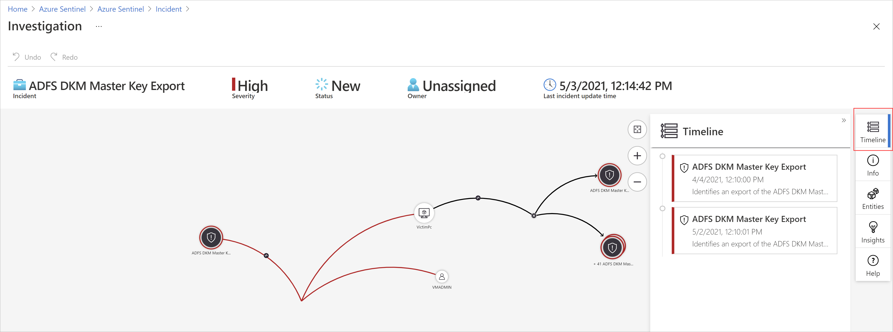

# 教程：使用 Azure Sentinel 调查事件

> [!IMPORTANT]
> 调查图现已正式发布。 

本教程帮助你使用 Azure Sentinel 调查事件。 将数据源连接到 Azure Sentinel 后，你希望在发生可疑情况时收到通知。 为此，Azure Sentinel 支持你创建高级警报规则，以生成可分配和调查的事件。

本文介绍：
> [!div class="checklist"]
> * 调查事件
> * 使用调查图
> * 应对威胁

一个事件可以包含多个警报。 它是用于特定调查的所有相关证据的聚合。 事件根据“分析”页中创建的分析规则而创建。 在事件级别设置与警报相关的属性，例如严重性和状态。 为 Azure Sentinel 指定要查找的威胁类型以及查找方式后，可以通过调查事件来监视检测到的威胁。

## 先决条件
- 只有在设置分析规则时使用了实体映射字段，才能调查事件。 调查图要求原始事件包含实体。

- 如果来宾用户需要分配事件，则必须在 Azure AD 租户中为该用户分配[目录读取者](../active-directory/roles/permissions-reference.md#directory-readers)角色。 默认情况下，常规（非来宾）用户分配有此角色。

## 如何调查事件

1. 选择“事件”。 通过“事件”页，可以了解事件数、打开的事件数、已设置为“正在进行”的事件数以及已关闭的事件数。 对于每个事件，可以查看其发生时间以及状态。 查看严重性，以决定优先处理的事件。

    

1. 可以根据需要筛选事件，例如按状态或严重性进行筛选。

1. 若要开始调查，请选择一个特定的事件。 在右侧，可以查看此事件的详细信息，包括其严重性、涉及的实体数摘要、触发此事件的原始事件以及事件的唯一 ID。

1. 若要详细查看事件中的警报和实体，请在“事件”页中选择“查看完整详细信息”，并查看汇总事件信息的相关选项卡。 

    

    例如：

    - 在“时间线”选项卡中，查看事件中警报和书签的时间线，这可以帮助你重构攻击者活动的时间线。
    - 在“警报”选项卡中，查看警报本身。 可以查看警报的所有相关信息 - 触发警报的查询、每个查询返回的结果数，以及对警报运行 playbook 的功能。 若要进一步向下钻取事件，请选择“事件”的数量。 这会打开生成结果和在 Log Analytics 触发警报的事件的查询。 
    - 在“实体”选项卡中，可以看到作为警报规则定义的一部分而映射的所有实体。

1. 如果正在积极调查事件，最好将事件的状态设置为“正在进行”，直到将其关闭。

1. 可以将事件分配到特定用户。 对于每个事件，可以通过设置“事件所有者”字段来分配一个所有者。 所有事件开始都处于未分配状态。 此外，还可以添加注释，以便其他分析师能够理解你调查的内容和你对事件的关注点。

    

1. 选择“调查”以查看调查图。

## 使用调查图深入了解

通过调查图，分析师能够针对每个调查询问正确的问题。 调查图通过将相关数据关联到任何涉及的实体，帮助你了解潜在安全威胁影响的范围并确定其根本原因。 可选择图中呈现的任何实体并在不同的展开选项之间选择，来深入了解并调查实体。  
  
调查图可提供：

- **来自原始数据的直观上下文**：实时可视化图形可显示自动从原始数据提取的实体关系。 这样，便可以轻松查看跨不同数据源的连接。

- **完整调查范围发现**：使用内置的探索查询来扩大调查范围，以呈现完整漏洞范围。

- **内置调查步骤**：使用预定义的探索选项，以确保在面临威胁时询问正确的问题。

若要使用调查图：

1. 选择一个事件，然后选择“调查”。 此操作会将你转到调查图。 此图对直接连接到警报的实体以及进一步连接的每个资源进行了图示说明。

   > [!IMPORTANT] 
   > - 只有在设置分析规则时使用了实体映射字段，才能调查事件。 调查图要求原始事件包含实体。
   >
   > - Azure Sentinel 目前支持调查“最多 30 天前的事件”。

   

1. 选择一个实体可打开“实体”窗格，以便查看有关该实体的信息。

    
  
1. 通过将鼠标悬停在每个实体上来展开调查，按实体类型显示安全专家和分析师设计的问题列表，以便进行深入调查。 这些选项称为“探索查询”。

    

   例如，你可以在计算机上请求相关警报。 如果选择探索查询，则会将生成的实体添加回此图。 在此示例中，选择“相关警报”向此图返回了以下警报：

    

1. 对于每个探索查询，可以通过选择“事件\>”来选择打开原始事件结果和 Log Analytics 中所使用的查询。

1. 为了便于你了解事件，此图提供了并行时间线。

    

1. 将鼠标悬停在时间线上，以查看图中某个时间点发生的警报。

    

## 关闭事件

解决了特定事件（例如调查已得出结论）之后，应将事件的状态设置为“已关闭”。 执行此操作时，系统将要求你指定关闭事件的原因来对事件进行分类。 此步骤是必需的。 单击“选择分类”，然后从下拉列表中选择下列其中一个：

- 真正 - 可疑活动
- 良性 - 可疑但符合预期
- 假正 - 错误警报逻辑
- 假正 - 错误数据
- 未确定

:::image type="content" source="media/tutorial-investigate-cases/closing-reasons-dropdown.png" alt-text="突出显示“选择分类”列表中可用分类的屏幕截图。":::

选择相应分类后，在“注释”字段中添加一些说明性文本。 当需要参考此事件时，这将非常有用。 完成后单击“应用”，事件将关闭。

:::image type="content" source="media/tutorial-investigate-cases/closing-reasons-comment-apply.png" alt-text="{alt-text}":::

## 后续步骤
在本教程中，你了解了如何开始使用 Azure Sentinel 调查事件。 继续阅读[如何使用自动执行的 playbook 来响应威胁](tutorial-respond-threats-playbook.md)教程。
> [!div class="nextstepaction"]
> [响应威胁](tutorial-respond-threats-playbook.md)以自动针对威胁做出响应。

