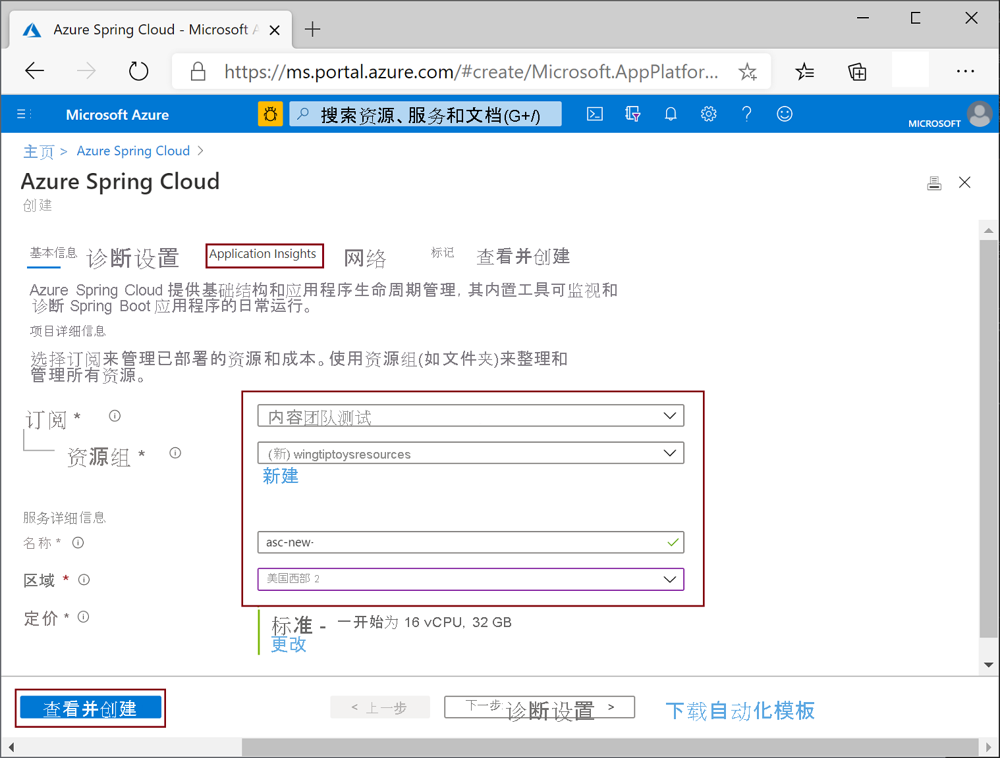

# <a name="quickstart-provision-an-azure-spring-cloud-service"></a>快速入门：预配 Azure Spring Cloud 服务

::: zone pivot="programming-language-csharp"
在本快速入门中，你将使用 Azure CLI 预配 Azure Spring Cloud 服务的实例。

## <a name="prerequisites"></a>先决条件

* 具有活动订阅的 Azure 帐户。 [免费创建帐户](https://azure.microsoft.com/free/?WT.mc_id=A261C142F)。
* [.NET Core 3.1 SDK](https://dotnet.microsoft.com/download/dotnet-core/3.1)。 Azure Spring Cloud 服务支持 .NET Core 3.1 及更高版本。
* [Azure CLI 版本 2.0.67 或更高版本](/cli/azure/install-azure-cli)。
* [Git](https://git-scm.com/)。

## <a name="install-azure-cli-extension"></a>安装 Azure CLI 扩展

验证 Azure CLI 版本是否为 2.0.67 或更高版本：

```azurecli
az --version
```

使用以下命令安装用于 Azure CLI 的 Azure Spring Cloud 扩展：

```azurecli
az extension add --name spring-cloud
```

## <a name="log-in-to-azure"></a>登录 Azure

1. 登录 Azure CLI。

    ```azurecli
    az login
    ```

1. 如果有多个订阅，请选择要用于本快速入门的订阅。

   ```azurecli
   az account list -o table
   ```

   ```azurecli
   az account set --subscription <Name or ID of a subscription from the last step>
   ```

## <a name="provision-an-instance-of-azure-spring-cloud"></a>预配 Azure Spring Cloud 的实例

1. 创建可包含 Azure Spring Cloud 服务的[资源组](../azure-resource-manager/management/overview.md)。 资源组名称可包含字母数字、下划线、括号、连字符、句点（位于末尾的除外）以及 Unicode 字符。

   ```azurecli
   az group create --location eastus --name <resource group name>
   ```

1. 预配 Azure Spring Cloud 服务的实例。 服务名称必须是唯一的，长度为 4 到 32 个字符，只能包含小写字母、数字及连字符。 服务名称的第一个字符必须是字母，最后一个字符必须是字母或数字。

    ```azurecli
    az spring-cloud create -n <service instance name> -g <resource group name>
    ```

    此命令可能需要几分钟才能完成。

1. 设置默认资源组名称和服务实例名称，这样就不必在后续命令中重复指定这些值。

   ```azurecli
   az configure --defaults group=<resource group name>
   ```

   ```azurecli
   az configure --defaults spring-cloud=<service instance name>
   ```
::: zone-end

::: zone pivot="programming-language-java"
可以使用 Azure 门户或 Azure CLI 实例化 Azure Spring Cloud。  以下过程介绍了这两种方法。
## <a name="prerequisites"></a>先决条件

* [安装 JDK 8](/java/azure/jdk/)
* [注册 Azure 订阅](https://azure.microsoft.com/free/)
* （可选）[安装 Azure CLI 版本 2.0.67 或更高版本](/cli/azure/install-azure-cli)，并使用以下命令安装 Azure Spring Cloud 扩展：`az extension add --name spring-cloud`
* （可选）[安装 Azure Toolkit for IntelliJ](https://plugins.jetbrains.com/plugin/8053-azure-toolkit-for-intellij/) 并[登录](/azure/developer/java/toolkit-for-intellij/create-hello-world-web-app#installation-and-sign-in)

## <a name="provision-an-instance-of-azure-spring-cloud"></a>预配 Azure Spring Cloud 的实例

#### <a name="portal"></a>[门户](#tab/Azure-portal)

以下步骤使用 Azure 门户创建 Azure Spring Cloud 的实例。

1. 在新选项卡中，打开 [Azure 门户](https://ms.portal.azure.com/)。 

2. 在顶部搜索框中，搜索“Azure Spring Cloud”。

3. 从结果中选择“Azure Spring Cloud”。

    

4. 在“Azure Spring Cloud”页上，单击“+ 添加”。

    

5. 在 Azure Spring Cloud“创建”页中填写表单。  遵循以下指南：
    - 订阅：选择要在其中收取此资源费用的订阅。
    - 资源组：最佳做法是为新资源创建新的资源组。 请注意，后面的步骤会将其用作 \<resource group name\>。
    - **服务详细信息/名称**：指定 \<service instance name\>。  该名称必须为 4 到 32 个字符，只能包含小写字母、数字及连字符。  服务名称的第一个字符必须是字母，最后一个字符必须是字母或数字。
    - 位置：选择服务实例的位置。
    - 为“定价层”选项选择“标准”。
    - 在“Application Insights”选项卡上，为“启用 Java 进程内代理”选择“是”。

    

6. 单击“审阅并创建”。

> [!div class="nextstepaction"]
> [我遇到了问题](https://www.research.net/r/javae2e?tutorial=asc-cli-quickstart&step=public-endpoint)

#### <a name="cli"></a>[CLI](#tab/Azure-CLI)

以下过程使用 Azure CLI 扩展来预配 Azure Spring Cloud 的实例。

1. 使用 Azure Spring Cloud 扩展更新 Azure CLI。

    ```azurecli
    az extension update --name spring-cloud
    ```

1. 登录到 Azure CLI 并选择你的有效订阅。

    ```azurecli
    az login
    az account list -o table
    az account set --subscription <Name or ID of subscription, skip if you only have 1 subscription>
    ```

1. 准备 Azure Spring Cloud 服务的名称。  该名称必须为 4 到 32 个字符，只能包含小写字母、数字及连字符。  服务名称的第一个字符必须是字母，最后一个字符必须是字母或数字。

1. 创建用于包含 Azure Spring Cloud 服务的资源组。  在 Azure Spring Cloud 服务的实例中进行创建。  

    ```azurecli 
    az group create --name <resource group name>
    az spring-cloud create -n <service instance name> -g <resource group name> --enable-java-agent
    ```

    详细了解 [Azure 资源组](../azure-resource-manager/management/overview.md)。

1. 使用以下命令设置默认的资源组名称和 Spring Cloud 服务名称：

    ```azurecli
    az configure --defaults group=<resource group name> spring-cloud=<service name>
    ```
---
::: zone-end

## <a name="next-steps"></a>后续步骤

在此快速入门中，你创建了 Azure 资源，如果这些资源保留在订阅中，将继续产生费用。 如果不打算继续学习下一个快速入门，请参阅[清理资源](./quickstart-logs-metrics-tracing.md#clean-up-resources)。 否则，请继续学习下一个快速入门：

> [!div class="nextstepaction"]
> [设置配置服务器](./quickstart-setup-config-server.md)