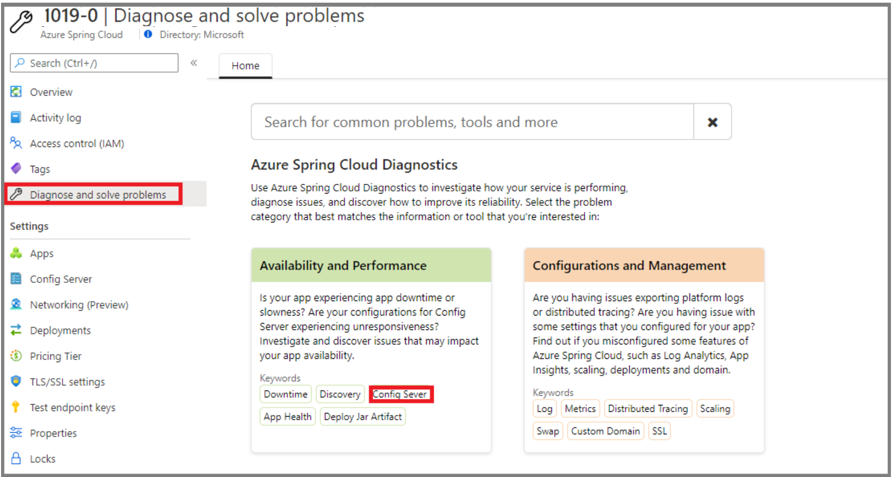

# <a name="quickstart-set-up-azure-spring-cloud-configuration-server"></a>快速入门：设置 Azure Spring Cloud Config Server

Azure Spring Cloud 配置服务器是分布式系统的集中式配置服务。 它使用当前支持本地存储、Git 和 Subversion 的可插入存储库层。 在此快速入门中，你将设置配置服务器以从 Git 存储库获取数据。

::: zone pivot="programming-language-csharp"

## <a name="prerequisites"></a>先决条件

* 完成此系列中前面的快速入门：[预配 Azure Spring Cloud 服务](./quickstart-provision-service-instance.md)。

## <a name="azure-spring-cloud-config-server-procedures"></a>Azure Spring Cloud Config Server 过程

通过运行以下命令，使用项目的 Git 存储库的位置设置配置服务器。 将 `<service instance name>` 替换为之前创建的服务的名称。 在前面的快速入门中设置的服务实例名称的默认值不适用于此命令。

```azurecli
az spring-cloud config-server git set -n <service instance name> --uri https://github.com/Azure-Samples/Azure-Spring-Cloud-Samples --search-paths steeltoe-sample/config
```

此命令指示配置服务器在示例应用存储库的 [steeltoe-sample/config](https://github.com/Azure-Samples/Azure-Spring-Cloud-Samples/tree/master/steeltoe-sample/config) 文件夹中查找配置数据。 由于将获取配置数据的应用名称为 `planet-weather-provider`，因此将使用的文件是 [planet-weather-provider.yml](https://github.com/Azure-Samples/Azure-Spring-Cloud-Samples/blob/master/steeltoe-sample/config/planet-weather-provider.yml)。

::: zone-end

::: zone pivot="programming-language-java"
Azure Spring Cloud Config Server 是分布式系统的集中式配置服务。 它使用当前支持本地存储、Git 和 Subversion 的可插入存储库层。  设置 Config Server，将微服务应用部署到 Azure Spring Cloud。

## <a name="prerequisites"></a>先决条件

* [安装 JDK 8](/java/azure/jdk/)
* [注册 Azure 订阅](https://azure.microsoft.com/free/)
* （可选）[安装 Azure CLI 版本 2.0.67 或更高版本](/cli/azure/install-azure-cli)，并使用以下命令安装 Azure Spring Cloud 扩展：`az extension add --name spring-cloud`
* （可选）[安装 Azure Toolkit for IntelliJ](https://plugins.jetbrains.com/plugin/8053-azure-toolkit-for-intellij/) 并[登录](/azure/developer/java/toolkit-for-intellij/create-hello-world-web-app#installation-and-sign-in)

## <a name="azure-spring-cloud-config-server-procedures"></a>Azure Spring Cloud Config Server 过程

#### <a name="portal"></a>[门户](#tab/Azure-portal)

以下过程使用 Azure 门户设置配置服务器来部署 [PetClinic 示例](https://github.com/azure-samples/spring-petclinic-microservices)。

1. 转到服务的“概览”页，选择“配置服务器”。 

2. 在“默认存储库”部分，将“URI”设置为“https://github.com/azure-samples/spring-petclinic-microservices-config” 。

3. 单击 **“验证”** 。

    

4. 完成验证后，请单击“应用”以保存更改。

    

5. 更新配置可能需要几分钟。
 
     

6. 配置完成后，会收到通知。

#### <a name="cli"></a>[CLI](#tab/Azure-CLI)


以下过程使用 Azure CLI 设置配置服务器来部署 [Pet Clinic 示例](https://github.com/azure-samples/spring-petclinic-microservices)。

运行以下命令来设置默认存储库。

```azurecli

az spring-cloud config-server git set -n <service instance name> --uri https://github.com/azure-samples/spring-petclinic-microservices-config
::: zone-end

> [!TIP]
> If you are using a private repository for config server, please refer to our [tutorial on setting up authentication](./how-to-config-server.md).

## Troubleshooting of Azure Spring Cloud config server

The following procedure explains how to troubleshoot config server settings.

1. In the Azure portal, go to the service **Overview** page and select **Logs**. 
1. Select **Queries** and **Show the application logs that contain the "error" or "exception" terms"**. 
1. Click **Run**. 
1. If you find the error **java.lang.illegalStateException** in logs, this indicates that spring cloud service cannot locate properties from config server.

    [  ](media/spring-cloud-quickstart-setup-config-server/setup-config-server-query.png)

1. Go to the service **Overview** page.
1. Select **Diagnose and solve problems**. 
1. Select **Config Server** detector.

    [  ](media/spring-cloud-quickstart-setup-config-server/setup-config-server-diagnose.png)

3. Click **Config Server Health Check**.

    [  ](media/spring-cloud-quickstart-setup-config-server/setup-config-server-genie.png)

4. Click **Config Server Status** to see more details from the detector.

    [  ](media/spring-cloud-quickstart-setup-config-server/setup-config-server-health-status.png)

## Next steps

In this quickstart, you created Azure resources that will continue to accrue charges if they remain in your subscription. If you don't intend to continue on to the next quickstart, see [Clean up resources](./quickstart-logs-metrics-tracing.md#clean-up-resources). Otherwise, advance to the next quickstart:

> [!div class="nextstepaction"]
> [Build and deploy apps](./quickstart-deploy-apps.md)
