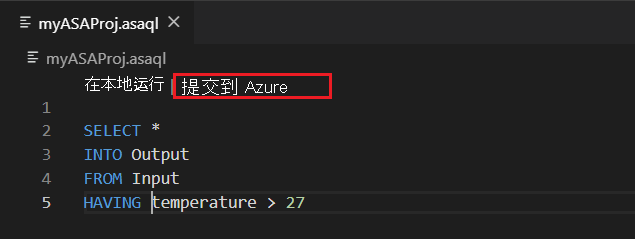

# 复制或备份 Azure 流分析作业

可以使用 Visual Studio Code 或 Visual Studio 来复制或备份已部署的 Azure 流分析作业。 将作业复制到其他区域时不会复制上次输出时间。 因此，在启动复制的作业时，不能使用 [**上次停止时**](./start-job.md#start-options)选项。

## 准备阶段
* 如果还没有 Azure 订阅，可以创建一个[免费帐户](https://azure.microsoft.com/free/)。

* 登录到 [Azure 门户](https://portal.azure.com/)。

* 安装[适用于 Visual Studio Code 的 Azure 流分析扩展](quick-create-visual-studio-code.md#install-the-azure-stream-analytics-tools-extension)或[适用于 Visual Studio 的 Azure 流分析工具](quick-create-visual-studio-code.md#install-the-azure-stream-analytics-tools-extension)。  

## Visual Studio Code

1. 单击 Visual Studio Code 活动栏上的 **Azure** 图标，然后展开“流分析”节点。 你的作业应显示在你的订阅下。

   

2. 若要将作业导出到本地项目，请在 Visual Studio Code 的 **流分析资源管理器** 中找到要导出的作业。 然后为项目选择一个文件夹。

    

    项目会导出到所选文件夹并添加到当前工作区。

3. 若要使用另一名称将作业发布到其他区域或备份，请在查询编辑器 (\*.asaql) 中选择“从订阅中选择以发布”，然后按照说明进行操作。

    

## Visual Studio

1. 按照[将部署的 Azure 流分析作业导出到项目说明](./stream-analytics-vs-tools.md#export-jobs-to-a-project)进行操作。

2. 在查询编辑器中打开 \*.asaql 文件，在脚本编辑器中选择“提交到 Azure”，然后按照说明使用新名称将作业发布到其他区域或备份。

## 后续步骤

* [快速入门：使用 Visual Studio Code 创建流分析作业](quick-create-visual-studio-code.md)
* [快速入门：使用 Visual Studio 创建流分析作业](stream-analytics-quick-create-vs.md)