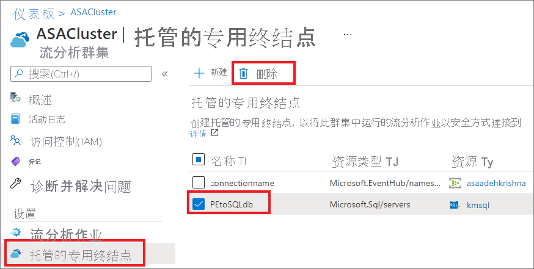

# 在 Azure 流分析群集中创建和删除托管的专用终结点

可以将群集上运行的 Azure 流分析作业连接到防火墙或 Azure 虚拟网络 (VNet) 后面的输入和输出资源。 首先，在流分析群集中创建资源（例如 Azure 事件中心或 Azure SQL 数据库）的托管专用终结点。 然后，批准从输入或输出中连接专用终结点。

批准连接后，在流分析群集中运行的任何作业都可以通过专用终结点访问资源。 本文介绍如何在流分析群集中创建和删除专用终结点。 可以为 Azure SQL 数据库、Azure Synapse SQL 数据库、Azure Cosmos DB、Azure 存储、Azure Data Lake Storage Gen2、Azure 事件中心、Azure IoT 中心和 Azure 服务总线创建专用终结点。

## 在流分析群集中创建托管的专用终结点

本部分介绍如何在流分析群集中创建专用终结点。

1. 在 Azure 门户中，找到并选择流分析群集。

1. 在“设置”下选择“托管的专用终结点” 。

1. 选择“新建”并输入以下信息，以选择要通过专用终结点安全访问的资源。

   |设置|值|
   |---|---|
   |名称|为专用终结点输入任意名称。 如果此名称已被使用，请创建唯一的名称。|
   |连接方法|选择“连接到我的目录中的 Azure 资源”。  你可以选择自己的一个资源来使用专用终结点安全连接，或者你可以使用其他人共享给你的资源 ID 或别名连接到他的资源。|
   |订阅|选择订阅。|
   |资源类型|选择[映射到资源的资源类型](../private-link/private-endpoint-overview.md#private-link-resource)。|
   |资源|选择要使用专用终结点连接到的资源。|
   |目标子资源|上述所选资源的子资源类型，你的专用终结点将能够访问该资源。|

   

1. 批准来自目标资源的连接。 例如，如果在上一步中创建了 Azure SQL 数据库实例的专用终结点，则应转到该 SQL 数据库实例并查看应批准的连接。 显示连接请求可能需要几分钟时间。

    

1. 可以返回流分析群集查看状态的变化：会从“等待客户批准”变为“等待 DNS 设置”，然后变成“设置完成”，这将在几分钟内完成  。

## 在流分析群集中删除托管的专用终结点

1. 在 Azure 门户中，找到并选择流分析群集。

1. 在“设置”下选择“托管的专用终结点” 。

1. 选择要删除的专用终结点，然后选择“删除”。

   

## 后续步骤

你现在已对如何在 Azure 流分析群集中管理专用终结点有了一个大致的了解。 接下来可以了解如何缩放群集并在群集中运行作业：

* [缩放 Azure 流分析群集](scale-cluster.md)
* [在流分析群集中管理流分析作业](manage-jobs-cluster.md)
