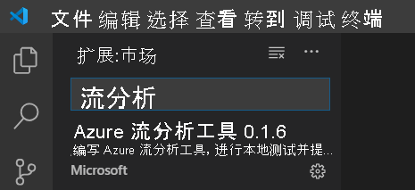
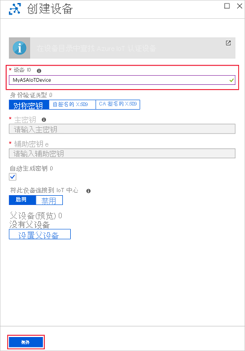
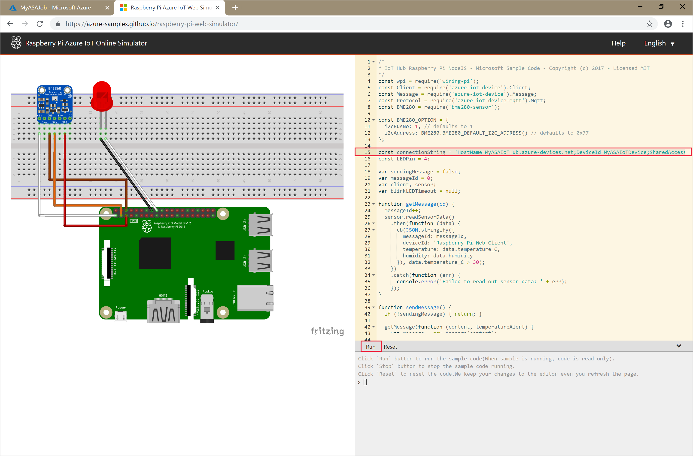
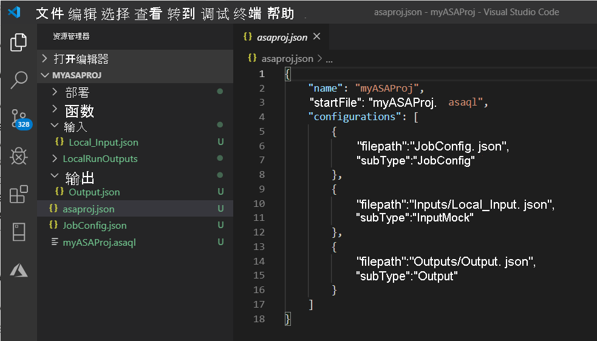
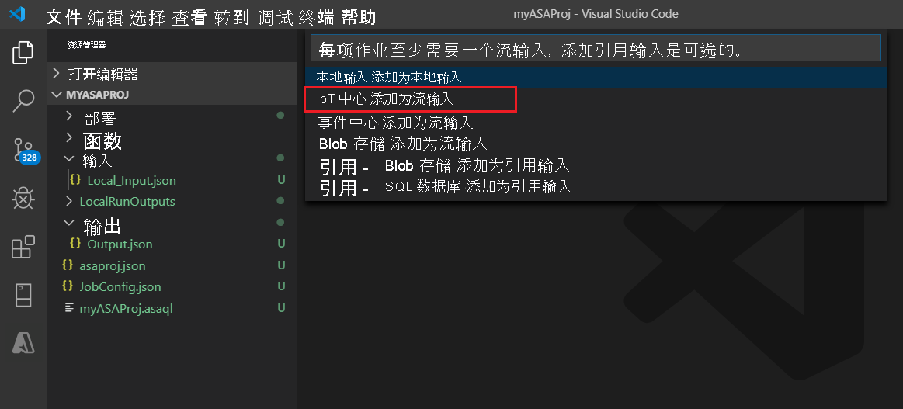
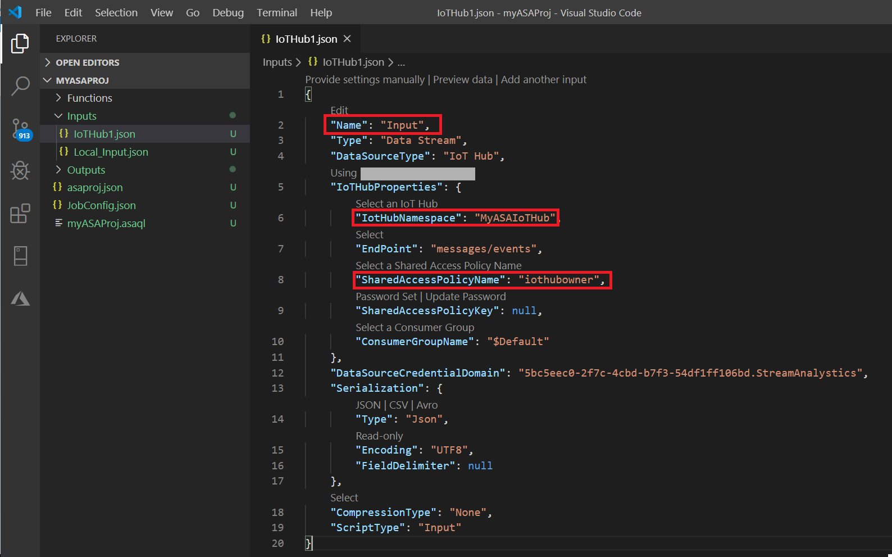
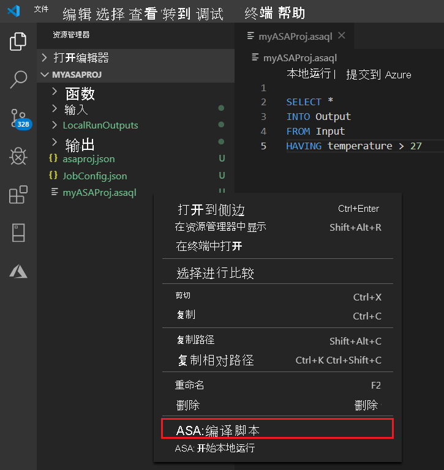
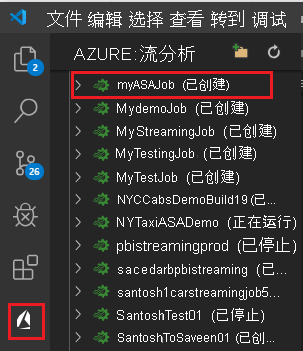
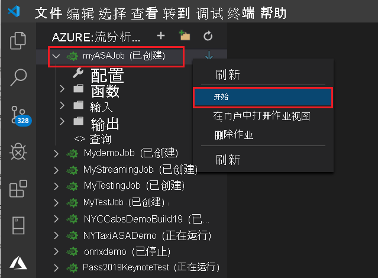

# <a name="quickstart-create-an-azure-stream-analytics-job-in-visual-studio-code-preview"></a>快速入门：在 Visual Studio Code 中创建 Azure 流分析作业（预览）

本快速入门介绍如何使用用于 Visual Studio Code 的 Azure 流分析工具扩展创建和运行 Azure 流分析作业。 示例作业从 Azure IoT 中心设备中读取流式处理数据。 你将定义一个作业，用以计算超过 27° 时的平均温度并将生成的输出事件写入到 blob 存储中的一个新文件。

> [!NOTE]
> Visual Studio 和 Visual Studio Code 工具不支持“中国东部”、“中国北部”、“德国中部”和“德国东北部”区域中的作业。

## <a name="before-you-begin"></a>开始之前

* 如果还没有 Azure 订阅，可以创建一个[免费帐户](https://azure.microsoft.com/free/)。

* 登录 [Azure 门户](https://portal.azure.com/)。

* 安装 [Visual Studio Code](https://code.visualstudio.com/)。

## <a name="install-the-azure-stream-analytics-tools-extension"></a>安装 Azure 流分析工具扩展

1. 打开 Visual Studio Code。

2. 在左窗格上的“扩展”中搜索“流分析”，然后选择“Azure 流分析工具”扩展对应的“安装”   。

3. 安装该扩展后，检查“Azure 流分析工具”是否显示在“已启用的扩展”中 。

   

## <a name="activate-the-azure-stream-analytics-tools-extension"></a>激活 Azure 流分析工具扩展

1. 选择 Visual Studio Code 活动栏中的 Azure 图标。 在边栏的“流分析”下，选择“登录到 Azure” 。

   

2. 登录后，Visual Studio Code 窗口左下角的状态栏上会显示你的 Azure 帐户名。

> [!NOTE]
> 如果你未注销，则 Azure 流分析工具扩展下一次会自动登录。如果你的帐户已启用双重身份验证，则我们建议使用手机身份验证，而不要使用 PIN 码。
> 如果列出资源时遇到问题，注销再重新登录通常有助于解决问题。 若要注销，请输入命令 `Azure: Sign Out`。

## <a name="prepare-the-input-data"></a>对输入数据进行准备

在定义流分析作业之前，应该对稍后会配置为作业输入的数据进行准备。 若要对作业所需的输入数据进行准备，请完成以下步骤：

1. 登录 [Azure 门户](https://portal.azure.com/)。

2. 选择“创建资源” > “物联网” > “IoT 中心”。

3. 在“IoT 中心”窗格中，输入以下信息： 

   |**设置**  |**建议的值**  |**说明**  |
   |---------|---------|---------|
   |订阅  | \<Your subscription\> |  选择要使用的 Azure 订阅。 |
   |资源组   |   asaquickstart-resourcegroup  |   选择“新建”，然后输入帐户的新资源组名称。 |
   |区域  |  \<Select the region that is closest to your users\> | 选择可以在其中托管 IoT 中心的地理位置。 使用最靠近用户的位置。 |
   |IoT 中心名称  | MyASAIoTHub  |   选择 IoT 中心的名称。   |

   

4. 在完成时选择“下一步:设置大小和规模”。

5. 选择“定价和缩放层”。 就本快速入门来说，请选择“F1 - 免费”层（前提是此层在订阅上仍然可用）。 如果免费层不可用，请选择可用的最低层。 有关详细信息，请参阅 [Azure IoT 中心定价](https://azure.microsoft.com/pricing/details/iot-hub/)。

   

6. 选择“查看 + 创建”。 查看 IoT 中心信息，然后选择“创建”。 创建 IoT 中心可能需要数分钟的时间。 可在“通知”窗格中监视进度。

7. 在 IoT 中心导航菜单的“IoT 设备”下选择“添加” 。 为“设备 ID”添加 ID，然后选择“保存” 。

   

8. 创建设备后，请从“IoT 设备”列表打开设备。 复制“连接字符串(主密钥)”中的字符串并保存到记事本，供稍后使用。

   

## <a name="run-the-iot-simulator"></a>运行 IoT 模拟器

1. 在新的浏览器标签页或窗口中打开 [Raspberry Pi Azure IoT 联机模拟器](https://azure-samples.github.io/raspberry-pi-web-simulator/)。

2. 将第 15 行的占位符替换为之前保存的 IoT 中心设备连接字符串。

3. 选择“运行”。 输出会显示传感器数据和发送到 IoT 中心的消息。

   

## <a name="create-blob-storage"></a>创建 Blob 存储

1. 从 Azure 门户的左上角选择“创建资源” > “存储” > “存储帐户”  。

2. 在“创建存储帐户”窗格中，输入存储帐户名称、位置和资源组。 选择与创建的 IoT 中心相同的位置和资源组。 然后选择“查看 + 创建”，以创建帐户。

   

3. 创建存储帐户以后，请在“概览”窗格上选择“Blob”磁贴 。

   

4. 从“Blob 服务”页面中，选择“容器”，为你的容器提供一个名称，例如 **container1**。 将“公共访问级别”保留为“专用(非匿名访问)”，然后选择“确定”  。

   

## <a name="create-a-stream-analytics-project"></a>创建流分析项目

1. 在 Visual Studio Code 中，选择 Ctrl+Shift+P 以打开命令面板。 然后输入 ASA 并选择“ASA: Create New Project”。

   

2. 输入项目名称（例如 myASAproj），然后选择项目的文件夹。

    

3. 新项目将添加到你的工作区中。 流分析项目由以下三个文件夹组成：“输入”、“输出”和“函数”  。 它还具有查询脚本 (*.asaql)、JobConfig.json 文件和 asaproj.json 配置文件  。

    **asaproj.json** 配置文件包含将流分析作业提交到 Azure 所需的输入、输出和作业配置文件信息。

    

> [!Note]
> 从命令面板添加输入和输出时，相应路径将自动添加到 asaproj.json 中。 如果直接在磁盘上添加或者删除输入或输出，则需要在 **asaproj.json** 中手动添加或删除。 可以选择将输入和输出放在一个放置，然后通过在每个 asaproj.json 文件中指定路径，在不同的作业中引用这些输入和输出。

## <a name="define-the-transformation-query"></a>定义转换查询

1. 打开项目文件夹中的 **myASAproj.asaql**。

2. 添加以下查询：

   ```sql
   SELECT *
   INTO Output
   FROM Input
   HAVING Temperature > 27
   ```

## <a name="define-a-live-input"></a>定义实时输入

1. 右键单击流分析项目中的“输入”文件夹。 然后从上下文菜单中选择“ASA:添加输入”。

    

    或选择 Ctrl+Shift+P 打开命令面板，然后输入“ASA: **Add Input**。

   

2. 选择“IoT 中心”作为输入类型。

   

3. 如果从命令面板添加了输入，请选择将使用该输入的流分析查询脚本。 该脚本中应会自动填充 myASAproj.asaql 的文件路径。

   

4. 从下拉菜单中选择“从 Azure 订阅中选择”。

    

5. 使用以下值编辑新生成的 IoTHub1.json 文件。 对于下面未提到的字段，请保留默认值。

   |设置|建议的值|说明|
   |-------|---------------|-----------|
   |名称|输入|输入一个名称，用于标识作业的输入。|
   |IotHubNamespace|MyASAIoTHub|选择或输入 IoT 中心的名称。 如果在同一订阅中创建 IoT 中心名称，则会自动将其删除。|
   |SharedAccessPolicyName|iothubowner| |

   可以借助 CodeLens 功能来输入字符串，从下拉列表中选择值，或者直接在文件中更改文本。 以下屏幕截图显示了“从订阅中选择”示例。 凭据将自动列出并保存在本地凭据管理器中。

   

   

## <a name="preview-input"></a>预览输入

从顶部行中选择 IoTHub1.json 中的“预览数据” 。 某些输入数据将从 IoT 中心提取并显示在预览窗口中。 此过程可能需要一些时间。

 

## <a name="define-an-output"></a>定义输出

1. 按 **Ctrl+Shift+P** 打开命令面板。 然后输入 **ASA:Add Output**。

   

2. 选择“Blob 存储”作为接收器类型。

3. 选择使用此输入的流分析查询脚本。

4. 输入输出文件名为 **BlobStorage**。

5. 使用以下值编辑 BlobStorage。 对于下面未提到的字段，请保留默认值。 使用 CodeLens 功能可帮助你从下拉列表中选择或输入字符串。

   |设置|建议的值|说明|
   |-------|---------------|-----------|
   |名称|输出| 输入一个名称，用于标识作业的输出。|
   |存储帐户|asaquickstartstorage|选择或输入存储帐户的名称。 如果在同一订阅中创建存储帐户名称，则会自动将其删除。|
   |容器|container1|选择你在存储帐户中创建的现有容器。|
   |路径模式|output|输入要在容器内创建的文件路径的名称。|

   

## <a name="compile-the-script"></a>编译脚本

脚本编译检查语法并生成 Azure 资源管理器模板，以便自动部署。

可通过两种方式触发脚本编译：

- 从工作区中选择脚本，然后从命令面板进行编译。

   

- 右键单击脚本，然后选择“ASA:**Compile Script**。

    

编译完成后，可以在项目的 Deploy 文件夹中看到生成的两个 Azure 资源管理器模板。 这两个文件用于自动部署。


## <a name="submit-a-stream-analytics-job-to-azure"></a>将流分析作业提交到 Azure

1. 在查询脚本的“脚本编辑器”窗口中，选择“提交到 Azure”。

   

2. 从弹出列表中选择你的订阅。

3. 选择“选择作业”。 然后选择“新建作业”。

4. 输入作业名称 myASAjob。 然后遵照说明选择资源组和位置。

5. 选择“提交到 Azure”。 可以在输出窗口中查找日志。 

6. 创建作业后，可以在“流分析资源管理器”中看到它。

    

## <a name="start-the-stream-analytics-job-and-check-output"></a>启动流分析作业并检查输出

1. 在 Visual Studio Code 中打开“流分析资源管理器”，并找到作业“myASAJob”。 

2. 右键单击作业名称。 然后在上下文菜单中选择“启动”。

   

3. 在弹出窗口中选择“立即”以启动该作业。

4. 请注意，作业状态已更改为“正在运行”。 右键单击作业名称，然后选择“在门户中打开作业视图”以查看输入和输出事件指标。 此操作可能需要几分钟的时间才能完成。

5. 若要查看结果，请在 Visual Studio Code 扩展或 Azure 门户中打开 Blob 存储。

## <a name="clean-up-resources"></a>清理资源

若不再需要资源组、流式处理作业以及所有相关资源，请将其删除。 删除作业可避免对作业使用的流单元进行计费。 

如果计划在将来使用该作业，可以先停止它，等到以后再重启它。 如果不打算再次使用该作业，请按照以下步骤删除本快速入门创建的所有资源：

1. 在 Azure 门户的左侧菜单中选择“资源组”，然后选择已创建资源的名称。  

2. 在资源组页上，选择“删除”。 在文本框中输入要删除的资源的名称，然后选择“删除”。

## <a name="next-steps"></a>后续步骤

在本快速入门中，你已使用 Visual Studio Code 部署了一个简单的流分析作业。 也可通过 [Azure 门户](stream-analytics-quick-create-portal.md)、[PowerShell](stream-analytics-quick-create-powershell.md) 和 [Visual Studio](stream-analytics-quick-create-vs.md) 部署流分析作业。

若要了解适用于 Visual Studio Code 的 Azure 流分析工具，请继续阅读以下文章：

* [通过 Visual Studio Code 使用示例数据在本地测试流分析查询](visual-studio-code-local-run.md)

* [通过 Visual Studio Code 在本地对实时输入测试 Azure 流分析作业](visual-studio-code-local-run-live-input.md)

* [使用 Visual Studio Code 查看 Azure 流分析作业](visual-studio-code-explore-jobs.md)

* [使用 npm 包设置 CI/CD 管道](./cicd-overview.md)