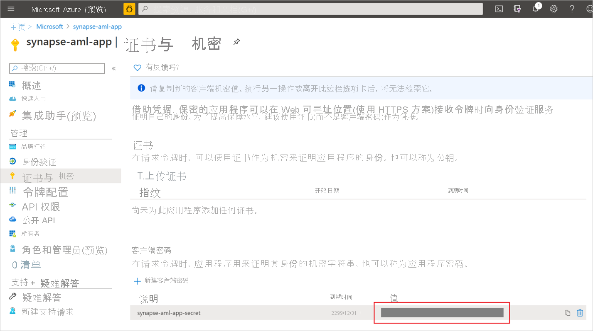
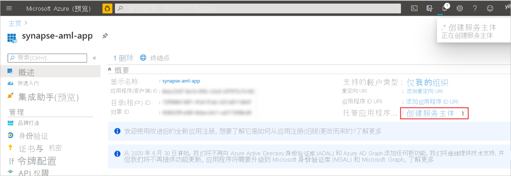
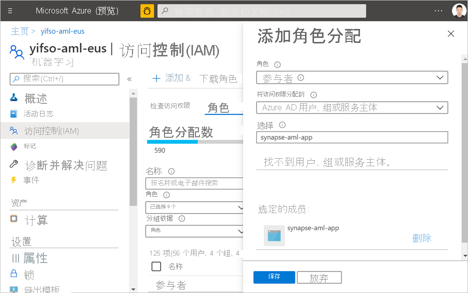

# 快速入门：在 Synapse 中创建新的 Azure 机器学习链接服务

在本快速入门中，你需要将 Azure Synapse Analytics 工作区链接到 Azure 机器学习工作区。 通过链接这些工作区，可以利用 Synapse 中的各种体验来使用 Azure 机器学习。

例如，链接到 Azure 机器学习工作区可获得以下体验：

- 将 Azure 机器学习管道作为 Synapse 管道中的一个步骤运行。 若要了解详细信息，请参阅[执行 Azure 机器学习管道](../../data-factory/transform-data-machine-learning-service.md)。

- 通过从 Azure 机器学习模型注册表中引入机器学习模型，可使用预测来丰富数据，并在 Synapse SQL 池中对该模型进行评分。 有关更多详细信息，请参阅[教程：用于 Synapse SQL 池的机器学习模型评分向导](tutorial-sql-pool-model-scoring-wizard.md)。

## 先决条件

- Azure 订阅 - [免费创建订阅](https://azure.microsoft.com/free/)。
- [Synapse Analytics 工作区](../get-started-create-workspace.md)，其中 ADLS Gen2 存储帐户配置为默认存储。 你必须是所用 ADLS Gen2 文件系统的存储 Blob 数据参与者。
- [Azure 机器学习工作区](../../machine-learning/how-to-manage-workspace.md)。
- 你需要具有相应权限（或者由具有相应权限的人请求）来创建服务主体和密码，它们可用于创建链接服务。 请注意，需要为此服务主体分配 Azure 机器学习工作区中的参与者角色。

## 登录到 Azure 门户

登录到 [Azure 门户](https://portal.azure.com/)

## 创建服务主体

此步骤将创建新的服务主体。 如果要使用现有服务主体，则可以跳过此步骤。
1. 打开 Azure 门户。 

1. 转到“Azure Active Directory” -> “应用注册”。 

1. 单击“新建注册”。 然后，按照 UI 上的说明注册新的应用程序。

1. 注册应用程序后， 为它生成一个密码。 转到你的应用程序  -> “证书和密码”。 单击“添加客户端密码”以生成密码。 请妥善保管密码，稍后将用到它。

   

1. 为应用程序创建服务主体。 转到你的应用程序  -> “概述”，然后单击“创建服务主体”。 在某些情况下，系统会自动创建此服务主体。

   

1. 将服务主体添加为 Azure 机器学习工作区的“参与者”。 请注意，必须是 Azure 机器学习工作区所属资源组的所有者才能执行此操作。

   

## 创建链接服务

1. 在要新建 Azure 机器学习链接服务的 Synapse 工作区中，转到“管理” -> “链接服务”，创建一个类型为“Azure 机器学习”的新链接服务。

   

2. 填写表单：

   - 服务主体 ID：这是应用程序的应用程序（客户端）ID。
  
     > [!NOTE]
     > 这不是应用程序的名称。 你可以在应用程序的概述页中找到此 ID。 它应是一个类似于“81707eac-ab38-406u-8f6c-10ce76a568d5”的长字符串。

   - 服务主体密钥：在上一部分中生成的密钥。

3. 单击“测试连接”以验证配置是否正确。 如果连接测试通过，请单击“保存”。

   如果连接测试失败，请确保服务主体 ID 和密码正确无误，然后重试。

## 后续步骤

- [教程：机器学习模型评分向导 - 专用 SQL 池](tutorial-sql-pool-model-scoring-wizard.md)
- [Azure Synapse Analytics 中的机器学习功能](what-is-machine-learning.md)