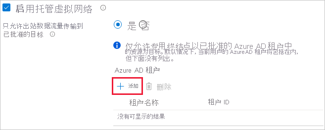

# Azure Synapse Analytics 托管虚拟网络

本文将介绍 Azure Synapse Analytics 中的托管虚拟网络。

## 托管工作区虚拟网络

创建 Azure Synapse 工作区时，可以选择将其关联到一个 Microsoft Azure 虚拟网络。 与工作区关联的虚拟网络由 Azure Synapse 管理。 此虚拟网络称为“托管工作区虚拟网络”。

托管工作区虚拟网络以四种方式提供值：

- 使用托管工作区虚拟网络，可以将管理虚拟网络的负担转移给 Azure Synapse。
- 你无需在自己的虚拟网络上配置入站 NSG 规则，即可让 Azure Synapse 管理流量进入虚拟网络。 这些 NSG 规则的配置错误会导致客户的服务中断。
- 不需要基于峰值负载为 Spark 群集创建子网。
- 托管工作区虚拟网络与托管专用终结点一起防止数据渗透。 只能在具有关联的托管工作区虚拟网络的工作区中创建托管专用终结点。

创建具有关联的托管工作区虚拟网络的工作区可确保你的工作区网络与其他工作区隔离。 Azure Synapse 在工作区中提供了各种分析功能：数据集成、无服务器 Apache Spark 池、专用 SQL 池和无服务器 SQL 池。

如果工作区具有托管工作区虚拟网络，则会在其中部署数据集成和 Spark 资源。 托管工作区虚拟网络还为 Spark 活动提供用户级隔离，因为每个 Spark 群集都在其自己的子网中。

专用 SQL 池和无服务器 SQL 池是多租户功能，因此位于托管工作区虚拟网络外部。 与专用 SQL 池和无服务器 SQL 池进行的工作区内通信使用 Azure 专用链接。 当你创建与托管工作区虚拟网络关联的工作区时，系统会自动为你创建这些专用链接。

>[!IMPORTANT]
>创建工作区后，无法更改此工作区配置。 例如，你无法重新配置没有托管工作区虚拟网络与之关联的工作区并将虚拟网络与之关联。 同样，你也无法重新配置具有关联的托管工作区虚拟网络的工作区并将虚拟网络与之解除关联。

## 创建包含托管工作区虚拟网络的 Azure Synapse 工作区

如果尚未注册网络资源提供程序，请注册它。 通过注册资源提供程序来配置订阅，以供资源提供程序使用。 [注册](../../azure-resource-manager/management/resource-providers-and-types.md)时，从资源提供程序列表中选择“Microsoft.Network”。

若要创建具有关联的托管工作区虚拟网络的 Azure Synapse 工作区，请在 Azure 门户中选择“网络”选项卡，然后选中“启用托管虚拟网络”复选框 。

如果将此复选框保留为未选中状态，则工作区不会有与之关联的虚拟网络。

>[!IMPORTANT]
>只能在具有托管工作区虚拟网络的工作区中使用专用链接。

选择将托管工作区虚拟网络与你的工作区关联后，可使用[托管专用终结点](./synapse-workspace-managed-private-endpoints.md)，仅允许从托管工作区虚拟网络到已批准目标的出站连接，从而防止数据外泄。 选择“是”，通过托管专用终结点限制从托管工作区虚拟网络到目标的出站流量。 

>[!IMPORTANT]
>在具有已启用数据外泄保护的托管虚拟网络的 Synapse 工作区中禁用元存储。 你将无法在这些工作区中使用 Spark SQL。

选择“否”以允许从工作区到任何目标的出站流量。

你还可控制从 Azure Synapse 工作区中创建的托管专用终结点的目标。 默认情况下，允许为你的订阅所属的同一 AAD 租户中的资源创建托管专用终结点。 如果要为并非你的订阅所属的 AAD 租户中的资源创建托管专用终结点，则可选择“+ 添加”来添加该 AAD 租户。 可从下拉列表中选择 AAD 租户，也可手动输入 AAD 租户 ID。

在创建工作区后，可以通过在 Azure 门户中选择“概览”来检查 Azure Synapse 工作区是否关联到某个托管工作区虚拟网络。

## 后续步骤

创建 [Azure Synapse 工作区](../quickstart-create-workspace.md)

详细了解[托管专用终结点](./synapse-workspace-managed-private-endpoints.md)

[创建用于访问数据源的托管专用终结点](./how-to-create-managed-private-endpoints.md)
