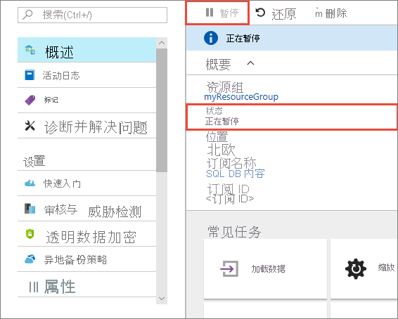
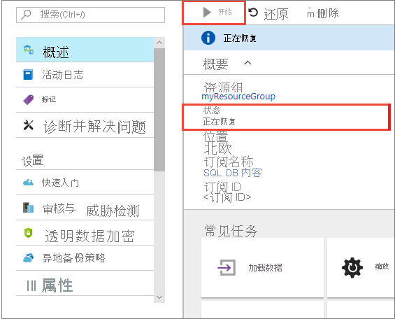

# 快速入门：通过 Azure 门户暂停和恢复专用 SQL 池中的计算

可以使用 Azure 门户暂停和恢复专用 SQL 池计算资源。 如果没有 Azure 订阅，请在开始之前创建一个[免费](https://azure.microsoft.com/free/)帐户。

## 登录到 Azure 门户

登录到 [Azure 门户](https://portal.azure.com/)。

## 开始之前

参考[创建和连接 - 门户](../quickstart-create-sql-pool-portal.md)创建名为 mySampleDataWarehouse 的专用 SQL 池。 

## 暂停计算

为了降低成本，可以按需暂停和恢复计算资源。 例如，如果晚上和周末不使用数据库，那么可以在这些时间暂停数据库的使用，然后在白天时恢复使用。
 
>[!NOTE]
>数据库暂停时，不对计算资源进行收费。 但是，仍将收取存储费用。 

按照以下步骤暂停专用 SQL 池：

1. 登录 [Azure 门户](https://portal.azure.com/)。
2. 导航到“专用 SQL 池”页，打开 SQL 池。 
3. 注意“状态”为“联机” 。

    

4. 若要暂停专用 SQL 池，请单击“暂停”按钮。 
5. 此时将出现询问是否恢复的确认提问。 单击 **“是”** 。
6. 等待几分钟后，“状态”将更改为“正在暂停” 。

    

7. 完成暂停操作后，状态将显示为“已暂停”，选项按钮变为“恢复”。 
8. 专用 SQL 池的计算资源现已脱机。 在恢复服务之前无需为计算付费。

    

## 恢复计算

按照以下步骤恢复专用 SQL 池。

1. 导航到“专用 SQL 池”页，打开 SQL 池。
3. 在“mySampleDataWarehouse”页中，可看到“状态”显示为“已暂停”  。

    

1. 若要恢复 SQL 池，请单击“恢复”。 
1. 此时将出现询问是否启动的确认提问。 单击 **“是”** 。
1. 可看到“状态”显示为“正在恢复” 。

    

1. SQL 池联机后，状态将显示为“联机”，选项按钮将变为“暂停”。 
1. SQL 池的计算资源现已联机，可以使用该服务。 收取已恢复计算费用。

    

## 清理资源

我们会根据数据仓库单位数和专用 SQL 池中存储的数据向你收取费用。 这些计算和存储资源是分开计费的。 

- 要将数据保存在存储中，请暂停计算。
- 若要避免将来产生费用，可以删除该专用 SQL 池。 

请按照下列步骤按需清理资源。

1. 登录到 [Azure 门户](https://portal.azure.com)，选择你的专用 SQL 池。

    

1. 要暂停计算，请单击“暂停”按钮。 

1. 若要删除专用 SQL 池以免产生计算或存储费用，请单击“删除”。

## 后续步骤

现已暂停并恢复了专用 SQL 池的计算。 请继续阅读下一篇文章，详细了解如何[将数据加载到专用 SQL 池](./load-data-from-azure-blob-storage-using-copy.md)。 有关管理计算功能的其他信息，请参阅[管理计算概述](sql-data-warehouse-manage-compute-overview.md)一文。