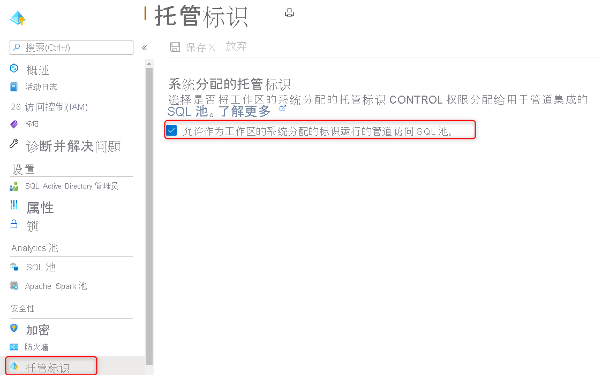

# <a name="securely-load-data-using-synapse-sql"></a>使用 Synapse SQL 安全地加载数据

本文重点介绍 [COPY 语句](/sql/t-sql/statements/copy-into-transact-sql?view=azure-sqldw-latest&preserve-view=true)的安全身份验证机制，并提供示例。 COPY 语句是在 Synapse SQL 中批量加载数据的最灵活且安全的方法。
## <a name="supported-authentication-mechanisms"></a>支持的身份验证机制

下表介绍了每种文件类型和存储帐户所支持的身份验证方法。 这适用于源存储位置和错误文件位置。

|                          |                CSV                |                      Parquet                       |                        ORC                         |
| :----------------------: | :-------------------------------: | :------------------------------------------------: | :------------------------------------------------: |
|  **Azure blob 存储**  | SAS/MSI/SERVICE PRINCIPAL/KEY/AAD |                      SAS/KEY                       |                      SAS/KEY                       |
| **Azure Data Lake Gen2** | SAS/MSI/SERVICE PRINCIPAL/KEY/AAD | SAS (blob<sup>1</sup>)/MSI (dfs<sup>2</sup>)/SERVICE PRINCIPAL/KEY/AAD | SAS (blob<sup>1</sup>)/MSI (dfs<sup>2</sup>)/SERVICE PRINCIPAL/KEY/AAD |

1：此身份验证方法需要在外部位置路径使用 .blob 终结点 (.blob.core.windows.net)。

2：此身份验证方法需要在外部位置路径使用 .dfs 终结点 (.dfs.core.windows.net)。

## <a name="a-storage-account-key-with-lf-as-the-row-terminator-unix-style-new-line"></a>A. 以 LF 作为行终止符的存储帐户密钥（Unix 样式的新行）


```sql
--Note when specifying the column list, input field numbers start from 1
COPY INTO target_table (Col_one default 'myStringDefault' 1, Col_two default 1 3)
FROM 'https://adlsgen2account.dfs.core.windows.net/myblobcontainer/folder1/'
WITH (
    FILE_TYPE = 'CSV'
    ,CREDENTIAL=(IDENTITY= 'Storage Account Key', SECRET='<Your_Account_Key>')
    --CREDENTIAL should look something like this:
    --CREDENTIAL=(IDENTITY= 'Storage Account Key', SECRET='x6RWv4It5F2msnjelv3H4DA80n0QW0daPdw43jM0nyetx4c6CpDkdj3986DX5AHFMIf/YN4y6kkCnU8lb+Wx0Pj+6MDw=='),
    ,ROWTERMINATOR='0x0A' --0x0A specifies to use the Line Feed character (Unix based systems)
)
```
> [!IMPORTANT]
>
> - 使用十六进制值 (0x0A) 指定换行符。 请注意，COPY 语句会将“\n”字符串解释为“\r\n”（回车换行符）。

## <a name="b-shared-access-signatures-sas-with-crlf-as-the-row-terminator-windows-style-new-line"></a>B. 使用 CRLF 作为行终止符的共享访问签名 (SAS)（Windows 样式新行）
```sql
COPY INTO target_table
FROM 'https://adlsgen2account.dfs.core.windows.net/myblobcontainer/folder1/'
WITH (
    FILE_TYPE = 'CSV'
    ,CREDENTIAL=(IDENTITY= 'Shared Access Signature', SECRET='<Your_SAS_Token>')
    --CREDENTIAL should look something like this:
    --CREDENTIAL=(IDENTITY= 'Shared Access Signature', SECRET='?sv=2018-03-28&ss=bfqt&srt=sco&sp=rl&st=2016-10-17T20%3A14%3A55Z&se=2021-10-18T20%3A19%3A00Z&sig=IEoOdmeYnE9%2FKiJDSFSYsz4AkNa%2F%2BTx61FuQ%2FfKHefqoBE%3D'),
    ,ROWTERMINATOR='\n'-- COPY command automatically prefixes the \r character when \n (newline) is specified. This results in carriage return newline (\r\n) for Windows based systems.
)
```

> [!IMPORTANT]
>
> - 请勿将 ROWTERMINATOR 指定为“\r\n”，它将被解释为“\r\r\n”，并可能导致解析问题

## <a name="c-managed-identity"></a>C. 托管标识

将存储帐户附加到 VNet 时，需要进行托管标识身份验证。 

### <a name="prerequisites"></a>先决条件

1. 按照此[指南](/powershell/azure/install-az-ps?toc=/azure/synapse-analytics/sql-data-warehouse/toc.json&bc=/azure/synapse-analytics/sql-data-warehouse/breadcrumb/toc.json)安装 Azure PowerShell。
2. 如果有常规用途 v1 或 Blob 存储帐户，则必须先按照此[指南](../../storage/common/storage-account-upgrade.md?toc=/azure/synapse-analytics/sql-data-warehouse/toc.json&bc=/azure/synapse-analytics/sql-data-warehouse/breadcrumb/toc.json)将该帐户升级到常规用途 v2 帐户。
3. 必须在 Azure 存储帐户的“防火墙和虚拟网络”设置菜单下启用“允许受信任的 Microsoft 服务访问此存储帐户”。 有关详细信息，请参阅此[指南](../../storage/common/storage-network-security.md?toc=/azure/synapse-analytics/sql-data-warehouse/toc.json&bc=/azure/synapse-analytics/sql-data-warehouse/breadcrumb/toc.json#exceptions)。

#### <a name="steps"></a>步骤

1. 如果你有独立的专用 SQL 池，请使用 PowerShell 向 Azure Active Directory (AAD) 注册 SQL Server： 

   ```powershell
   Connect-AzAccount
   Select-AzSubscription -SubscriptionId <subscriptionId>
   Set-AzSqlServer -ResourceGroupName your-database-server-resourceGroup -ServerName your-SQL-servername -AssignIdentity
   ```

   Synapse 工作区中的专用 SQL 池不需要此步骤。

1. 如果有 Synapse 工作区，请注册工作区的系统托管标识：

   1. 在 Azure 门户中转到 Synapse 工作区
   2. 转到“托管标识”边栏选项卡 
   3. 请确保已启用“允许管道”选项
   
   

1. 按照此 [指南](../../storage/common/storage-account-create.md)创建 **常规用途 v2 存储帐户**。

   > [!NOTE]
   >
   > - 如果有常规用途 v1 或 Blob 存储帐户，则必须先按照此 [指南](../../storage/common/storage-account-upgrade.md)将该帐户 **升级到 v2** 帐户。
   > - 若要了解 Azure Data Lake Storage Gen2 的已知问题，请参阅此[指南](../../storage/blobs/data-lake-storage-known-issues.md)。

1. 在存储帐户下导航到“访问控制(标识和访问管理)”，然后选择“添加角色分配”。  将存储 Blob 数据参与者 Azure 角色分配给托管已注册到 Azure Active Directory (AAD) 的专用 SQL 池的服务器或工作区。

   > [!NOTE]
   > 只有具有“所有者”特权的成员能够执行此步骤。 有关各种 Azure 内置角色，请参阅此[指南](../../role-based-access-control/built-in-roles.md?toc=/azure/synapse-analytics/sql-data-warehouse/toc.json&bc=/azure/synapse-analytics/sql-data-warehouse/breadcrumb/toc.json)。
   
    > [!IMPORTANT]
    > 指定存储 Blob 数据所有者、参与者或读取着 Azure 角色 。 这些角色不同于所有者、参与者和读取者 Azure 内置角色。 

    

4. 现在可以运行指定“托管标识”的 COPY 语句：

    ```sql
    COPY INTO dbo.target_table
    FROM 'https://myaccount.blob.core.windows.net/myblobcontainer/folder1/*.txt'
    WITH (
        FILE_TYPE = 'CSV',
        CREDENTIAL = (IDENTITY = 'Managed Identity'),
    )
    ```

## <a name="d-azure-active-directory-authentication"></a>D. Azure Active Directory 身份验证
#### <a name="steps"></a>步骤

1. 在存储帐户下导航到“访问控制(标识和访问管理)”，然后选择“添加角色分配”。 为 Azure AD 用户分配存储 Blob 数据所有者、参与者或读取者 Azure 角色。 

    > [!IMPORTANT]
    > 指定存储 Blob 数据所有者、参与者或读取着 Azure 角色 。 这些角色不同于所有者、参与者和读取者 Azure 内置角色。

    

2. 按照以下[文档](../../azure-sql/database/authentication-aad-configure.md?tabs=azure-powershell)中的步骤配置 Azure AD 身份验证。 

3. 使用 Active Directory 连接到 SQL 池，现在可以在其中运行 COPY 语句，而无需指定任何凭据：

    ```sql
    COPY INTO dbo.target_table
    FROM 'https://myaccount.blob.core.windows.net/myblobcontainer/folder1/*.txt'
    WITH (
        FILE_TYPE = 'CSV'
    )
    ```


## <a name="e-service-principal-authentication"></a>E. 服务主体身份验证
#### <a name="steps"></a>步骤

1. [创建 Azure Active Directory 应用程序](../..//active-directory/develop/howto-create-service-principal-portal.md#register-an-application-with-azure-ad-and-create-a-service-principal)
2. [获取应用程序 ID](../..//active-directory/develop/howto-create-service-principal-portal.md#get-tenant-and-app-id-values-for-signing-in)
3. [获取身份验证密钥](../../active-directory/develop/howto-create-service-principal-portal.md#authentication-two-options)
4. [获取 V1 OAuth 2.0 令牌终结点](../../data-lake-store/data-lake-store-service-to-service-authenticate-using-active-directory.md?bc=%2fazure%2fsynapse-analytics%2fsql-data-warehouse%2fbreadcrumb%2ftoc.json&toc=%2fazure%2fsynapse-analytics%2fsql-data-warehouse%2ftoc.json#step-4-get-the-oauth-20-token-endpoint-only-for-java-based-applications)
5. 在存储帐户上[为 Azure AD 应用程序分配读取、写入和执行权限](../../data-lake-store/data-lake-store-service-to-service-authenticate-using-active-directory.md?bc=%2fazure%2fsynapse-analytics%2fsql-data-warehouse%2fbreadcrumb%2ftoc.json&toc=%2fazure%2fsynapse-analytics%2fsql-data-warehouse%2ftoc.json#step-3-assign-the-azure-ad-application-to-the-azure-data-lake-storage-gen1-account-file-or-folder)
6. 现在可以运行 COPY 语句：

    ```sql
    COPY INTO dbo.target_table
    FROM 'https://myaccount.blob.core.windows.net/myblobcontainer/folder0/*.txt'
    WITH (
        FILE_TYPE = 'CSV'
        ,CREDENTIAL=(IDENTITY= '<application_ID>@<OAuth_2.0_Token_EndPoint>' , SECRET= '<authentication_key>')
        --CREDENTIAL should look something like this:
        --,CREDENTIAL=(IDENTITY= '92761aac-12a9-4ec3-89b8-7149aef4c35b@https://login.microsoftonline.com/72f714bf-86f1-41af-91ab-2d7cd011db47/oauth2/token', SECRET='juXi12sZ6gse]woKQNgqwSywYv]7A.M')
    )
    ```

> [!IMPORTANT]
>
> - 使用 OAuth 2.0 令牌终结点 V1 版本

## <a name="next-steps"></a>后续步骤

- 若要了解详细语法，请查看 [COPY 语句](/sql/t-sql/statements/copy-into-transact-sql?view=azure-sqldw-latest&preserve-view=true#syntax)一文
- 若要了解加载的最佳做法，请查看[数据加载概述](./design-elt-data-loading.md#what-is-elt)一文
